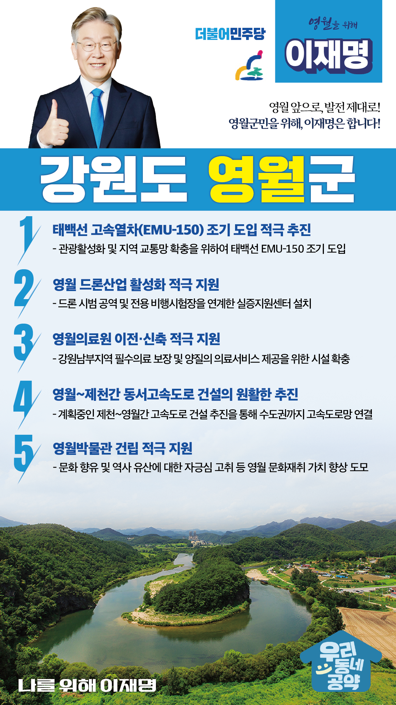

## 강원 지역 공약

# 영월군

### 영월 앞으로! 발전 제대로! 영월군민을 위해, 이재명!
> 2022-02-14

존경하는 영월군민 여러분, 

 

영월군은 의암 류인석 의병장을 중심으로 원용팔, 이강년, 김상태 의병장 등 목숨을 걸고 일제에 항거한 의병운동의 역사를 간직한 의로운 고장입니다.

 

1980년대 군사정권의 석탄산업합리화 정책에 따른 산업구조 변경으로 한때 12만명에 달하던 인구는 4만이 붕괴된 지 오랩니다. 당시 정권의 대안도 없는 산업정책으로 영월은 소멸위험지역으로 분류되면서 희망을 찾기 어려운 지역으로 변해 가고 있습니다. 하지만 이대로 주저앉을 수는 없습니다. 

 

대전환의 시기, 다시 살아나는 영월을 위한 5대 공약을 약속드립니다.

 

첫째, 태백선 고속열차(EMU-150) 조기 도입을 적극 추진하겠습니다.

영월은 과거 석탄산업으로 국가 산업발전에 크게 기여했습니다. 태백선 고속열차(EMU-150)의 조기 도입하여 영월 지역경제가 다시 활력을 찾도록 하겠습니다. 

 

둘째, 영월의 드론산업 활성화를 적극 지원하겠습니다.

영월군은 국내 드론산업의 전초기지입니다. 영월 드론산업의 구심점이 될 드론 실증지원센터 건립을 지원하겠습니다. 드론 상용화 시대를 열어 영월의 먹거리로 육성하고 지역 소멸위기를 극복하겠습니다.

 

셋째, 영월의료원을 이전·신축을 적극 지원하겠습니다. 

영월의료원은 영월, 평창, 정선 권역의 지역책임의료기관입니다. 강원남부지역의 필수의료 보장과 양질의 의료서비스 제공을 위해 거점병원에 걸맞는 시설 확충을 적극 지원하겠습니다.

 

넷째, 영월~제천간 동서고속도로 건설이 원활히 추진될 수 있게 하겠습니다.

현재 계획중인 제천~영월간 고속도로가 원활히 추진하여 수도권까지 고속도로망을 조속히 연결하겠습니다. 강원남부의 교통 인프라 확충으로 국토균형발전의 기반을 마련하겠습니다.

 

다섯째, 영월박물관 건립을 적극 지원하겠습니다.

영월에는 유네스코 세계문화유산으로 지정된 영월 장릉, 오백나한 등 다양한 문화유산이 있습니다. 영월군민의 문화 향유와 역사 유산에 대한 자긍심을 키우고, 영월 문화재의 가치를 높일 영월박물관 건립을 지원하겠습니다.

 

 

존경하는 영월군민 여러분!

 

이재명은 지킬 수 있는 것만 약속했고 약속했던 것은 지켜왔습니다.

살기 좋은 영월 미래를 위한 약속, 실력과 성과로 입증된 이재명이 반드시 실천하겠습니다.

 

영월 앞으로! 발전 제대로! 

영월군민을 위해, 이재명! 

						