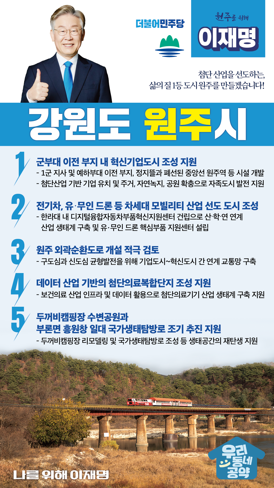

## 강원 지역 공약

# 원주시

### 첨단 산업을 선도하는, 삶의 질 1등 도시 원주를 만들겠습니다!
> 2022-02-14

원주시민 여러분, 더불어민주당 대통령 후보 이재명입니다.

 

치악산 아래 맑은 공기를 자랑하는 원주는 빼어난 자연과 함께 찬란한 문화유산, 화려한 축제가 어우러진 도시입니다.

 

이중환의 ‘택리지’에서도 ‘두메에 가까워 난리가 나도 숨어 피하기 쉽고, 서울과 가까워 세상이 평안하면 벼슬길에 나아가기 쉽다’라고 언급될 정도로 예부터 자연의 아름다움과 지리적 이점을 동시에 가진 강원의 보배이기도 합니다.

 

산업화의 시대에서 디지털시대로 대전환이 이루어지고 있습니다. 강원도, 그리고 원주시 역시 또다른 변화가 필요합니다. 내일이 기대되는 원주를 만들기 위한 원주시 5대 공약을 약속드립니다.

 

첫째, 군부대가 떠난 자리를 혁신기업도시로 조성될 수 있도록 지원하겠습니다.

1군 지사가 떠난 자리는 원주시 원도심의 핵심지역입니다. 1군 지사 및 예하부대가 있던 자리와 함께 정지뜰과 폐선된 중앙선 원주역의 시설도 함께 개발하는 원주시의 계획을 돕겠습니다. 단순히 아파트만 짓는 것이 아니라 첨단산업 기반의 기업을 유치하고, 주거와 함께 자연녹지·공원도 확충하여 일자리·주거·여가·문화·교육이 가능한 자족도시로 만들도록 지원하겠습니다.

 

둘째, 전기차, 유‧무인 드론 등 차세대 모빌리티 산업을 선도하는 도시 조성에 힘을 쏟겠습니다.  

한라대 내에 디지털융합자동차부품혁신지원센터를 건립하여 대학을 중심으로 산‧학‧연이 연계한 산업 생태계를 구축하겠습니다. 이를 통해 원주를 친환경 미래자동차 부품 산업의 거점으로 만들겠습니다. 대학이 지역 일자리 창출의 산실이 되는 도시 조성의 첫발이 될 것입니다. 아울러 유·무인 드론 핵심부품 지원센터를 설립해 차세대 모빌리티 산업을 선도할 수 있도록 뒷받침하겠습니다. 

 

셋째, 외곽순환도로 개설을 적극 검토하여, 원주의 구도심과 신도심 간 균형발전을 이루겠습니다. 

원주 기업도시와 혁신도시 간 연계 교통망을 구축을 검토하여 신도심과 구도심이 균형있게 발전할 수 있도록 하겠습니다. 원주시 외곽 순환 도로의 단절구간이 연결되면 도시 내외곽의 접근성이 향상되어 시민 편익이 높아질 것입니다. 

 

넷째, 원주시가 추진하고 있는 데이터 산업 기반의 첨단의료복합단지 조성을 지원하겠습니다. 

혁신도시의 건강보험공단과 건강보험심사평가원은 보건·의료분야 빅데이터의 보고입니다. 전국 최초로 개소한 가명정보활용지원센터를 비롯해 올해 들어설 임상빅데이터연구센터, 친환경 디지털헬스케어지원센터 및 의료기기 국제인증지원센터와 문재인 대통령님의 공약인 부론 디지털헬스케어 국가산업단지 등을 기반으로 보건의료 데이터를 활용한 첨단의료기기 산업 생태계가 구축될 수 있도록 지원을 아끼지 않겠습니다. 

 

다섯째, 두꺼비캠핑장 수변공원과 부론면 흥원창 일대 국가생태탐방로가 조기 추진되도록 하겠습니다.

원주를 가로지르는 원주천 주변을 시민 모두가 즐길 수 있는 생태공간으로 재탄생 시켜야 합니다. 두꺼비캠핑장 수변공원과 흥원창 일대 국가생태탐방로가 조성되면 지역주민의 삶을 질을 끌어올리는 것과 동시에 지역을 대표하는 주요 관광지로 거듭나 지역경제에도 큰 도움이 될 것입니다.

 

대한민국을 지탱하는 지역을 만들고, 지역 주민의 삶의 질을 높이기 위해서는 능력있는 정치인이 필요합니다. 

지역을 알고, 민생을 가장 중요하게 생각하는 전문가가 있어야 합니다. 

 

앞으로 제대로! 이재명이 하겠습니다!

원주시의 미래를 저 이재명이 시민 여러분과 함께 만들어 가겠습니다. 

원주시민 여러분, 이재명이 열어갈 원주의 미래를 기대해주십시오!

 

원주를 위해, 이재명! 

						