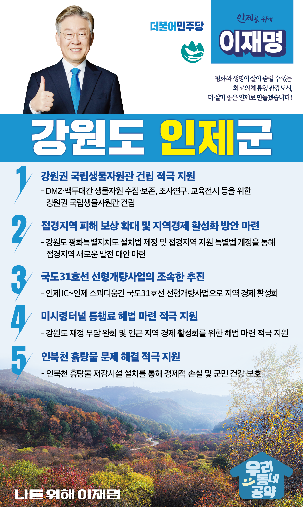

## 강원 지역 공약

# 인제군

### 하늘내린 인제군을 평화와 생명이 살아 숨쉴 수 있는 최고의 체류형 관광도시, 더 살기 좋은 인제로 만들겠습니다!
> 2022-02-14

존경하는 인제군민 여러분,

 

평화와 생명이 살아 숨쉬는 곳, 하늘이 내린 아름다운 자연을 느낄 수 있는 곳, 인제는 조용하지만 대한민국의 미래 번영을 꿈꿀 수 있는 곳입니다. 그동안은 남북 분단의 피해를 본 지역이지만 앞으로는 남북평화를 통해 번영하는 미래를 꿈꿀 수 있는 곳이기도 합니다. 

 

평화와 생명의 땅 인제를 위한 이재명의 다섯까지 약속을 말씀드리겠습니다.

 

 

첫째, 강원권 국립생물자원관이 건립될 수 있도록 적극 지원하겠습니다.

2019년 DMZ 일대가 유네스코 생물권 보전지역으로 지정되었습니다. 이렇듯 강원도는 우리나라 생물자원의 핵심지역입니다. DMZ와 백두대간이 교차하는 인제에 국립생물자원관이 건립될 수 있도록 적극 지원하겠습니다.

 

둘째, 접경지역 피해 보상 확대와 지역경제 활성화 방안을 마련하겠습니다.

부대이전과 군 병력 감축으로 지역상권이 무너지는 곳이 많습니다. 강원도 평화특별자치도 설치법 제정과 접경지역 지원 특별법 개정을 통해 인제를 비롯한 접경지역이 새로운 발전 대안을 찾을 수 있도록 적극 지원하겠습니다.

 

셋째, 국도31호선 선형개량사업을 조속히 추진하겠습니다.

인제 IC부터 인제 스피디움간 국도31호선 선형개량사업을 빠르게 추진하겠습니다. 주민 교통을 더 편리하게 하여 

지역경제 활성화에 보탬이 되도록 지원하겠습니다.

 

넷째, 미시령터널 통행료 해법 마련을 적극 지원하겠습니다.

서울양양고속도로 개통 후 미시령터널 통행량이 급감하였습니다. 미시령터널은 강원도 재정에 과도한 부담이 되고 있습니다.또한 국도변 인근 지역경제도 많이 어렵습니다. 미시령터널 통행료 해법이 마련되도록 적극 지원하겠습니다. 

 

다섯째, 인북천 흙탕물 문제가 해결되도록 적극 지원하겠습니다.

깨끗한 물이 흐르는 인제군이 매년 흙탕물 대란으로 경제적 손실은 물론 군민 건강까지 위협받고 있습니다. 인북천에 흙탕물 저감시설 설치를 지원하고 근본적으로 문제가 해결되도록 적극 돕겠습니다.

 

 

존경하는 인제 군민 여러분!

 

이재명은 지킬 수 있는 것만 약속했고 약속했던 것은 지켜왔습니다.

살기좋은 인제군 미래를 위한 약속 실력과 성과로 입증된 이재명이 반드시 실천하겠습니다.

 

인제 앞으로, 발전 제대로!

인제군민을 위해, 이재명은 합니다!