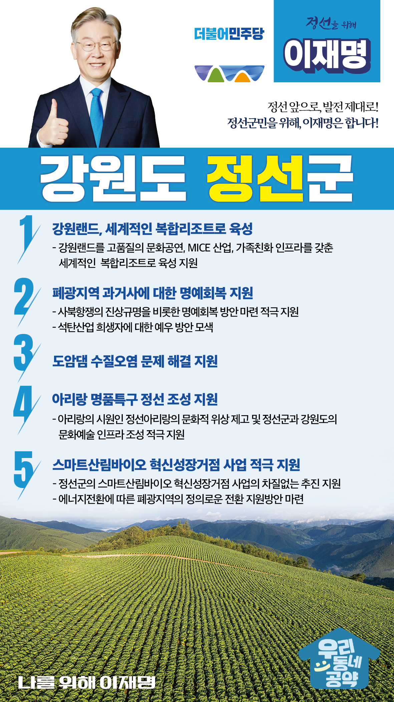

## 강원 지역 공약

# 정선군

### 정선 앞으로, 발전 제대로! 정선군민을 위해, 이재명은 합니다!
> 2022-02-14

존경하는 정선군민 여러분,

 

정선군은 한민족 정서를 대표하는 아리랑의 발상지이자, 수려한 자연경관을 보유한 관광의 1번지입니다. 

 

그러나 폐광지역이 증가하면서 지역경제는 여전히 갈 길이 멀고 관광산업을 활성화를 위해서는 아직도 해야 할 일이 많습니다.

 

더욱 쾌적하고 안전하며 더 살기 좋은 정선군을 만들기 위해 5대 공약을 약속드립니다.

 

첫째, 강원랜드 세계적인 복합리조트로 만들겠습니다. 

강원랜드를 고품질의 문화공연, MICE 산업, 가족친화 인프라를 갖춘 세계적인 복합리조트로 육성하겠습니다. 정선지역 일자리 창출과 폐광지역의 경제자립 기반을 탄탄히 하겠습니다.

 

둘째, 폐광지역 과거사에 대한 명예회복을 지원하겠습니다.

광산의 열악한 노동환경과 처우개선을 요구하며 일어났던 사북항쟁은 지금까지 국가 차원의 사과와 피해보상, 명예회복이 충분치 않았습니다. 사북항쟁의 진상규명을 추진하여 희생되신 분들을 기리고 명예가 회복되도록 적극 지원하겠습니다.

 

셋째, 도암댐 수질오염 문제 해결을 지원하겠습니다.

도암댐의 수질오염이 심각한 상황입니다. 생태계 파괴는 물론이고, 경제적 피해도 나날이 증가하고 있습니다. 도암댐 수질오염 문제가 해결될 수 있도록 다각도로 지원하여 정선군민이 깨끗하고 안전한 물을 이용할 수 있도록 하겠습니다.

 

넷째, 정선이 아리랑 명품특구로 조성될 수 있도록 뒷받침하겠습니다.

아리랑의 시원인 정선아리랑의 문화적 위상을 높이고, 아리랑을 통한 남북 문화교류 확대가 필요합니다. 정선군과 강원도의 문화예술 인프라 조성을 적극 지원하겠습니다. 

 

다섯째, 스마트산림바이오 혁신성장거점 사업을 적극 지원하겠습니다.

폐광지역 경제 재생을 위해서는 제대로 된 종합대책이 있어야 합니다. 정선군의 스마트산림바이오 혁신성장거점 사업이 차질 없이 진행될 수 있도록 적극 지원하겠습니다. 에너지전환에 따른 폐광지역의 정의로운 전환 지원방안도 마련하겠습니다. 

 

 

존경하는 정선군민 여러분,

 

이재명은 지킬 수 있는 것만 약속했고 약속했던 것은 지켜왔습니다.

살기좋은 정선군 미래를 위한 약속 실력과 성과로 입증된 이재명이 반드시 실천하겠습니다.

 

정선 앞으로, 발전 제대로!

정선군민을 위해, 이재명은 합니다! 

						