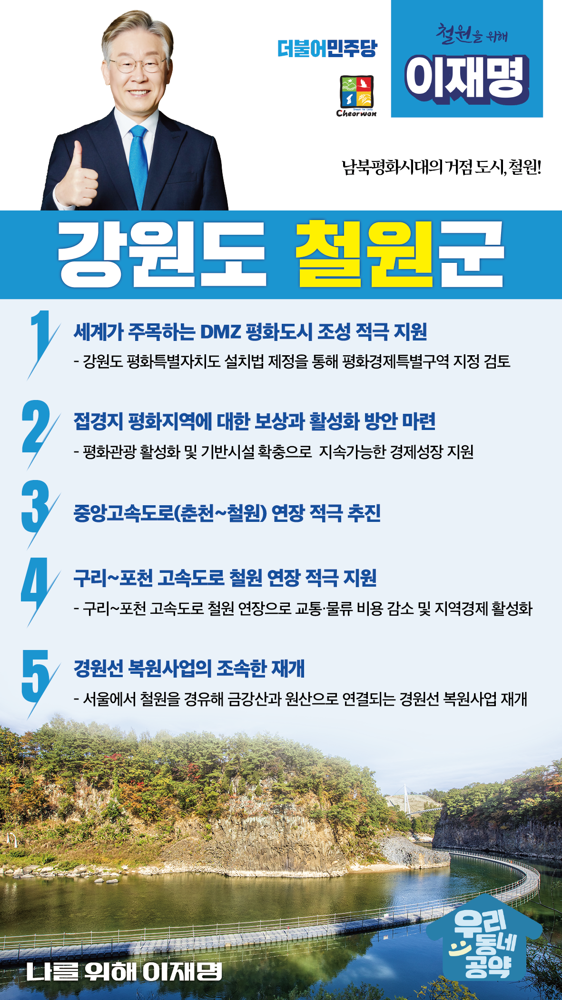

## 강원 지역 공약

# 철원군

### 남북평화시대의 거점 도시, 철원!
> 2022-02-14

존경하는 철원군민 여러분,

 

철원은 명산과 절경이 곳곳 자리잡은 한반도의 자랑입니다. 그러나 국방개혁2.0, 인구감소, 고령화의 위기가 큰 파도로 다가오고 있습니다. 

 

철원군민 여러분!

위기를 극복하면 기회를 마주할 수 있습니다. 지역발전의 적임자가 만드는 철원의 마스터플랜이 필요합니다. 더욱 쾌적하고 안전하며 더 살기 좋은 철원군을 만들기 위한 이재명의 5대 공약을 말씀드립니다.

 

첫째, 철원을 세계가 주목하는 DMZ 평화도시로 만들어가겠습니다.

철원은 평화전망대와 월정리역 등 평화관광자원이 산재한 곳입니다. 또한 DMZ국제평화마라톤이 열리고, DMZ평화의 길을 가진 역사 치유의 장소입니다. 강원도 평화특별자치도 설치법 제정을 통해 철원을 평화경제특별구역 지정을 검토하고 철원이 남북평화시대를 선도하는 지역이 되도록 적극 지원하겠습니다.

 

둘째, 접경지 평화지역에 대한 보상과 활성화 방안을 마련하겠습니다.

부대이전과 군 병력 감축으로 접경지와 군부대 인근의 지역경제가 침체될 것으로 예상됩니다. 평화관광 활성화와 기반시설이 확충되도록 지원하여 평화지역이 지속가능한 경제성장을 하도록 돕겠습니다.  

 

셋째, 중앙고속도로 철원 연장을 적극 추진하겠습니다. 

접경지역 평화벨트와 남북 내륙지역의 경제발전을 위해서는 도로망 확충이 절실합니다. 춘천~철원을 잇는 중앙고속도로 연장을 적극 추진하겠습니다. 중앙고속도로 연장으로 철원 발전의 시금석을 놓겠습니다.

 

넷째, 구리-포천 고속도로 철원 연장을 적극 지원하겠습니다. 

한반도 평화경제시대 대비한 국가전략적 도로망 확충이 절실합니다. 구리-포천 고속도로가 철원까지 연장되도록 적극 지원하겠습니다. 교통·물류 비용을 감소시켜 접경지역의 지역경제에 활력을 불어 넣겠습니다.

 

다섯째, 경원선 복원사업을 조속히 재개하겠습니다. 

서울에서 철원을 경유해 금강산과 원산으로 연결되는 경원선은 남북평화의 상징이자 미래 한반도 평화경제의 토대입니다. 남북관계 개선과 함께 경원선 복원사업을 조속히 재개하여 철원이 대륙으로 뻗어가는 철도 거점도시가 되도록 하겠습니다.

 

 

존경하는 철원 군민 여러분!

이재명은 지킬 수 있는 것만 약속했고 약속했던 것은 지켜왔습니다.

살기 좋은 철원군 미래를 위한 약속 실력과 성과로 입증된 이재명이 반드시 실천하겠습니다.

 

철원 앞으로, 발전 제대로!

철원군민을 위해, 이재명은 합니다! 

						