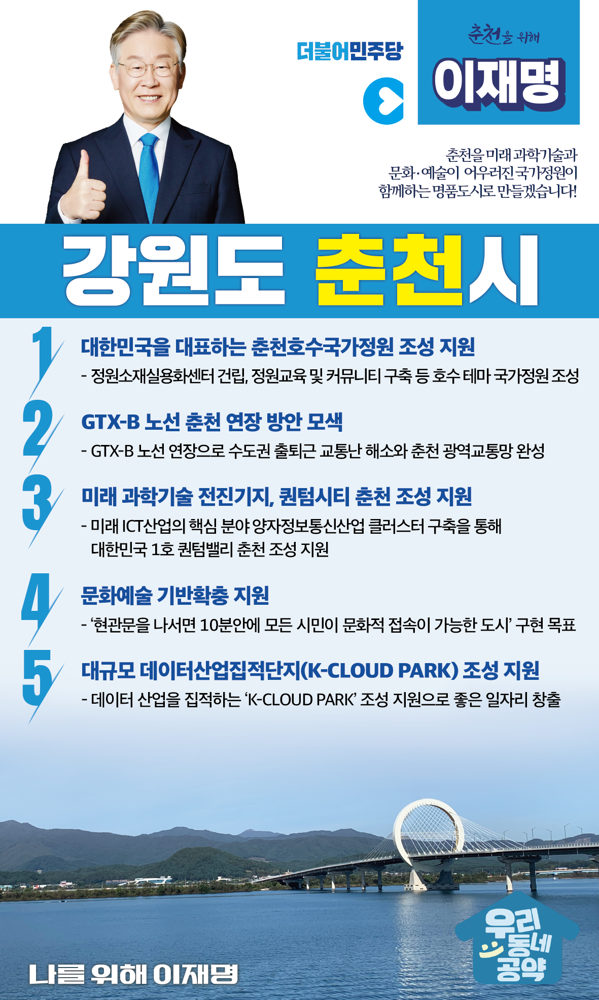

## 강원 지역 공약

# 춘천시

### 춘천을 미래 과학기술과 문화·예술이 어우러진 국가정원이 함께하는 명품도시로 만들겠습니다! 
> 2022-02-14

존경하는 춘천시민 여러분, 더불어민주당 대통령 후보 이재명입니다.

 

춘천은 아름다운 호수와 산을 품고 있는 강원도의 중심도시입니다. “춘천을 한 번도 안 온 사람은 있어도, 한 번만 오는 사람은 없다”는 말이 있을 정도로  남녀노소 누구나 마음속 고향같은 도시입니다.

 

하지만 춘천의 아름다운 자연환경은, 역설적으로 춘천 발전을 더디게 하는 족쇄로 작용하고 있습니다. 수도권 상수원 보호를 위한 이중 삼중의 규제는 춘천의 활력을 잃게 만들었으며, 새로운 성장 동력의 발굴도 각종 규제 앞에 번번이 좌초되곤 했습니다.

 

 이제 발상의 전환이 필요합니다!  춘천을 미래 과학기술과 문화·예술 ․ 환경이 어우러진 명품도시로 만들기 위한 춘천 발전 5대 공약을 약속드립니다.

 

첫째, 춘천 호수국가정원 조성을 지원하겠습니다.

호수는 춘천의 미래입니다. 춘천의 호수 일대를 아름다운 정원으로 조성해야 합니다. 이미 정원소재실용화센터 건립 등 정원 관련 국비 예산도 준비되고 있습니다. 춘천 호수공원 일대가 국가정원으로 조성될 수 있도록 적극 지원하겠습니다.

 

둘째, 춘천까지 GTX-B (광역철도) 노선이 연장방안을 모색하겠습니다.

GTX-B 노선의 춘천 연장은 기존 경춘선을 활용할 수 있습니다. 향후 동서고속화철도가 완공되면 고속열차의 운행 조건도 완비됩니다. GTX-B 노선의 춘천 연장 방안을 적극 검토해 춘천 시민들이 편리하게 수도권에 접근할 수 있도록 돕겠습니다.

 

셋째, 미래 과학기술 전진기지인 <퀀텀시티 춘천> 조성을 지원하겠습니다.

양자정보통신은 미래 ICT산업의 핵심 분야로 잠재력이 큽니다. 주요 국가들도 중장기 계획을 수립하고 예산을 투자하고 있습니다. 춘천에 양자정보통신 기술과 산업이 집적될 수 있도록 적극 지원하겠습니다.

 

넷째, 춘천의 문화예술 기반확충을 지원하겠습니다.

국제인형극제, 마임축제, 연극제 등 지난 30여년 동안 춘천이 키워온 축제는 대한민국 대표 문화·예술축제로 자리잡고 있습니다. 춘천이 법정 문화도시로 지정된 만큼 기존 축제를 더 활성화해야 합니다. 춘천시민 모두가 마을 구석구석, 내 집 앞 곳곳에서 문화와 예술을 향유할 수 있는 도시가 되도록 지원하겠습니다.

 

다섯째, 춘천에 데이터산업 집적단지(K-CLOUD PARK)가 조성되도록 돕겠습니다.

춘천은 소양강댐의 냉수를 활용한 수열에너지를 기반으로 데이터산업 클러스터 조성을 추진하고 있습니다. 데이터산업 집적단지인 ‘K-CLOUD PARK’가 조성될 수 있도록 적극 지원하겠습니다.

 

 

이재명이 꿈꾸는 미래 과학기술과 문화·예술이 어우러진 국가정원이 함께하는 명품도시!

30만 춘천시민들과 함께 만들어 가겠습니다.

 

앞으로 제대로! 이재명이 하겠습니다!

춘천시의 미래를 저 이재명이 시민 여러분과 함께 만들어 가겠습니다. 

춘천시민 여러분, 이재명이 열어갈 춘천의 미래를 기대해주십시오!

 

춘천을 위해, 이재명! 

						