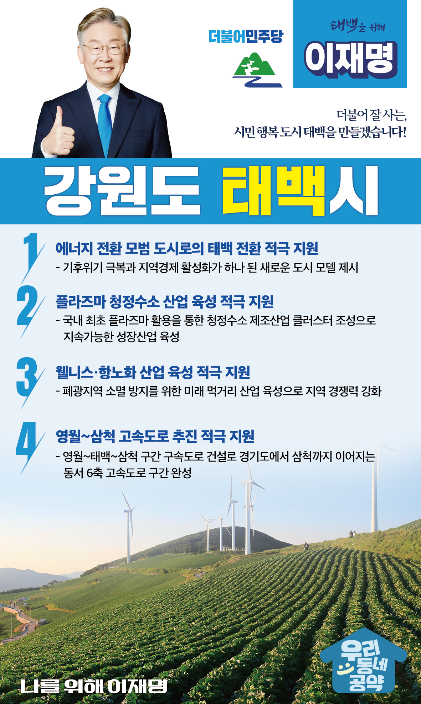

## 강원 지역 공약

# 태백시

### 더불어 잘 사는 시민 행복 도시 태백을 만들겠습니다!
> 2022-02-14

존경하는 태백시민 여러분,

 

태백시는 3대강 발원지이자 민족의 영산인 태백산이 있는 도시입니다. 해발 평균 902m로 열대야가 없는 국내 유일의 도시입니다.

 

하지만 석탄산업이 사양화되면서 지역경제는 급격히 쇠퇴했습니다. 태백시는 현재 새로운 대전환의 시기에 있습니다. 

 

이제는 지역자원을 활용한 정의로운 에너지 전환을 통해 에너지 패러다임의 새로운 혁신을 주도해야 합니다. 이러한 혁신과 태백의 미래를 위한 4대 지역공약을 말씀드리겠습니다.

 

첫째, 태백시를 에너지 전환의 모범 도시가 되도록 적극 지원하겠습니다.

기후위기 대응을 위한 탈석탄 정책은 세계적 추세입니다. 태백시 장성 광업소도 폐광 위기이고, 지역 경제도 위기입니다. 이제 위기를 기회로 바꾸겠습니다. 태백의 풍부한 바람과 산림을 활용하여 에너지 전환의 모범도시로 만들겠습니다. 기후위기 극복과 지역경제 활성화가 하나 된 새로운 모델을 만들겠습니다.

 

둘째, 태백의 플라즈마 청정수소 산업 육성을 적극 지원하겠습니다. 

수소는 기후위기 극복과 탄소중립을 위한 핵심 에너지원입니다. 국내 최초로 플라즈마를 활용한 청정수소 산업을 육성해 태백이 수소산업의 새로운 거점이 되도록 적극 지원하겠습니다. 

 

셋째, 태백의 웰니스·항노화 산업 육성을 적극 돕겠습니다.

태백시는 백두대간의 천혜 자연환경을 품고 있습니다. 태백의 강점을 활용한 웰니스·항노화 산업 육성을 집중 지원하여 태백의 산업 경쟁력을 키우도록 뒷받침하겠습니다.

 

넷째, 영월~삼척 고속도로 추진을 적극 지원하겠습니다.

경기도에서 삼척까지 이어지는 동서6축 고속도로 구간 중에서 추진이 확정되지 않았던 영월~태백~삼척 구간이 마침내 확정되었습니다. 태백시민의 교통 편의와 지역경제 활성화에 도움이 되도록 적극 지원하겠습니다.

 

 

존경하는 태백시민 여러분!

 

이재명은 지킬 수 있는 것만 약속했고 약속했던 것은 지켜왔습니다.

살기 좋은 태백 미래를 위한 약속, 실력과 성과로 입증된 이재명이 반드시 실천하겠습니다.

 

태백 앞으로! 발전 제대로! 

태백시민을 위해, 이재명!      

						