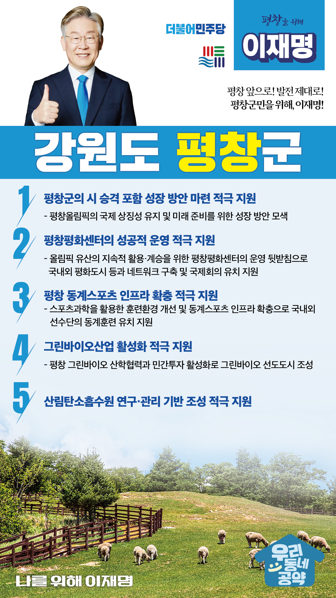

## 강원 지역 공약

# 평창군

### 평창 앞으로! 발전 제대로! 평창군민을 위해, 이재명!
> 2022-02-14

존경하는 평창군민 여러분,

 

우리 평창군은 2018평창동계올림픽 개최지입니다. 스포츠를 통한 인류화합의 상징적 대회였던 평창올림픽을 시작으로, 평창은 세계적인 도시로 발돋움했습니다. 이후에도 평창은 유·무형의 올림픽 유산사업으로 확산 발전시켜 나가고 있습니다.

 

그러나, 올림픽 이후 정체되어 있는 평창에는 지역경제를 다시 살리기 위한 새로운 성장동력이 필요합니다. 살기 좋은 평창을 만들기 위한 5대 공약을 약속드립니다.

 

첫째, 평창군의 시 승격을 포함한 성장 방안 마련을 적극 지원하겠습니다. 

평창은 성공적으로 동계올림픽을 개최하여 평화와 번영의 상징이 된 도시입니다. 평창올림픽의 국제 상징성을 유지하며 미래를 준비해야 합니다. 평창군이 시 승격을 포함한 성장 방안을 마련하도록 적극 지원하겠습니다. 

 

둘째, 평창평화센터의 성공적 운영을 적극 지원하겠습니다.

평창군이 올림픽 유산을 지속적으로 활용·계승하기 위해 만든 평창평화센터의 성공적 운영을 지원하겠습니다. 평창군이 국내외 평화도시 등과 네트워크를 구축하고 국제회의를 유치할 수 있도록 돕겠습니다. 

 

셋째, 평창의 동계스포츠 인프라 확충을 적극 지원하겠습니다.

동계스포츠 선수들의 경기력 향상을 위하여 스포츠과학을 활용한 훈련환경 개선 등 체계적인 지원이 필요합니다. 평창의 동계스포츠 인프라를 확충하여 국내외 선수단의 동계훈련을 유치할 수 있도록 적극 지원하겠습니다. 우리나라가 동계스포츠 강국이 되도록 하겠습니다. 

 

넷째, 평창의 그린바이오산업 활성화를 적극 지원하겠습니다.

평창은 서울대 그린바이오 과학기술연구원의 기반을 갖추고 있습니다. 평창의 그린바이오 산학협력과 민간투자 활성화를 적극 지원하겠습니다. 

 

다섯째, 산림탄소흡수원에 대한 연구·관리 기반 조성을 적극 지원하겠습니다. 

평창군은 우수한 산림자원을 보유한 지역입니다. 평창에 산림을 활용한 탄소흡수원을 연구·관리하는 기반이 조성될 수 있도록 적극 돕겠습니다.

 

 

존경하는 평창군민 여러분!

 

이재명은 지킬 수 있는 것만 약속했고 약속했던 것은 지켜왔습니다.

살기 좋은 평창 미래를 위한 약속, 실력과 성과로 입증된 이재명이 반드시 실천하겠습니다.

 

평창 앞으로! 발전 제대로! 

평창군민을 위해, 이재명! 

						