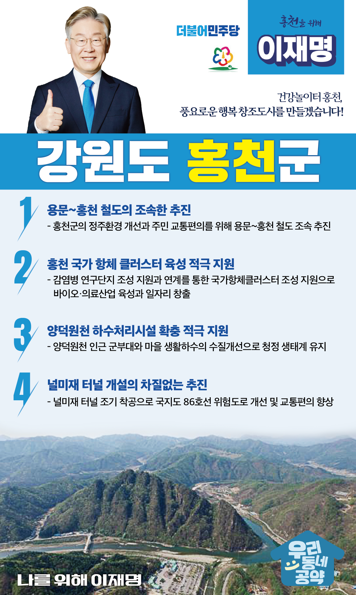

## 강원 지역 공약

# 홍천군

### 건강놀이터 홍천, 풍요로운 행복 창조도시를 만들겠습니다!
> 2022-02-14

존경하는 홍천 군민 여러분,

 

홍천은 한반도와 강원도의 중심에 있으며, 아름다운 자연과 풍부한 자원을 품고 있고 홍천강을 중심으로 동서남북을 연결하는 영서내륙의 사통팔달 교통 요충지입니다. 또한 홍천 6년근 인삼·홍천 한우·홍천 꽁꽁축제와 찰옥수수 축제가 전국적으로 유명한 귀농·귀촌 1등 도시입니다.

 

그러나, 저출산 고령화로 지방은 소멸시대로 접어들면서 지방의 균형발전을 위한 대전환의 시대를 마주하고 있습니다. 또한, 지역경제를 다시 살리기 위한 새로운 성장이 필요합니다.

 

더욱 쾌적하고 안전하며 살기 좋은 홍천을 만들기 위한 4대 공약을 약속드립니다.

 

첫째, 용문~홍천 철도가 원활히 추진되도록 하겠습니다.

강원도와 수도권을 연결하는 용문~홍천 철도의 신설은 국가균형발전과 지역경제 활성화에 기여할 것입니다. 홍천군의 정주환경 개선과 주민 교통편의를 위해 용문~홍천 철도가 조속히 추진될 수 있도록 돕겠습니다.

 

둘째, 홍천 국가 항체 클러스터 육성을 적극 뒷받침하겠습니다.

홍천에 진행 중인 감염병 연구단지 조성을 적극 지원하겠습니다. 이와 연계하여 홍천군과 강원도가 계획하는 '국가항체클러스터' 조성방안도 돕겠습니다. 바이오·의료산업 육성과 일자리 창출로 홍천군의 신성장 동력을 만들겠습니다.

 

셋째, 양덕원천 하수처리시설 확충을 적극 지원하겠습니다.

양덕원천 인근 군부대와 마을 생활하수의 적정한 처리로 조속한 수질개선이 필요합니다. 쾌적한 생활환경을 위해 공공하수처리시설 설치를 뒷받침하겠습니다.

 

넷째, 널미재 터널 개설을 차질없이 추진하겠습니다.

국지도 86호선의 안전한 통행을 위해서 널미재 터널 개설이 필요합니다. 널미재 터널 공사가 신속히 착공하고 차질없이 추진되어 동절기 안전사고 예방으로 주민들의 교통편의가 높아지도록 하겠습니다.

 

존경하는 홍천군민 여러분!

 

이재명은 지킬 수 있는 것만 약속했고 약속했던 것은 지켜왔습니다.

살기 좋은 홍천군 미래를 위한 약속, 실력과 성과로 입증된 이재명이 반드시 실천하겠습니다.

 

홍천 앞으로! 발전 제대로! 

홍천군민을 위해, 이재명!

						