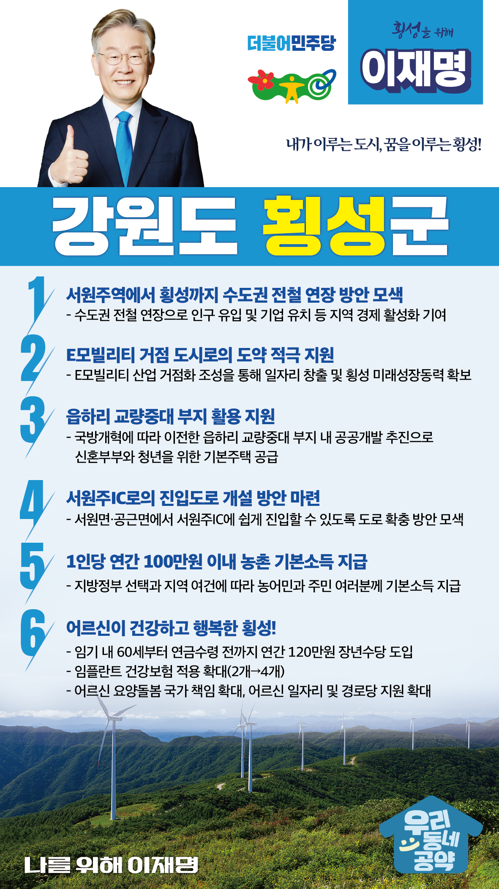

## 강원 지역 공약

# 횡성군

### 내가 이루는 도시, 꿈을 이루는 횡성!
> 2022-02-14

존경하는 횡성군민 여러분,

 

횡성군은 강원도 3.1운동의 효시가 된 4.1만세운동이 일어난 애국의 고장이자, 대한민국을 대표하는 명품 브랜드 ‘횡성한우’가 있는 고장입니다.

 

국난의 시기마다 결연히 일어선 기개 서린 군민 의식에 더해 적극적 투자와 끊임없는 연구로 횡성한우를 세계에서 인정받는 명품브랜드로 육성해 낸 곳입니다. 다목적 댐 건설로 생긴 횡성호에 힐링과 치유의 걷는 길을 조성하여 지역의 관광명소로 조성한 창의성까지 강원도 작은 도시 횡성은 작지만 매운, 단단한 힘을 지닌 곳입니다. 

 

지역 발전의 걸림돌들을 하나하나 제거하면서 더욱 쾌적하고 안전하며 더 살기 좋은 횡성군을 만들기 위한 6대 공약을 약속드립니다.

 

첫째, 횡성 발전을 위해 수도권 전철 연장 방안을 찾겠습니다.

서원주역에서 횡성까지 수도권 전철을 연장하면 횡성 지역경제의 활성화와 인구 유입, 기업유치에 도움이 될 것입니다.

수도권 전철의 연장 방안을 적극 모색하겠습니다.

 

둘째, 횡성이 <E모빌리티 거점 도시>로 도약하도록 적극 지원하겠습니다.

횡성형 상생일자리로 생산된 ‘포트로’가 돌풍을 일으키며 횡성군이 초소형 전기차 산업의 선두로 나섰습니다. E모빌리티 산업 거점화를 통해 일자리를 창출하며 횡성의 미래성장동력이 되도록 확실히 뒷받침하겠습니다.

 

셋째, 읍하리‘교량중대’부지의 현명한 활용을 돕겠습니다.

국방개혁에 따라 이전한 읍하리‘교량중대’부지는 횡성시가지 중심부에 위치하고 있습니다. 횡성군이 추진하는 이전 부지의 공공개발을 적극 지원하여 신혼부부와 청년을 위한 기본주택이 공급되도록 하겠습니다.

 

넷째, 서원주IC로의 진입도로 개설 방안 마련을 돕겠습니다.

횡성의 수도권 접근성을 확보하고 주민 교통편의를 높이겠습니다. 서원면·공근면에서 서원주IC에 쉽게 진입할 수 있도록 도로 확충 방안을 찾겠습니다.

 

다섯째, 농촌에 거주하는 농민과 주민 여러분께 기본소득을 지급하겠습니다. 

지방정부의 선택과 지역의 여건에 따라 1인당 연간 100만원 이내의 농촌 기본소득을 지급하겠습니다. 농촌 기본소득 지급으로 농촌과 도시 간 소득격차를 줄이고, 안정적 생활을 지원하겠습니다. 

 

여섯째, 어르신이 건강하고 행복한 횡성을 만들겠습니다. 

소득 공백에 놓인 60대 초반을 대상으로 연간 120만원의 장년수당을 지급하겠습니다. 또한 임플란트 건강보험 적용 개수를 현재 2개에서 4개로 확대하고 어르신 요양에 대한 국가 책임을 확대하고 어르신 일자리 지원과 경로당 지원 확대로 어르신들이 행복한 횡성을 만들겠습니다.

 

 

 

존경하는 횡성군민 여러분!

 

이재명은 지킬 수 있는 것만 약속했고 약속했던 것은 지켜왔습니다.

살기 좋은 횡성군 미래를 위한 약속, 실력과 성과로 입증된 이재명이 반드시 실천하겠습니다.

 

횡성 앞으로! 발전 제대로! 

횡성군민을 위해, 이재명!