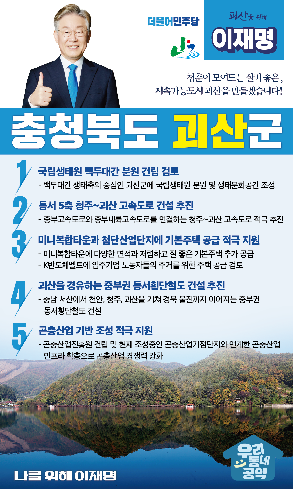

## 충북 지역 공약

# 괴산군

### 청춘이 모여드는 살기좋은 지속가능도시 괴산을 만들겠습니다! 
> 2022-02-12

존경하는 괴산군민 여러분, 

 

대한민국 국토의 정중앙, 전국 어디든 2시간대에 닿을 수 있는 괴산군은 산막이옛길, 충청도 양반길, 화양계곡이 널리 알려진 아름다운 고장입니다.

 

하지만, 괴산의 합계출산율은 충북 최저수준입니다. 한달에 태어나는 아이가 열 명이 안되는 지역소멸위기 지역입니다. 청장년이 모여들도록 질 좋은 일자리를 늘리고 아이 낳고 키우기 좋은 환경을 제공해야 합니다. 

 

괴산이 다시 활기를 되찾을 수 있도록 이재명은 괴산의 미래를 전폭적으로 지원하겠습니다.

 

괴산을 위한 이재명의 다섯 가지 약속을 말씀드립니다.

 

 

첫째, 국립생태원 백두대간 분원 건립을 검토하겠습니다. 

 

괴산은 강원․경상․전라도로 연계되는 백두대간 생태축의 중심에 위치해 있습니다. 한반도 고유종과 멸종위기 동식물을 보전하고 연구하기 위한 최적지입니다. 괴산에 전국민이 즐겨찾는 생태문화 공간 조성을 적극 검토하겠습니다.

 

둘째, 동서 5축인 청주~괴산 고속도로 건설을 추진하겠습니다. 

 

괴산의 고속도로는 군 외곽의 중부내륙고속도로 하나뿐입니다. 괴산 어디서나 고속도로에 쉽게 접근할 수 있도록 서해안 서산에서 동해안 울진까지 연결하는 동서5축 고속도로가 필요합니다. 청주~괴산구간 고속도로 연결사업을 적극 추진하겠습니다.

 

셋째, 미니복합타운과 첨단산업단지에 기본주택이 공급되도록 적극 지원하겠습니다. 

 

정주여건 개선으로 젊은층이 돌아오는 괴산을 만들어야 합니다. 미니복합타운에 다양한 면적과 저렴하고 질 좋은 기본주택 추가 공급을 적극 지원하겠습니다. 또한, K반도체벨트에 입주기업 노동자들의 주거를 위한 주택 공급도 검토하겠습니다. 

 

 

넷째, 괴산을 경유하는 중부권 동서횡단철도 건설을 추진하겠습니다.

 

국가균형발전을 위해 충청권에 한반도 동서축을 잇는 철도가 필요합니다. 충남 서산에서 천안, 청주, 괴산을 거쳐 경북 울진까지 이어지는 ‘중부권 동서횡단철도’건설을 적극 추진하겠습니다.

 

다섯째, 괴산의 곤충산업 기반 조성을 적극 지원하겠습니다. 

 

곤충산업은 2030년까지 전세계 10조원 규모로 성장이 예상되는 미래 유망 산업입니다. 괴산군에 조성중인 곤충산업거점단지와 연계해 곤충산업 인프라를 확충해야 합니다. 괴산군에 곤충산업진흥원이 건립될 수 있도록 지원해 곤충산업의 경쟁력을 높이겠습니다. 

 

 

 

이재명은 지킬 수 있는 것만 약속했고, 약속했던 것은 지켜왔습니다.

살기 좋은 괴산군의 미래를 위한 약속, 실력과 성과로 입증된 이재명이 반드시 실천하겠습니다.

 

괴산 앞으로, 발전 제대로!

괴산군민을 위해, 이재명은 합니다! 

						