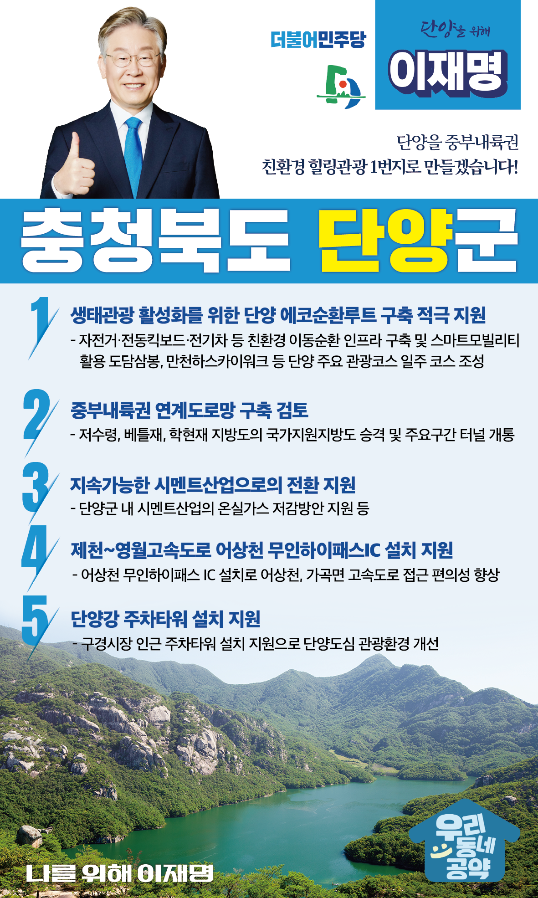

## 충북 지역 공약

# 단양군

### 단양을 중부내륙권 친환경 힐링관광 1번지로 만들겠습니다!
> 2022-02-12

존경하는 단양군민 여러분, 

 

단양은 소백산·월악산과 남한강자락을 낀 아름다운 고장입니다. 단양8경과 고수동굴 등 전국에서 손꼽히는 관광지이자,  최근에는 만천하스카이워크, 잔도길 등으로 힐링여행지로 떠오르고 있습니다. 단양읍, 매포읍의 시멘트산업은 지역경제를 뒷받쳐 온 주요 산업입니다.

 

하지만 지방소멸 시대에 단양의 지속가능한 발전을 위해서는 새 비전이 필요합니다. 단양은 ‘잠시 머무르기 좋은 곳’에서 ‘정착하기 좋은 곳’으로 나아가야 합니다. 

 

미래로 도약하는 단양을 위해, 단양군민께 5가지를 약속드립니다. 

 

 

첫째, 단양 에코순환루트 구축을 적극 지원하여 단양을 생태관광의 중심지로 만들겠습니다. 

환경의 시대, 단양의 관광산업도 천혜의 자연환경을 활용한 생태관광지로 변모해야 합니다. 연 1천만 단양 방문 관광객들이 자동차 대신 자전거, 전동킥보드, 전기차로 도담삼봉-단양시가지-만천하스카이워크 등 단양관광 주요 코스를 일주하는 단양 에코순환루트 구축사업을 적극 지원하여 단양을 생태관광의 중심지로 만들겠습니다. 

 

둘째, 중부내륙권 연계도로망 구축을 검토하여 중부내륙권 관광을 활성화하겠습니다.

단양 관광의 부가가치를 높이기 위해서는 주변지자체와 연계한 중부내륙권 관광벨트화가 필요합니다. 조속히 관광벨트를 연결하는 도로망을 구축하는 것이 우선입니다. 저수령, 베틀재, 학현재 지방도의 국가지원지방도 승격과 주요구간 터널 개통을 조속히 검토하겠습니다.  제천, 영월, 영주와의 도로교통망을 개선하여 단양 관광산업의 경쟁력을 더욱 높이겠습니다.  

 

셋째, 단양의 시멘트산업을 지속가능한 시멘트산업으로 전환할 수 있도록 지원하겠습니다.

시멘트산업은 단양의 지역경제를 지탱하는 핵심 요소입니다. 그러나 탄소중립시대, 이산화탄소 발생량이 많은 시멘트산업이 활력을 잃어가고 있습니다. 단양군 내에 있는 시멘트산업의 온실가스 저감을 지원하겠습니다. 단양을 지속가능한 시멘트산업의 중심지가 될 수 있도록 지원을 아끼지 않겠습니다. 

 

 

넷째, 제천~영월고속도로 어상천 무인하이패스 IC 설치를 지원하겠습니다. 

평택에서 충주까지 연결된 동서고속도로 제천~영월구간이 추진되면 단양에서 수도권으로 가는 교통이 대폭 개선됩니다. 하지만 어상천, 가곡면에서 고속도로를 타려면 30분 넘게 돌아가야 하기 때문에 주민들이 많은 불편을 호소하고 있습니다. 어상천 무인하이패스 IC 설치를 지원하여 교통편의성을 높이겠습니다. 단양의 교통, 이재명이 책임지겠습니다. 

 

다섯째, 단양강 주차타워 설치를 지원하여 단양읍 관광환경을 개선하겠습니다. 

단양군은 매년 천만명 이상이 방문하는 중부내륙 대표관광지임에도 도심주차장 부족으로 이면주차가 심각하고 관광객 통행에 불편을 겪고 있습니다. 특히 구경시장은 주차공간이 부족해 관광객들을 그냥 돌려보내는 일이 많습니다. 구경시장 인근 주차타워 설치를 지원하여 관광객들이 머물기 좋은 단양도심 환경을 만들겠습니다.

 

존경하는 단양군민 여러분,

 

기초와 광역에서 10년 이상 지방행정을 이끌어 온 행정 전문가!

이재명이 하면 다릅니다.

 

이재명은 지킬 수 있는 것만 약속했고, 약속했던 것은 지켜왔습니다.

살기 좋은 단양군의 미래를 위한 약속, 실력과 성과로 입증된 이재명이 반드시 실천하겠습니다.

 

단양 앞으로, 발전 제대로!

단양군민을 위해, 이재명은 합니다! 

						