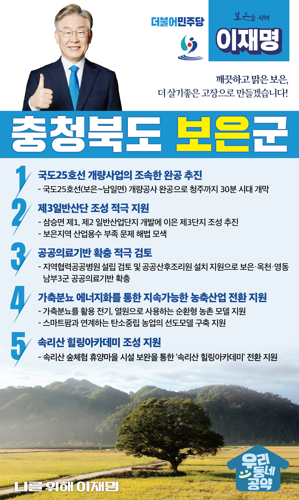

## 충북 지역 공약

# 보은군

### 맑은 보은, 더 살기좋은 고장으로 만들겠습니다! 
> 2022-02-12

존경하는 보은군민 여러분, 

 

보은은 한반도의 중심에 위치하여 금강과 한강의 시작점입니다. 대한팔경 속리산과 함께 구병산, 금적산을 거느린 충북의 알프스이며, 대추와 한우의 명산지이기도 합니다.

 

하지만 보은에 새로운 활력이 필요한 때입니다. 보은의 인구소멸위험지수는 소멸 고위험단계입니다. 

 

기존의 농축산업의 경쟁력을 더 높이고 새로운 산업발전의 기반을 마련해야 합니다. 청장년이 찾아드는 보은을 만들기 위한 이재명의 보은발전 5대 공약을 말씀드리겠습니다. 

 

 

첫째, 국도25선 개량사업을 조속히 완공하여 청주까지 30분 시대를 만들겠습니다.

 

피반령 고갯길은 도로폭이 좁고 굽이져 상당히 불편하고 위험합니다. 보은에서 남일면까지 국도 25호선 개량공사를 조속히 완공하겠습니다. 청주까지 30분 시대를 활짝 열겠습니다. 

 

둘째, 보은 제3일반산단 조성을 적극 지원하겠습니다. 

 

삼승면 제1, 제2 일반산업단지 개발로 보은의 일자리가 크게 늘어났습니다. 이제는 제3 일반산업단지 조성을 추진해야 할 때입니다. 더 많은 일자리를 만들기 위해 제3일반산단 조성을 적극 지원하겠습니다. 기업 유치에 걸림돌이던 산업용수 부족 문제도 해법을 찾겠습니다. 일자리 확충으로 청·장년층이 되돌아오는 보은을 만들겠습니다.

 

셋째, 보은의 공공의료기반 확충을 적극 검토하겠습니다. 

 

보은엔 이비인후과, 피부과, 분만시설이 없어, 보은군민들은 병원을 가려면 청주나 대전까지 나가야 합니다. 보은․옥천․영동 남부3군의 공공의료기반 확충이 필요합니다. 남부3군이 공동으로 이용할 수 있는 지역협력공공병원 설립을 검토하고, 공공산후조리원이 설치·운영될 수 있도록 적극 지원하겠습니다. 

 

넷째, 가축분뇨 에너지화를 통해 지속가능한 농축산업 전환을 지원하겠습니다. 

 

현재 보은군에서 발생하는 가축분뇨의 90%가 개별적으로 처리되고 있습니다. 농축산인들의 폐기물 부담을 덜어드리고, 

소 배설물을 전기, 열원으로 사용하는 지속가능한 농촌을 만들겠습니다. 또한 스마트팜과 연계하는 탄소중립 농업의 선도모델을 구축해 나가겠습니다.  

 

다섯째, 속리산 힐링아카데미 조성을 지원하겠습니다.  

 

산림의 ‘힐링기능’이 주목받고 있습니다. 충북의 자랑인 속리산의 휴양시설도 백두대간 생태명소로 발전시켜야 합니다. 속리산 숲체험 휴양마을이 ‘속리산 힐링아카데미’로 전환될 수 있도록 지원하겠습니다. 우리나라 대표 국립공원인 속리산을 백두대간 힐링관광 명소로 만들겠습니다.

 

 

 

존경하는 보은군민 여러분,

 

이재명은 지킬 수 있는 것만 약속했고, 약속했던 것은 지켜왔습니다.

살기 좋은 보은군의 미래를 위한 약속, 실력과 성과로 입증된 이재명이 반드시 실천하겠습니다.

 

보은 앞으로, 발전 제대로!

보은군민을 위해, 이재명은 합니다! 

						