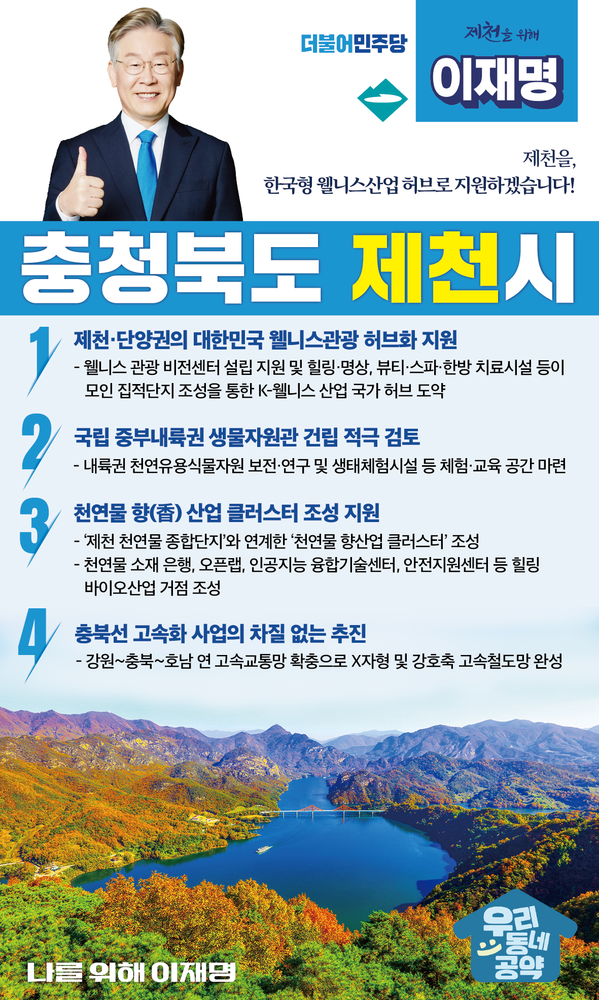

## 충북 지역 공약

# 제천군

### 제천을 한국형 웰니스산업 허브로 지원하겠습니다!
> 2022-02-12

존경하는 제천시민 여러분, 

 

제천은 한반도 중심 중부내륙 중앙부에 위치한 아름다운 산과 비단같은 내륙의 바다, 청풍호를 품은 고장입니다. 

 

일제강점기 을미의병 항일투쟁을 이끈 의로운 도시이며, 현재는 한방 바이오산업을 기반으로 한 ‘자연치유도시’로 발전해가고 있습니다. 

 

지방소멸의 시대, 제천엔 새로운 성장비전이 필요합니다. 청년이 자리잡고 아이가 태어나는 제천을 위해서는 지역특성에 맞는 미래산업 발굴과 산업전환이 필수입니다. 천혜의 자연환경을 기반으로 한 한방 바이오산업과 천연물산업, 그리고 웰니스 관광이 제천의 미래먹거리가 되어야 합니다. 

 

제천발전의 새로운 도약을 위해 제천시민께 네 가지를 약속드립니다. 

 

 

첫째, 제천·단양권을 대한민국 웰니스관광 허브가 될 수 있도록 지원하겠습니다. 

 

의료와 치유, 관광이 결합된 ‘웰니스’시장이 미래 유망산업으로 성장하고 있습니다. 천혜의 자연환경과 천연물 산업기반을 가진 제천과 단양은 웰니스산업이 매우 유망한 지역입니다. 제천에 ‘웰니스 관광 비전센터’설립을 지원하겠습니다. 힐링·명상, 뷰티·스파·한방 치료시설 등이 모인 집적단지가 조성되면 제천·단양권은 K-웰니스 산업의 국가 허브로 도약할 수 있습니다. 

 

둘째, 국립 중부내륙권 생물자원관을 건립을 적극 검토하겠습니다. 

 

제천은 인근에 월악산, 치악산, 소백산의 3개 국립공원을 두고 있어 중부 내륙지역 생물자원을 체계적으로 보전·관리할 최적지입니다. 제천 생물자원관은 내륙권 천연유용식물자원의 보전·연구는 물론, 제천시민과 관광객들의 체험·교육시설로도 활용할 계획입니다. 

 

셋째, 천연물 향(香) 산업 클러스터 조성을 지원하겠습니다. 

 

국내에서 소비되는 향료는 대부분 수입에 의존하고 있습니다. ‘제천 천연물 종합단지’와 연계한 ‘천연물 향산업 클러스터’ 조성을 지원하겠습니다. 향산업의 발전기반이 될 천연물 소재 은행, 연구개발 공유시설인 오픈랩, 인공지능 융합기술센터, 안전지원센터 등이 계획되고 있습니다. 제천이 ‘힐링 바이오산업’의 중심지로 도약할 수 있도록 바이오산업 인프라를 구축하겠습니다. 

 

넷째, 충북선 고속화사업을 차질 없이 추진하겠습니다. 

 

충북선 고속화를 통해 강원~충북~호남을 연결하는 고속철도망을 확충하여 X자형 및 강호축 고속철도망을 완성하겠습니다. 충북선이 고속화되면 충북지역은 국토발전의 핵심축이 됩니다. 제천에서 청주·세종이 더욱 가까워지고, 강릉까지의 접근성도 향상되도록 만들겠습니다.

 

존경하는 제천시민 여러분,

 

기초와 광역에서 10년 이상 지방행정을 이끌어 온 행정 전문가!

이재명이 하면 다릅니다.

 

이재명은 지킬 수 있는 것만 약속했고, 약속했던 것은 지켜왔습니다.

살기 좋은 제천시의 미래를 위한 약속, 실력과 성과로 입증된 이재명이 반드시 실천하겠습니다.

 

제천 앞으로, 발전 제대로!

제천시민을 위해, 이재명은 합니다! 

						