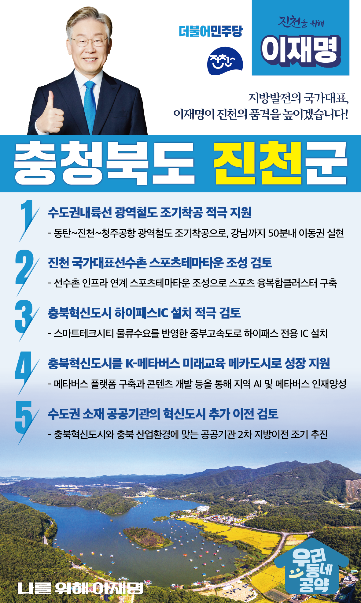

## 충북 지역 공약

# 진천군

### 지방발전의 국가대표, 이재명이 진천의 품격을 높이겠습니다!
> 2022-02-12

존경하는 생거 진천 군민 여러분, 

 

민주당과 이재명은 진천의 발전과 함께해 왔습니다. 특히 지난해 확정된 ‘수도권내륙선 광역철도’는 진천군과 경기도와가 함께 추진했고 좋은 결실을 맺었습니다. 

 

최근 진천은 지방발전의 모범사례가 되고 있습니다. 비수도권 중에 인구증가율과 취업자수 증가율이 최고 수준이고, 주민 1인당 지역내총생산(GRDP)도 전국 최고 수준입니다. 진천군의 눈부신 발전은 국가균형발전의 희망입니다. 

 

아프간 특별공로자들을 품어 안은 ‘미라클 작전’ 진천의 품격을 기억합니다. 대한민국 국가대표 진천이 충청권 핵심지역으로 도약할 수 있도록, 진천군민께 5가지 약속을 드리겠습니다.

 

첫째, 동탄에서 진천을 지나 청주공항까지, 수도권내륙선 광역철도 조기착공을 적극 지원하겠습니다. 

 

수도권내륙선이 놓이면 진천은 강남까지 50분 이내 이동가능한 수도권 생활권이 됩니다. 충청권 광역철도까지 연결되면 진천은 수도권과 충청을 잇는 가교 역할을 할 수 있습니다. 수도권내륙선의 조기 착공, 개통까지 지원을 아끼지 않겠습니다. 진천의 교통 혁명, 이재명이 완성시키겠습니다. 

 

둘째, 진천 국가대표선수촌에 스포츠테마타운 조성을 검토하여 진천을 대한민국 스포츠 중심도시로 육성하겠습니다. 

 

세계적 수준의 진천선수촌이지만 주변지역은 난개발로 울상입니다. 계획적인 개발을 통해 선수촌의 가치를 진천의 가치로 만들어야 합니다. 선수촌 인프라와 연계된 스포츠테마타운 조성 방안 마련을 지원하겠습니다. 스포츠테마타운이 조성되면 국가대표 선수들에게는 좋은 훈련환경이 마련되고, 진천주민들에게는 수준 높은 생활체육 환경과 일자리가 주어질 것입니다.

 

셋째, 충북혁신도시 하이패스IC 설치를 적극 검토하겠습니다. 

 

충북혁신도시와 신척·산수산단 교통량 증가로 진천IC와 북진천IC에 상습정체가 발생하고 있습니다. 현재 개발 중인 스마트테크시티의 물류수요를 반영하여 중부고속도로 하이패스 전용 IC 설치를 적극 검토하겠습니다. 고속도로 접근성을 개선하고 산업단지와 혁신도시의 경쟁력을 높이겠습니다.

 

넷째, 충북혁신도시를 K-메타버스 활용 미래교육의 중심지가 될 수 있게 지원하겠습니다.

 

학령인구비율 충북 1위, 교육연구 공공기관이 집중된 충북혁신도시는 미래교육 개발에 가장 적합한 지역입니다. 진천은 전국 혁신도시 유일 K-스마트 교육시범도시로 지정됐고 카이스트와 함께 지역 인공지능 인재양성에 나서고 있습니다. 진천을 인공지능과 메타버스를 활용한 미래교육의 중심지로 만들어가겠습니다.

 

다섯째, 수도권 공공기관의 혁신도시 추가 이전을 검토하겠습니다.

 

현재까지 충북 혁신도시에 이전된 공공기관은 11개소입니다. 아직 이전하지 않고 수도권에 남아있는 공공기관의 추가 이전이 필요합니다. 충북혁신도시와 충북의 산업환경에 맞는 공공기관 추가 이전을 적극 검토하여 혁신도시 시즌2를 완성하겠습니다.

 

 

이재명은 지킬 수 있는 것만 약속했고, 약속했던 것은 지켜왔습니다.

살기 좋은 진천군의 미래를 위한 약속, 실력과 성과로 입증된 이재명이 반드시 실천하겠습니다.

 

진천 앞으로, 발전 제대로!

진천군민을 위해, 이재명은 합니다! 

						