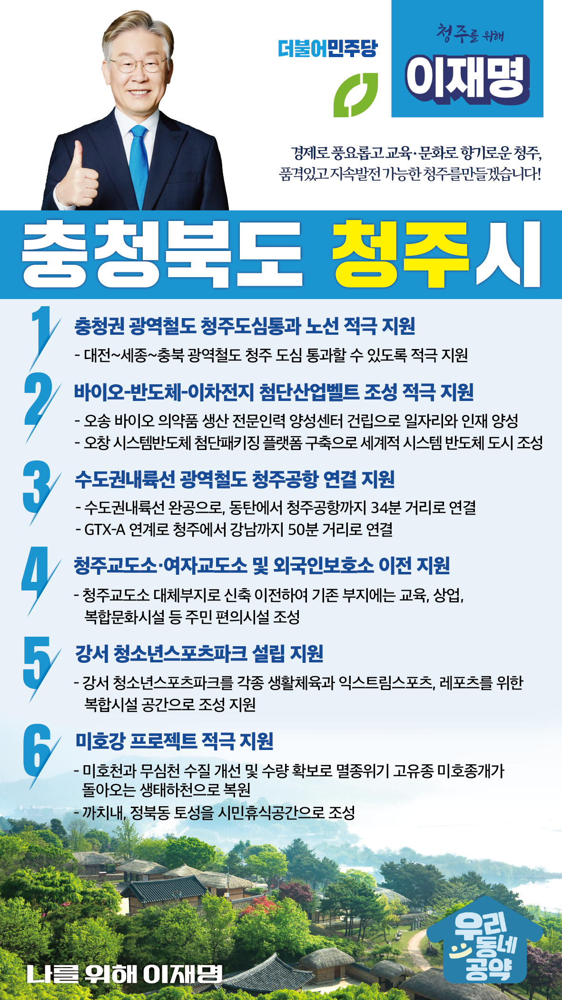

## 충북 지역 공약

# 청주시

### 경제로 풍요롭고 교육·문화로 향기로운 청주를 만들겠습니다! 
> 2022-02-12

존경하는 청주시민 여러분, 더불어민주당 대통령후보 이재명입니다.

 

청주는 현존 최고 금속활자본 직지심체요절을 만들어낸 혁신의 땅입니다. 이제 다시, 청주는 대한민국 첨단산업의 중심으로 발돋움하고 있습니다. 이미 국내 최고 수준인 반도체와 더불어 바이오, 이차전지 산업기반이 조성돼 있습니다. 문재인 정부가 오창에 방사광가속기 유치를 확정하면서 청주는 명실상부 대한민국 첨단산업 대표선수로 우뚝 설 것입니다.

 

교육과 문화의 도시에서 이제는 첨단산업의 전진기지로 발돋움하는 청주! 

 

청주발전을 위한 이재명의 6가지 약속을 말씀드리겠습니다.

 

 

 

첫째, 충청권 광역철도 청주도심통과 노선을 적극 지원하겠습니다. 

지난해 국가철도계획에는 청주도심 통과노선이 확정되지 않아 청주시민들이 안타까워 하고 있습니다. 85만 청주시민의 편리한 교통과 청주 구도심 활력을 위해서는 충청 광역철도는 청주도심을 통과해야 합니다. 대전~세종~충북 광역철도가 청주도심을 통과할 수 있도록 적극 지원하겠습니다.

 

둘째, 청주 중심의 충청권 바이오-반도체-이차전지 첨단산업벨트를 조성하겠습니다.

오송에 바이오 의약품생산 전문인력 양성센터를 건립하여 청주시민에겐 좋은 일자리를, 기업에겐 우수한 인재를 공급하겠습니다. 오창 시스템반도체 첨단패키징 플랫폼을 구축하여 세계적인 시스템 반도체 도시로 거급나게 하겠습니다. 이미 전국 생산액 1위, 수출비중 1위인 이차전지 산업도 더 확대될 수 있도록 적극 지원하겠습니다. 

 

셋째, 수도권내륙선 광역철도를 청주공항까지 연결하겠습니다.

수도권내륙선이 완성되면 동탄에서 청주공항까지 34분 거리로 연결됩니다. GTX-A 연계시 청주에서 강남까지 50분 시대가 열립니다. 수도권 남부 전역에서 청주공항 접근성이 대폭 개선되어, 청주공항이 충청은 물론 수도권 제2공항 역할을 할 수 있도록 지원하겠습니다.

넷째, 청주 서남권 숙원사업인 청주교도소 이전을 지원하겠습니다.

서원구 미평동의 청주교도소는 오랜 기간 청주 서남권 발전을 가로막아 왔습니다. 청주-세종-대전의 충청권 메가시티 완성을 위해, 교도소 이전을 더 이상 미룰 수 없습니다. 청주교도소를 대체부지로 신축 이전하겠습니다. 기존 부지에는 주택뿐 아니라 교육, 상업, 복합문화시설 등 주민 편의시설로 조성하겠습니다.

 

다섯째, 강서 청소년스포츠파크 설립을 지원하겠습니다.

강서동 옛 예비군훈련장 부지에 설립될‘청소년스포츠파크’는 각종 생활체육과 익스트림스포츠, 레포츠를 위한 복합시설입니다. 자라나는 청소년들의 호연지기를 키우고, 청주 주민들의 삶의 질을 높이는 공간이 될 것입니다.

 

여섯째, 미호강 프로젝트를 적극 지원하겠습니다. 

충청권 메가시티의 시대, 청주의 중심은 무심천 시대를 넘어 미호천 시대로 확장되어야 합니다. 미호천과 무심천의 수질을 개선하고 수량을 충분히 확보하여 멸종위기 고유종 미호종개가 돌아오는 생태하천으로 복원하겠습니다. 까치내, 정북동 토성은 역사와 문화를 느끼는 시민휴식공간으로 조성하여 미호천을 서울의 양재천과 같은 대한민국 대표 생태하천으로 만들겠습니다.

 

 

노무현대통령이 시작한 균형발전의 시대, 그 중심에 청주가 있습니다. 

지난 5년, 문재인 정부에서 뿌려진 청주발전의 씨앗이 열매를 맺을 수 있도록, 실행력 강한 지방행정과 자치분권 전문가! 

저 이재명과 함께해 주십시오.

 

청주 앞으로, 발전 제대로! 나를 위해, 청주를 위해! 이재명입니다. 

						