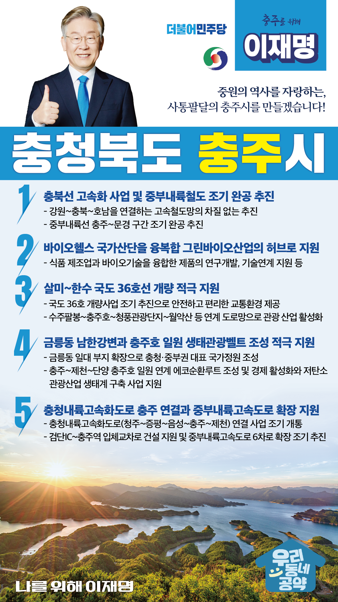

## 충북 지역 공약

# 충주시

### 중원의 역사를 자랑하는, 사통팔달의 충주시를 만들겠습니다!
> 2022-02-12

존경하는 충주시민 여러분, 

 

한반도의 중심, 경기도, 강원도, 경상도와 인접한 충주시는 예로부터 서울로 가는 물자와 사람이 모이는 요충지였습니다. 

팔도의 다른 문화가 어우러지는 상생과 화합의 중원문화의 중심지이자 남한강, 충주호를 낀 호반의 도시이기도 합니다. 

 

지방소멸과 저성장 시대, 국가균형발전은 국가의 최우선 과제입니다.

강원, 호남을 잇는 강호축을 발전시켜 국토를 균형있게 발전시켜야 합니다.  

이재명이 충주의 사통팔달 대한민국 중심도시 도약을 적극 지원하겠습니다.

 

충주발전을 위한 5대 공약을 약속드립니다.

 

 

첫째, 충북선 고속화 사업과 중부내륙철도를 조기에 완공하겠습니다. 

 

충북선 고속화는 강원과 충청, 호남을 연결하는 고속철도망 완성을 위한 핵심사업입니다. 

충북선 고속화로 강원~충북~호남을 연결하는 고속철도망이 차질 없이 추진되도록 정부 차원의 지원을 확대하겠습니다. 

중부내륙선 충주~문경 구간도 조기 완공을 추진하겠습니다. 

 

둘째, 충주 바이오헬스 국가산단을 융복합 그린바이오산업의 허브로 지원하겠습니다. 

 

충주에 조성되는 바이오헬스국가산단이 융복합 그린바이오산업 거점으로 발전되도록 지원하겠습니다. 

식품 제조업과 바이오기술을 융합한 제품의 연구개발, 기술연계를 지원하겠습니다. 

 

셋째, 살미~한수 국도 36호선 개량을 적극 지원하겠습니다. 

 

충주호를 따라 살미면에서 제천 한수면을 잇는 36번 국도는 굴곡이 심하고 노폭이 좁아 사고가 자주 일어나는 도로입니다. 

국도 36호선 개량사업을 조기 추진하여 충주시민 및 관광객들에게 안전하고 편리한 교통환경을 제공하겠습니다. 

 

 

넷째, 금릉동 남한강변과 충주호 일원의 생태관광벨트 조성을 적극 지원하겠습니다.

 

금릉동 남한강변 세계무술공원 부지를 확장하여 충청·중부권 대표 정원이 되도록 지원하겠습니다.

또한, 충주~제천~단양 충주호 일원을 연계한 에코순환루트를 조성하고, 경제 활성화와 저탄소 관광산업 생태계 구축 사업을 지원하겠습니다. 

 

다섯째, 충청내륙고속화도로의 충주 연결과 중부내륙고속도로 확장을 지원하겠습니다.

 

충청내륙고속화도로의 조기 개통과 검단IC에서 충주역까지 연결하는 입체교차로 건설을 지원하겠습니다. 

또한, 중부내륙고속도로의 6차로 확장이 조기에 추진될 수 있도록 돕겠습니다.

 

 

존경하는 충주시민 여러분!

 

충주는 제 동반자의 고향입니다.

충주의 사위 이재명이 충주를 바꾸겠습니다.

 

이재명은 지킬 수 있는 것만 약속했고 약속했던 것은 지켜왔습니다.

살기 좋은 충주시 미래를 위한 약속 실력과 성과로 입증된 이재명이 반드시 실천하겠습니다.

 

충주 앞으로, 발전 제대로!

충주시민을 위해, 이재명은 합니다! 

						