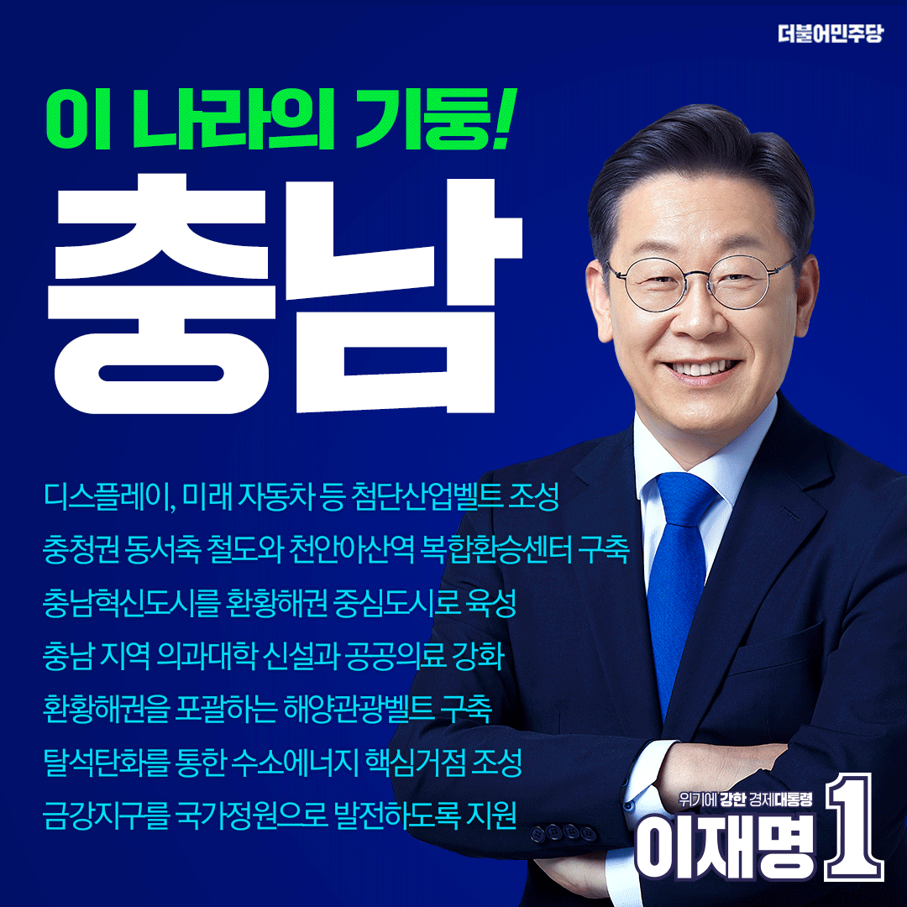

## 지역 공약

# 충청남도

- [계룡](./005_012_001/005_012_001.md)
- [공주](./005_012_002/005_012_002.md)
- [금산](./005_012_003/005_012_003.md)
- [논산](./005_012_004/005_012_004.md)
- [당진](./005_012_005/005_012_005.md)
- [보령](./005_012_006/005_012_006.md)
- [부여](./005_012_007/005_012_007.md)
- [서산](./005_012_008/005_012_008.md)
- [서천](./005_012_009/005_012_009.md)
- [아산](./005_012_010/005_012_010.md)
- [예산](./005_012_011/005_012_011.md)
- [천안](./005_012_012/005_012_012.md)
- [청양](./005_012_013/005_012_013.md)
- [태안](./005_012_014/005_012_014.md)
- [홍성](./005_012_015/005_012_015.md)

### 환황해권의 중심, 첨단산업을 선도하는 충남! 이재명은 합니다!
> 2022-02-14

존경하존경하는 충남도민 여러분, 

대한민국의 중심 충청남도는 국가 균형발전의 교두보로서
대한민국 성장의 중추적인 역할을 수행하고 있습니다.

충남은 코로나 팬데믹으로 어려운 상황임에도 불구하고
지난해 수출 전국 2위, 무역수지 전국 1위를 달성하며
대한민국의 경제회복을 이끌었습니다.

혁신도시로 지정되면서 수도권과 비수도권을 잇는
대한민국 행정의 중심이 되었습니다. 
 
충청의 사위, 저 이재명이 
균형발전을 토대로 충남이 첨단산업을 선도하며, 
국방의 중심, 환황해권 중심도시로서 
새롭게 도약하고 발전할 수 있는 기틀을 마련하겠습니다. 

이를 위한 이재명 정부의 충청남도 7대 공약을 말씀드리겠습니다. 

첫째, 충남에 디스플레이‧미래 자동차 산업‧스마트 국방으로 이어지는 
첨단산업벨트를 조성하겠습니다.

충남은 첨단산업에 최적의 인프라를 갖추고 있습니다. 
충남에는 디스플레이와 이차전지 분야에 있어

세계적 수준의 산업 생태계가 형성돼 있습니다.

디스플레이 분야 소부장 특화단지로 지정된
천안 ․ 아산 지역을 제대로 육성하겠습니다.

전문인력 양성을 지원하고 혁신공정 플랫폼을 구축해
글로벌한 디스플레이 허브로 조성하겠습니다.

아산 스마트밸리 소부장 특화단지에 첨단투자지구를 지정해
국내외 투자기업에 맞춤형 인센티브와 규제 특례를 제공하겠습니다. 

추진 중인 ‘차량용 반도체‧자율주행 R&D캠퍼스 구축’ 사업과 연계해
차량용 반도체 전 주기 지원 플랫폼을 구축하겠습니다. 

도심항공교통 실증기반을 조성해
미래 모빌리티의 핵심 거점으로 육성하겠습니다.

의료 패러다임이 바뀌면서 
디지털 치료제와 같은 헬스케어 시장이 급부상할 것입니다.

국가 디지털 헬스케어 융합 연구단지 조성을 지원해 
미래 의료 신산업을 육성하겠습니다.

논산 ․ 계룡 지역에 조성되고 있는 국방산업단지를 
급변하는 안보환경에 맞춰
스마트 국방산업 클러스터로 확대 발전시켜 나가겠습니다.

국방산업단지 내에 육군 AI 데이터센터와 
첨단 개인 전투 장비를 갖춘 병사의 전력을 파악하기 위한 
워리어 플랫폼 테스트베드 센터 구축,  
방위사업청 방산혁신클러스터 유치를 지원하겠습니다.

군 교육기관과 연계한 군 전문인력 양성과 역량 강화로 
국방 안보의 첨단화를 이끌겠습니다.

둘째, 충남의 교통인프라 확충으로 국가균형발전을 이끌겠습니다.

제4차 국가철도망 구축계획에 
같은 동서축 철도인 달빛내륙철도(광주~대구) 노선은 반영된 반면
충청권과 영남권을 가로지르는 동서횡단철도와 
충북권을 가로지르는 보령선은 반영되지 않았습니다. 

충청권에 한반도 동서축을 잇는 철도가 반드시 필요합니다.

충남 대산에서 천안 ․ 청주를 거쳐 
경북 울진을 연결하는‘동서횡단철도’건설과 
보령에서 부여 ․ 청양 ․ 공주 ․ 세종을 거쳐 
충북선과 연결하는‘보령선’추진을 적극 지원하겠습니다. 

천안 ‧ 아산역의 고속열차와 광역버스, 택시, 전철을 연계한 
복합환승센터 구축을 지원하겠습니다.

관광과 상업시설, 문화복지시설을 확충해
지역 거점 기능을 강화하여 
충남 도민의 편의를 향상시키겠습니다.

셋째, 충남혁신도시를 환황해권 중심도시로 육성하겠습니다.

혁신도시 시즌2를 조속히 추진하겠습니다. 

충남이 2020년 10월 혁신도시로 지정되었지만,
아직까지 이전한 공공기관은 전무합니다. 

수도권 공공기관을 조속히 이전해
지역 성장의 거점으로 육성하겠습니다.

혁신도시를 스마트 탄소중립 도시로 조성하고 특화산업을 육성해
내포신도시가 환황해권 중심지로 도약할 수 있도록 하겠습니다.

넷째, 충남에 의과대학 신설을 지원하고 
공공의료를 강화하겠습니다.

충남에 위치한 국립대학에는 의대가 없으며
의료기관이 일부 지역에 편중돼 있습니다.

도민의 33%가 충남을 벗어난 지역에서 진료를 받는
역외 의료기관 이용률이 전국 최고 수준입니다. 

충남 소재 국립대학에 의과대학 신설을 지원하고 
지역의사제를 도입해 의료복지 수준을 높이겠습니다. 

재난 전문 국립경찰병원을 설립해
비수도권 경찰공무원의 진료 접근성을 높이고 
지역 의료 격차를 해소하겠습니다.

국립경찰병원이 코로나와 같은 대규모 감염병에 대응하는 
지역 의료거점 역할을 수행할 수 있도록 하겠습니다.

다섯째, 관광의 중심 환황해권에 해양관광벨트를 구축하겠습니다.

충남이 추진하고 있는 가로림만 해양정원 조성과 
서천 브라운필드 재자연화, 부남호 역간척, 
금강하구 생태복원 사업을 
국가 차원에서 적극 지원하겠습니다. 

이를 바탕으로 환황해권 관광벨트를 구축하고 
해양 신산업을 육성하겠습니다. 

보령해저터널과 원산안면대교로 이어진 
원산도를 포함해 5개 섬을 연계한 지역이 
글로벌 해양레저 관광도시가 되도록 지원하겠습니다.

주요 관광 거점 간의 연계성을 높이기 위해
가로림만 해상교량 건설 추진 방안을 적극 마련하겠습니다. 

여섯째, 충남에 수소에너지 핵심거점을 조성하고
석탄화력발전 산업의 정의로운 전환을 지원하겠습니다.

전국 석탄화력발전소 중 절반이 충남에 위치해 있습니다.

국내 미세먼지 배출량의 15.9%가 충남에서 배출됩니다.

탈석탄 지역의 정의로운 전환을 적극 추진하겠습니다.

산업대전환에 대비하여 
성공적인 일자리 전환과 경력개발을 관리하는 
정의로운 전환지원센터 설치를 지원하겠습니다.

석탄화력발전소 폐쇄에 따른 일자리 감소와
지역의 경기침체에 대응하기 위해 
기후대응기금을 적시에 배정하겠습니다. 

보령‧태안‧당진에 수소에너지‧산업 기반이 구축되고 있습니다. 

이곳에 수소특화단지를 조성해 
수소의 생산과 유통 인프라를 확대하고 
국가 에너지 수급의 지속가능성을 높이겠습니다. 

수소산업 컨트롤타워 역할을 수행하는 기관 설립을 지원해
관련 기업‧기관을 집적시키고
지역경쟁력을 강화하겠습니다.

일곱째, 금강지구가 국가정원으로 발전하도록 지원하겠습니다.

금강은 충남을 가로지르는 생명수입니다.

금강에 인접한 공주 ‧ 부여 ‧ 청양을 아우르는 정원을 조성해
충남도민의 생태복지를 실현하겠습니다. 

금강과 백제 문화권의 지역 특징을 살려 
천혜의 자연과 역사, 예술이 공존하는 금강지구가 
국가정원으로 발전할 수 있도록 지원하겠습니다. 

존경하는 충남도민 여러분!

4차 산업혁명으로 인한 디지털 대전환,
기후 위기를 극복하기 위한 에너지 대전환은
피할 수 없는 시대적 흐름입니다.

이 전환의 위기를 현명하게 극복하는 것은
국가의 명운을 좌우하는 차기 정부의 핵심 과제입니다.

충남에 육성하는 첨단산업과 수소에너지 거점이
충남을 넘어 국가의 미래 먹거리가 되도록 하겠습니다.

에너지 전환 과정에서 소외되는 충남도민이 없도록
세심하고도 각별한 노력을 기울이겠습니다.

저 이재명이 살아온 여정에는 무수한 위기가 있었지만
이를 돌파하며 기회를 만들어냈습니다.

충청의 사위, 저 이재명이
대전환의 위기를 기회로 만들어
충남과 대한민국을 변화시키겠습니다.

환황해권의 중심, 첨단산업을 선도하는 충남!

이재명은 합니다!

고맙습니다.​  