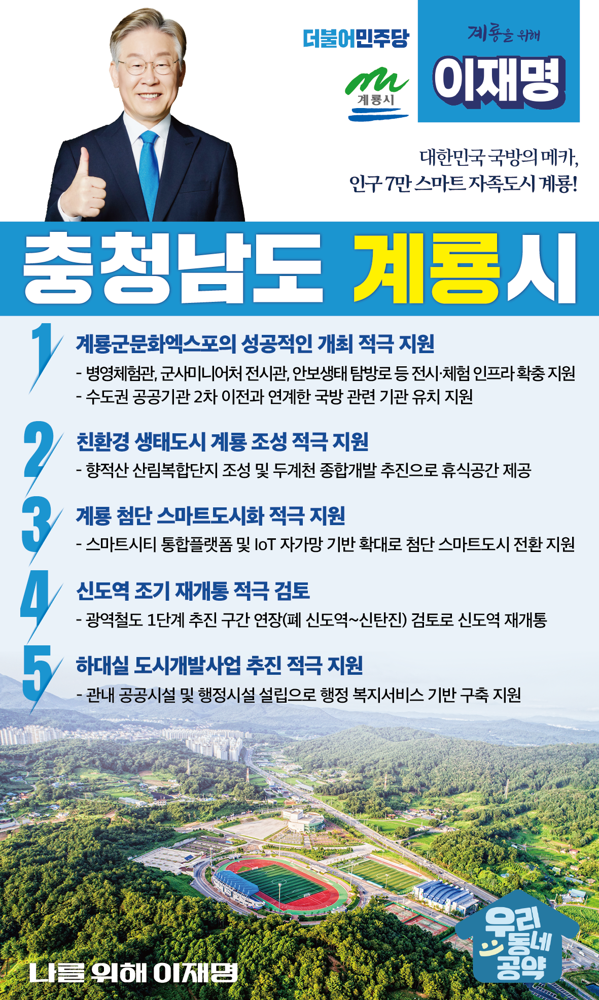

## 충남 지역 공약

# 계룡시

### 대한민국 국방의 메카! 인구 7만의 스마트 자족도시 계룡!
> 2022-02-05

존경하는 계룡시민 여러분,

 

육·해·공 3군본부가 위치한 계룡은 대한민국 국방의 중심지로서 매년 세계군문화엑스포를 개최하며 다양한 국가들과의 군사문화, 장비 교류 등을 이어오고 있으며, 이와 연계한 새로운 성장동력 발굴을 추진하고 있습니다.

또한, 호남고속도로와 호남선 철도가 지나는 위치는 전국 어디에서나 접근성이 매우 우수하여 무한한 시너지를 낼 수 있는 잠재력을 가지고 있으며, 민족의 영산 계룡산을 배경으로 하는 수려한 자연경관도 도시자체가 하나의 공원으로 느껴질만큼 잘 보존되어 있어 이를 활용한 관광산업도 각광받고 있습니다.

 

국방중심지 계룡의 문화와 지리적 특성 그리고 빼어난 자연을 활용하여 “인구 7만의 자족도시”, “자타공인 국방의 메카” 계룡으로 그 위상을 확고히 하기 위한 이재명의 5대 공약을 말씀드리겠습니다.

 

첫째, 계룡군문화엑스포를 성공적으로 개최할 수 있도록 적극 지원하겠습니다. 

‘병영체험관’, ‘군사미니어처 전시관’, ‘계룡 안보생태 탐방로’등 전시·체험 인프라 확충을 지원하겠습니다. 

국방중심 도시로서 계룡시 위상을 강화하기 위해 국방관련 공공기관 2차 이전을 지원하겠습니다. 

 

둘째, 천혜의 자원을 활용하여 ‘친환경 생태도시 계룡’을 만들겠습니다.

 

계룡의 수려한 자연경관을 활용한 향적산 산림복합단지 조성이 성공적으로 마무리될 수 있도록 적극 지원하겠습니다. 

두계천 종합개발을 통해 계룡시민이 편히 쉴 수 있는 수변공원 조성을 돕겠습니다. 

이와 함께 휴양·문화·관광이 어우러진 ‘찾고싶은 계룡’을 만들기 위해 지원을 아끼지 않겠습니다.

 

 

셋째, 스마트도시 계룡시가 되도록 지원하겠습니다. 

 

계룡은 전국에서 면적이 가장 작은 도시이기 때문에 도시개발과 도시관리가 용이합니다.

이미 갖춰진 스마트시티 통합플랫폼과 IoT 자가망 기반을 더욱 확대해 시민이 체감할 수 있는 첨단 스마트도시로 전환을 적극 지원하겠습니다.

 

넷째, 신도역 조기 재개통을 적극 검토하겠습니다. 

 

충청권 광역철도 1단계 구간은 계룡역까지만 계획되어 있습니다. 

인구가 1만 8천 명인 엄사면 주민들은 수혜를 받을 수 없습니다.  

엄사면 주민들의 교통편의를 위해 신도역의 조기 재개통을 적극 검토하겠습니다.  

 

다섯째, 계룡시가 추진중인 하대실 도시개발사업의 성공을 돕겠습니다. 

 

하대실 도시개발사업은 계룡의 새로운 성장동력이 될 것입니다. 

이 사업이 계획대로 추진되도록 적극 지원하겠습니다. 

또한 일상생활에 불편함이 없도록 관내 행정 복지서비스 기반 구축을 지원하겠습니다.

 

 

 

존경하는 계룡시민 여러분!

 

이재명은 지킬 수 있는 것만 약속했고 약속했던 것은 지켜왔습니다.

살기 좋은 계룡 미래를 위한 약속, 실력과 성과로 입증된 이재명이 반드시 실천하겠습니다.

 

계룡 앞으로! 발전 제대로! 

계룡시민을 위해, 이재명! 

						