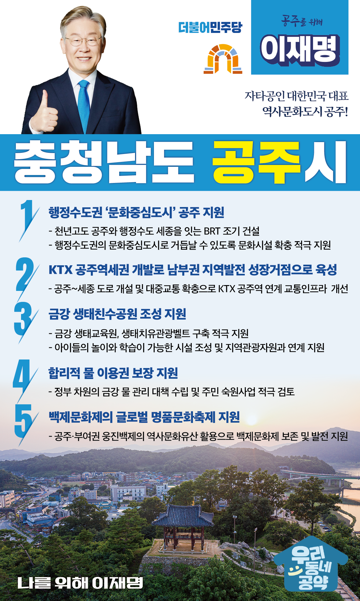

## 충남 지역 공약

# 공주시

### 자타공인 대한민국 대표, 역사문화도시 공주!
> 2022-02-05

존경하는 공주시민 여러분, 

 

공주는 웅진백제의 수도, 충청감영의 소재지였던 유서 깊은 충청의 중심도시입니다. 

특히, 예로부터 교육도시라 불리며, 명문학교와 함께 충남의 교육거점 역할을 했습니다. 

또한 무령왕릉, 금강, 계룡산, 마곡사 등 풍부한 관광자원도 보유하고 있습니다.

 

하지만 섬유산업 등 전통산업의 쇠퇴를 겪으며 지역경제가 위축되고, 지속적인 인구감소로 소멸위기에 처해 변화가 절실한 상황입니다.

  

이제 옛 충청의 중심도시였던 공주시의 위상을 되찾겠습니다.

충청권 메가시티 권역과 세종시 중심의 행정수도권 안에서 공주가 중추적인 역할을 수행하면서 더욱 발전시킬 공주시 5대공약을 말씀드리겠습니다.

 

첫째, 행정수도권 ‘문화중심도시’ 공주로 거듭나겠습니다.

 

지속적인 인구유출로 인해 공주시는 ‘10만 인구 붕괴’라는 거대한 불안에 직면해 있습니다. 위기를 기회로 삼아야 합니다.

천년고도 공주와 행정수도 세종을 잇는 BRT를 조기 건설하고, 행정수도권의 문화중심도시로 거듭날 수 있도록 문화시설 확충을 적극 지원하겠습니다.

 

둘째, KTX 공주역세권을 균형발전 허브로 대전환시키겠습니다.

 

KTX공주역은 주변 상업시설 없이 역만 덩그러니 있습니다.

일일 탑승객이 적지 않지만, 연계 교통인프라가 부족해서 잠재성을 충분히 살리지 못하고 있습니다.

공주와 세종을 연결하는 도로 개설과 대중교통 확충을 통해 공주역이 지역발전의 성장거점이 되도록 적극 지원하겠습니다. 

 

셋째, 아이들과 즐길 수 있는 ‘금강 생태친수공원’조성을 지원하겠습니다.

 

역사·문화·경관이 어우러진 금강에 생태교육원, 생태치유관광벨트 구축을 적극 지원하겠습니다. 

앞으로 공주시민들에게 삶의 질을 높이고 아이들에게는 놀이와 학습을 병행할 수 있는 시설들을 갖추도록 만들겠습니다. 

또한 지역관광사업과 연계해 금강에 활력을 불어넣겠습니다. 

 

넷째, 공주시민의 ‘합리적 물 이용권’ 보장을 지원하겠습니다.

 

예로부터 금강 주변에 터를 잡고 살아온 지역 주민들이 계십니다.

지역주민들의 생활용수와 농업용수에 대한 보완책이 필요합니다.  

정부 차원의 금강 물 관리 대책을 만들고, 주민들의 숙원사업들을 적극 검토하겠습니다.

 

다섯째, 천년고도 공주의 자랑 백제문화제를 ‘글로벌 명품문화축제’로 만들겠습니다.

 

유네스코가 지정한 세계문화유산 공산성, 무령왕릉 외에도 공주에는 수많은 옛 웅진백제의 문화유산이 있습니다.

공주시와 부여권이 매년 공동 개최하고 있는 백제문화제를 보존․발전시켜 세계적 수준의 글로벌 명품문화축제로 거듭날 수 있도록 지원하겠습니다.

 

 

자타공인 대한민국 대표 역사문화도시 공주!

공주 앞으로! 발전 제대로! 공주를 위해, 이재명! 

						