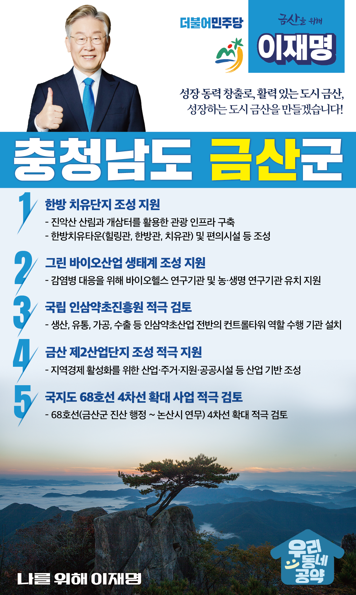

## 충남 지역 공약

# 금산군

### 자타공인 대한민국 대표, 역사문화도시 공주!
> 2022-02-05

존경하는 금산군민 여러분,

 

금산군은 충청남도에서 가장 높은 서대산과 금강 상류의 깨끗한 물을 보유하고 수려한 자연경관을 지닌 청정지역입니다.

1500년 역사를 가진 고려 인삼의 종주지이고, 특히 금산인삼은 2018년 세계중요농업유산으로 등재되어 그 가치와 위상이 세계로 뻗어가고 있습니다.

또한 600억원 이상의 매출을 올리고 있는 명품 추부깻잎은 전국 최고의 맛과 향을 자랑합니다.

한방과 약초가 유명한 힐링의 도시로 금산인삼축제 등 다양한 축제와 함께 칠백의총과 대둔산 자락의 태고사가 있는 충절의 고장입니다.

 

금산군은 인삼산업과 관광산업 육성, 제2산단 조성 등 충남·대전·세종권 도시로서의 강점을 살려 미래 먹거리를 창출해야 합니다. 

이를 위한 이재명의 금산 발전 5대 약속을 말씀드리겠습니다.

 

첫째, ‘한방 치유단지’조성을 지원하겠습니다. 

 

금산의 명산인 진악산 산림과 금산인삼의 시초인 개삼터를 활용해 금산만의 특색있는 관광 인프라가 구축되도록 돕겠습니다. 

인삼과 약초로 원기를 돋우고 한방 마사지와 스파로 치유하는 한방 치유단지 조성으로 대표적 힐링 명소가 되도록 지원하겠습니다. 

 

둘째, 그린 바이오산업 생태계 조성을 지원하겠습니다.

 

코로나19와 같은 감염병 대응을 위해 바이오헬스 연구기관과 농·생명 연구기관 유치를 지원하겠습니다. 

친환경 바이오산업 생태계 조성으로 금산의 새로운 성장동력과 일자리 창출을 돕겠습니다. 

 

셋째, 금산의 인삼·약초 재부흥을 위해 ‘국립 인삼약초진흥원’을 적극 검토하겠습니다.

 

금산의 ‘인삼과 약초’는 대한민국을 대표하는 세계적 특산품입니다.

그러나 담배인삼공사가 민영화된 후 마케팅, 수출, R&D 등 인삼약초산업 컨트롤타워가 없는 상황입니다.

금산인삼이 세계로 도약할 수 있도록, ‘국립 인삼약초진흥원’을 설립을 검토하겠습니다.

 

넷째, 금산 제2산업단지 조성을 적극 지원하겠습니다. 

 

금산은 인구가 계속 감소하고 있어, 인구 증가를 위한 방안이 절실합니다.

국토 중심에 위치한 금산은 세종, 대전의 배후도시로서의 강점을 살릴 수 있습니다.

금산에 제2산업단지가 조성된다면 인구유입으로 지역경제가 활성화될 것입니다. 

 

다섯째, 국지도 68호선 도로 여건을 조속히 개선하겠습니다.

 

국지도 68호선은 충남 남부를 동서로 연결하는 유일한 도로입니다. 

그러나 2차선으로 협소하여 불편함이 큽니다.  

내포신도시와 서해안권과의 교통 여건을 획기적으로 개선하기 위해 68호선의 4차선 확대 사업을 적극 검토하겠습니다. 

 

 

존경하는 금산군민 여러분!

 

이재명은 지킬 수 있는 것만 약속했고 약속했던 것은 지켜왔습니다.

살기 좋은 금산 미래를 위한 약속, 실력과 성과로 입증된 이재명이 반드시 실천하겠습니다.

 

금산 앞으로! 발전 제대로! 

금산군민을 위해, 이재명!  

						
 