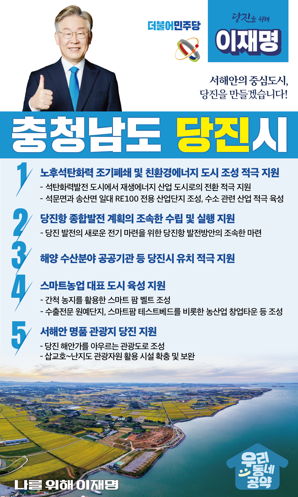

## 충남 지역 공약

# 당진시

### 서해안의 중심도시, 당진!
> 2022-02-05

당진시민 여러분, 더불어민주당 대통령 후보 이재명입니다.

 

당진은 넓은 농지와 국가산업단지, 항만이 있어 성장잠재력이 무궁무진하고 활력이 넘치는 도시입니다. 

농어업과 철강, 에너지, 해양산업 등 국가 주력산업이 조화롭게 어우러져, 지속가능 발전의 토대를 갖추고 있는 곳이 바로 당진입니다.

 

이제 스마트 농어업으로 경쟁력을 높이고, 에너지 전환 위기를 기회로 만드는 한편침체되어 있는 당진항을 활용하여 국가기간 산업을 더욱 고도화 할 때입니다.

 

17만 당진시를 30만 자족도시로 발전시킬 ‘당진 발전 5대공약’을 말씀드리겠습니다.

 

 

첫째, 노후석탄화력발전소를 조기에 폐쇄하고 친환경 에너지 도시로 거듭나도록 적극 지원하겠습니다.

 

노후한 당진석탄화력발전소 1,2,3,4호기가 2029년, 2030년에 폐쇄됩니다. 

기후위기 대응을 위해 불가피한 일이지만, 시민들은 일자리와 지역경제 위축을 걱정합니다. 

당진을 석탄화력발전 도시에서 재생에너지 산업 도시로 전환할 수 있도록 적극 지원하겠습니다. 

당진 석문면과 송산면 일대에 RE100 전용 산업단지를 조성하고, 수소 관련 산업도 적극 육성, 지원하겠습니다.

 

둘째, 당진항 종합발전 계획을 조속히 수립하여, 당진 발전의 새로운 기회를 만들겠습니다.

 

그동안 당진․평택항은 평택항 중심으로 발전해 왔습니다. 

특히 지난해 2월, 오랫동안 끌어왔던 도계분쟁에서 당진시가 패소하면서 시민들의 상실감이 매우 큰 상황입니다. 당진시민들께 위로의 말씀을 드립니다. 

당진항 종합발전 방안을 조속히 마련하여, 전화위복의 계기가 되도록 적극 지원하겠습니다. 

셋째, 당진이 서해안 해양수산 거점도시가 되도록 적극 지원하겠습니다. 

 

당진은 이름 그대로 과거부터 대중국 해양교역의 거점이었습니다.

당진에 해양 수산 분야 공공기관 등의 유치를 적극 지원하여 서해안 시대 명실상부한 해양수산의 거점도시가 될 수 있도록 하겠습니다.

 

넷째, 당진을 스마트 농업을 대표하는 도시로 만들겠습니다.

 

당진은 전국 쌀 생산량 1위 도시입니다.

그 명성에 걸맞게 간척 농지를 활용하여 스마트 팜 벨트를 조성하겠습니다.

수출전문 원예단지, 스마트팜 테스트베드를 비롯하여 농산업 창업타운 등을 만들어 당진의 농업 경쟁력을 획기적으로 제고할 수 있도록 뒷받침하겠습니다.

 

다섯째, 당진을 서해안 명품 관광지로 조성하겠습니다. 

 

수도권에서 가장 가까운 당진은 무한한 관광자원을 가지고 있습니다. 당진의 해안가를 아우르는 관광도로를 조성하겠습니다. 또한, 삽교호에서 난지도에 이르기까지 뛰어난 관광자원들을 적극 활용한 시설을 확충하고 보완하겠습니다.

 

 

서해안의 중심도시 당진, 30만 자족도시 당진으로 거듭날 수 있도록

이재명이 당진의 미래를 새롭게 열어가겠습니다. 감사합니다.

 

당진 앞으로! 발전 제대로!

새로운 당진시를 위해, 이재명! 

						