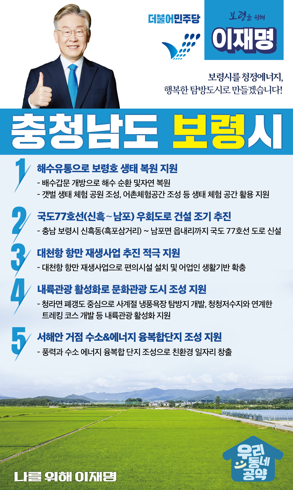

## 충남 지역 공약

# 보령시

### 보령시를 청정에너지, 행복한 탐방도시로!
> 2022-02-05

존경하는 보령시민 여러분,

 

보령은 대천해수욕장과 무창포해수욕장 등으로 유명한 해양관광도시입니다.

또한, 성주사지와 충청수영성 등 자랑스런 문화유산이 잘 보존되어 있는 역사·문화중심도시입니다.

역사와 문화, 천연관광 자원이 공존하는 보령을 더욱 발전시킬 이재명의 보령시 5대공약을 말씀드리겠습니다.

 

첫째, 해수유통으로 보령호 생태 복원을 지원하겠습니다.

 

보령방조제는 농업용수 확보를 위해 건설했으나 담수호 수질악화, 잔여염분농도가 높아서 농업용수로 사용이 어렵습니다. 

막아놓은 배수갑문을 개방해 해수를 순환시키고 망가진 자연을 복원하고 갯벌 생태 체험 공원 조성, 어촌체험공간 조성 등 다양한 생태 체험의 장으로 활용 될 수 있도록 적극 지원하겠습니다. 

 

둘째, 국도77호선(신흑∼남포) 우회도로 건설을 조기에 추진하겠습니다.

 

상시 발생하는 도심구간 교통체증을 해소하기 위해 국도77호선 우회도로 건설이 필요합니다. 

국도 77호선을 통해 대천해수욕장 등 주요관광지와의 접근성을 높이고 물류비용을 절감시키겠습니다. 

 

셋째, 대천항 항만 재생사업 추진을 적극 지원하겠습니다.

 

2002년 준공되어 낙후된 항만구역에 다시 활력을 불어넣겠습니다. 

대천항 항만 재생사업을 통해 다양한 주민 편의시설을 설치하고 어업인의 생활기반을 확충하겠습니다. 

찾기 쉽고 살기 좋은 대천항이 될 수 있도록 돕겠습니다. 

넷째, 내륙관광 활성화로 행복한 문화관광 도시를 만들겠습니다

 

보령의 관광산업은 해양을 중심으로 발달해 있어 내륙관광지 개발이 절실합니다. 

청라면의 폐갱도를 중심으로 사계절 냉풍욕장 탐방지 개발, 청청저수지와 연계한 트레킹 코스 개발 등 다양한 내륙관광이 활성화될 수 있도록 지원을 아끼지 않겠습니다.

 

다섯째, 서해안 거점 수소&에너지 융복합단지 조성을 지원하겠습니다.

 

기후위기 대응을 위해 석탄화력 발전소가 단계적으로 폐지되고 있습니다. 

보령 석탄발전소도 예외가 아닙니다. 

보령에 풍력과 수소 에너지 융복합 단지를 조성하여 에너지 전환 과정에서 친환경 일자리가 만들어질 수 있도록 적극 지원하겠습니다.

 

 

존경하는 보령시민 여러분!

 

이재명은 지킬 수 있는 것만 약속했고 약속했던 것은 지켜왔습니다.

살기 좋은 보령 미래를 위한 약속, 실력과 성과로 입증된 이재명이 반드시 실천하겠습니다.

 

보령 앞으로! 발전 제대로! 

보령시민을 위해, 이재명! 

						