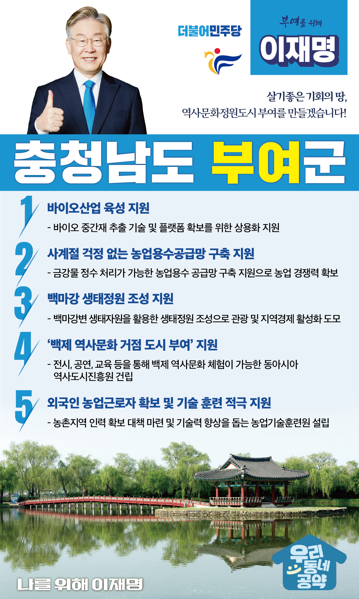

## 충남 지역 공약

# 부여군

### 살기좋은 기회의 땅, 역사문화정원도시 부여!
> 2022-02-05

존경하는 부여군민 여러분

 

부여는 백제의 국호 남부여를 계승한 유일한 도시로 유네스코가 인정한 찬란한 세계유산도시입니다.

관북리 유적과 부소산성, 정림사지, 부여 왕릉원, 나성 등 부여군 전체가 지붕 없는 박물관이라고 할 수 있을 정도로

 

다양한 역사문화 자원을 가지고 있습니다.
또한, ‘굿뜨래’로 대표되는 전국 최고 품질의 농산물을 생산하는 청정농업도시입니다.

 

백제문명의 가치와 전통에 풍부한 휴양‧레저관광이 어우러진 도시, 자타공인 충남 최고의 역사문화도시, 그리고 가장 신뢰받는 청정생태환경과 첨단농업기술을 가진 도시인 부여의 내일을 위한 이재명의 5대 공약을 말씀드리겠습니다.

 

 

첫째, 부여군이 추진하는 바이오산업 육성을 지원하겠습니다. 

 

미래차, 배터리, 시스템 반도체와 함께 미래 4대산업 중 하나로 꼽히는 바이오 산업은 전 세계적으로 각광받고 있는 분야입니다. 

바이오 중간재 추출 기술 및 플랫폼 확보를 위한 상용화를 지원하여 부여가 첨단 바이오소재 시대를 열도록 지원하겠습니다.

 

둘째, ‘사계절 걱정 없는 농업용수공급망’ 구축을 지원하여 물 걱정 없는 부여를 만들겠습니다.

 

부여군에는 1,426ha에 달하는 면적에 걸쳐 시설하우스가 있습니다. 

그러나 지역 특성상 농가에서 사용하는 지하수에 과도한 철분이 함유되어 있어 부여군민들은 오랜 기간 몸살을 앓아왔습니다.

금강물을 정수처리하여 사용할 수 있는 농업용수공급망 구축 지원을 통해 물 걱정 없는 부여를 함께 만들어 나가겠습니다.

 

셋째, 부여하면 떠오르는 랜드마크, ‘백마강 생태정원’ 조성하겠습니다.

 

천혜의 자원인 백마강변 일원의 생태자원을 활용하여 아이들과 함께 즐길 수 있고, 연인과 함께 보고 싶은 풍성한 생태공원이 생길 수 있도록 돕겠습니다. 

부여군민 여러분의 몸과 마음의 안식처 마련을 위해 이재명이 적극 지원하겠습니다.

 

넷째, 부여를 백제 역사문화거점도시로 우뚝 세우겠습니다. 

 

부여가 백제의 문화와 역사를 체험할 수 있는 도시가 되도록 최선을 다하겠습니다. 

전시, 공연, 교육 체험을 통해 고대 백제를 이해하고 느낄 수 있는 시설 건립을 지원하겠습니다. 

 

다섯째, 외국인 농업근로자 확보와 기술 훈련을 적극 지원하겠습니다.  

 

농촌 고령화와 청년층 농업기피에 따라 부여에서는 외국인근로자 고용이 해마다 증가하고 있습니다. 

그러나 최근 코로나19로 노동력 수급이 어려워지면서 우리 농업에 큰 위기가 닥쳐왔습니다. 

안정적으로 외국인 근로자를 확보하고, 기술력을 높이기 위한 시설 설립을 적극 지원하겠습니다. 

 

 

 

살기 좋은 기회의 땅 부여! 역사문화정원도시 부여!

부여 앞으로! 발전 제대로!

부여를 위해, 이재명! 

						