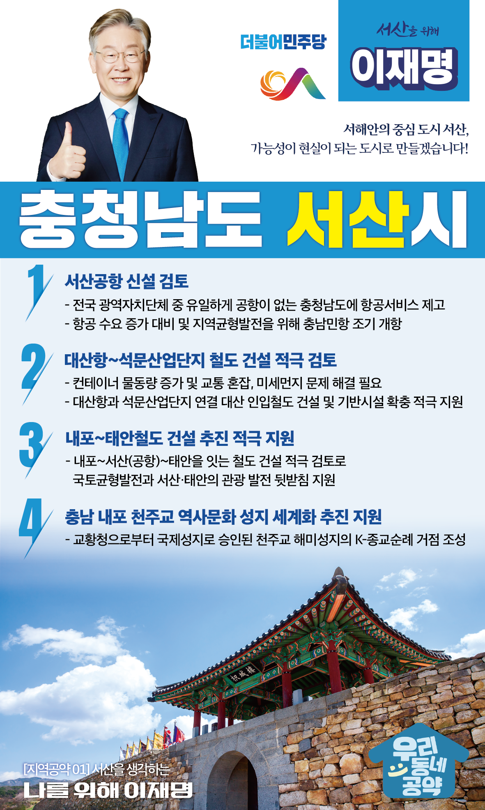

## 충남 지역 공약

# 서산시

### 가능성이 현실이 되는 도시, 서산!
> 2022-02-05

존경하는 부여군민 여러분존경하는 충남 서산시민 여러분, 더불어민주당 대통령 후보 이재명입니다.

 

서산은 예로부터 넉넉하고 인심 좋은 고장으로 알려져 있습니다.

지금은 충남을 넘어 대한민국의 성장을 이끄는 선도 도시가 되었습니다.

 

꾸준히 인구가 증가하고, 일자리도 점차 늘고 있습니다. 

 

한 때는 대규모 간척사업과 석유화학 단지가 서산 발전을 이끌었다면 이제는 첨단산업과 미래산업으로 서산을 서해안 중심 도시로 키워야 할 때입니다. 

서산 테크노벨리의 자동차산업, 석유화학단지의 첨단정밀산업으로의 전환, 그리고 수소산업을 적극 육성해야 합니다. 

관광도 빼놓을 수 없는 발전 자원입니다.

 

서산의 미래를 열어 나갈 이재명의 ‘서산 발전 4대 공약’을 말씀드리겠습니다.

 

첫째, 충남의 하늘길을 열기 위해 서산공항 신설을 검토하겠습니다.

 

광역자치단체 중 충남만 유일하게 공항이 없습니다. 

항공 서비스 소외 지역이란 불명예를 이제 없애야 할 때입니다. 

서산이 그 중심입니다.

서산민항은 점차 증가하고 있는 항공 수요에 대비할 뿐만 아니라 지역균형발전을 위한 핵심적인 수단입니다. 

새정부에서 서산공항 신설을 검토하겠습니다.

 

둘째, 대산항부터 석문산업단지까지 철도 건설을 적극 검토하겠습니다.

 

서산지역의 물류수송 방법은 현재 국도가 유일합니다. 

그에 따른 교통 혼잡과 미세먼지 등을 줄이기 위해 친환경 교통수단인 철도 건설이 반드시 필요합니다. 

컨테이너 물동량이 증가하는 대산항과 석문산업단지를 연결하는 대산 인입철도 건설과 기반시설 확충을 적극 지원하겠습니다.

 

셋째, 내포 ~ 태안철도 건설이 추진되도록 적극 지원하겠습니다.

 

충남 서북부권 관광교통수단이 서해안 고속도로 밖에 없는 실정입니다. 

서산태안을 찾는 관광객은 늘 교통체증에 시달리고 있습니다. 다양한 교통 인프라 구축이 필요합니다. 

내포∼서산(공항)∼태안을 잇는 철도 건설을 적극 검토하여 국토균형발전과 서산태안의 관광발전을 뒷받침하겠습니다.

 

넷째, 충남 내포 천주교 역사문화 성지 세계화 추진을 지원하겠습니다.

 

천주교 해미 성지는 병인박해기에 122명, 그 외에도 많은 무명 순교자가 나온 곳입니다.  

프란치스코 교황께서 직접 방문하셨고, 교황청으로부터 국제성지로 승인된 역사적인 장소입니다. 

전 세계인이 찾은 K-종교순례의 거점으로 만들어야 합니다. 

국가 차원의 지원으로 종교를 초월한 대한민국의 종교문화 브랜드가 될 수 있도록 지원하겠습니다. 

 

 

서산 앞으로! 발전 제대로!

새로운 서산을 위해, 이재명!

						