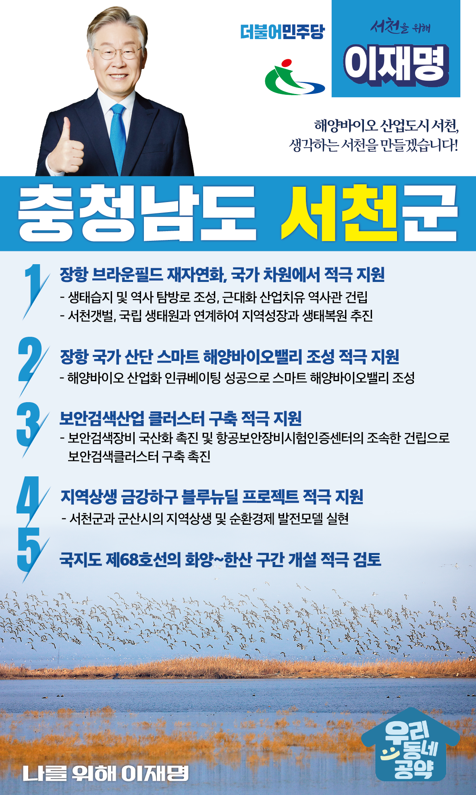

## 충남 지역 공약

# 서천군

### 해양바이오 산업도시 서천, 생각하는 서천!
> 2022-02-05

존경하는 서천군민 여러분,

 

서천은 충남 서해안 최남단 작은 도시이지만, 잘 보존된 자연경관과 바다와 인접하여 각종 해산물이 풍부하고 천연 농수산물이 풍부한 지역입니다. 

이런 천혜의 환경을 가진 서천을 더욱 발전시킬 이재명의 5대 공약을 말씀드리겠습니다.

 

첫째, 장항 브라운필드 재자연화를 국가 차원에서 적극 지원하겠습니다.

 

일제강점기 수탈의 아픔을 간직하고 있는 장항 브라운필드 재자연화를 지원하겠습니다. 

역사적 아픔을 극복하고 희망의 공간으로 탈바꿈할 수 있도록 돕겠습니다.  

서천갯벌, 국립 생태원과 연계하여 브라운필드가 생태복원의 대표 모델이 되도록 하겠습니다.   

 

둘째, 장항 국가 산단에 스마트 해양바이오밸리 조성을 적극 지원하겠습니다.

 

해양바이오산업은 고부가가치 해양산업으로 해양환경 오염 문제 해결을 위한 대안으로 급부상하고 있습니다. 

서천군이 해양바이오 산업화 인큐베이팅을 성공하고 스마트 해양바이오밸리가 조성될 수 있도록 돕겠습니다. 

 

셋째, 서천군에 보안검색산업 클러스터가 구축되도록 적극 지원하겠습니다.

 

항공·철도·선박 테러와 안보위협이 지속적으로 증가하고 있습니다. 

서천군이 추진하고 있는 보안검색산업 클러스터가 구축되면 외국의 장비와 기술에 의존했던 보안검색장비의 국산화를 촉진할 수 있습니다. 

항공보안장비시험인증센터를 조속히 건립하여 보안검색클러스터 구축을 촉진하겠습니다. 

 

넷째, 금강하구 지역의 상생발전을 위한 ‘블루뉴딜 프로젝트’를 적극 지원하겠습니다.

 

금강하구는 생태환경, 역사문화 등 발전 잠재력을 보유하고 있습니다.  

서천군과 군산시가 지역 간 연결성(Connectivity)을 높이고 금강하구의 다양하고 풍부한 강과 해양자원을 활용하기 위한 ‘블루뉴딜 프로젝트’를 돕겠습니다.  

 

 

다섯째, 국지도 제68호선의 화양~한산 구간 개설을 적극 검토하겠습니다.

 

국지도 제68호선은 서천의 주요 기간도로망을 연결하는 중요한 도로입니다. 

제68호선 미개통구간인 화양~한산 간 도로 개설을 적극 검토하겠습니다.

이를 통해 서천의 주요 관광지 접근성과 교통환경을 개선하겠습니다. 

 

 

해양바이오 산업도시 서천!

서천 앞으로! 발전 제대로! 서천을 위해, 이재명!

						