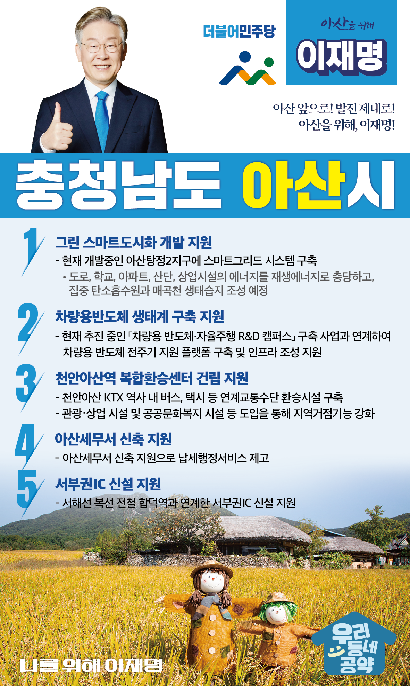

## 충남 지역 공약

# 아산시

### 아산 앞으로, 발전 제대로!
> 2022-02-05

존경하는 아산시민 여러분, 더불어민주당 대통령 후보 이재명입니다.

 

중부권 중심 도시로서의 발돋움을 준비하는 아산은 계속해서 역동적으로 발전하고 있습니다. 

KTX 천안아산역을 중심으로 비수도권 유일의 108만평 신도시가 아산에 들어서고, 삼성디스플레이, 현대자동차 등 대기업과 중소·중견 기업이 지역의 산업을

고루 이끌고 있습니다.

또한, 강소특구, 디스플레이 특화단지, 지식산업센터 등 대한민국 미래 먹거리 산업이 아산에 둥지를 틀고, 더 큰 도약을 준비하고 있습니다.

 

이런 잠재 가능성 도시 아산을 기존 신도시와는 다른, 새로운 미래형 혁신도시로 만들겠습니다.

아산에서 살고, 아산에서 일하고, 아산에서 즐기고 쉴 수 있는 30만 자족형 혁신도시 아산을 만들기 위한 ‘이재명의 아산 발전 5대 공약’을 말씀 드리겠습니다.

 

 

첫째, 아산신도시를 대한민국 대표 ‘그린 스마트도시’ 개발을 지원하겠습니다.

 

현재 개발 중인 아산탕정2지구에 스마트그리드 시스템을 구축하여 도로, 학교, 아파트, 산단, 상업시설의 에너지를 재생에너지로 충당하고, 집중 탄소흡수원과 매곡천 생태습지를 조성해 대한민국 대표 저탄소 녹색도시가 되도록 지원하겠습니다. 

미세먼지 걱정 없는 도시, 시민이 체감하는 건강한 혁신도시. 차원이 다른 아산을 만들어가겠습니다. 

 

둘째, 차량용반도체 생태계 구축을 통해 ‘미래 자동차 거점’이 되도록 지원하겠습니다.

 

현재 추진 중인 「차량용 반도체·자율주행 R&D 캠퍼스」 구축 사업과 연계하여 차량용 반도체 全주기 지원 플랫폼을 구축하고, 핵심 기반기술 확보와 공동기술 개발 및 사업화를 지원하는 인프라 조성을 지원하겠습니다.

 

셋째, ‘천안아산역 복합환승센터 건립’을 지원하겠습니다.

 

하루 2만 명이 이용하는 KTX 천안아산역사 앞에 KTX, 전철, 광역버스가 한 곳에 모이도록 지원하겠습니다.

이 센터는 아산시민은 물론 충남 서북부권 주민의 KTX역 이용을 더 편리하게 하여, KTX 천안아산역이 명실상부한 대한민국 대표 KTX역이 될 것입니다.

 

넷째, ‘아산세무서 신축’으로 납세자의 편의와 지역균형발전을 이루겠습니다.

 

현재 아산세무서는 민간건물에서 임시로 운영되고 있습니다. 

30만 자족도시 아산의 위상과 납세자의 편의성을 위해 새로운 청사가 필요합니다.

아산세무서 신축을 통해 아산시민 여러분이 편리하게 이용하실 수 있도록 하겠습니다. 

 

다섯째, ‘신창IC 신설’을 지원하여 중부권 대표 산업도시 아산의 접근성을 높이겠습니다.

 

삼성디스플레이, 현대자동차 아산공장, 아산테크노밸리 등 아산은 중부권 대표 산업도시로 발돋움했습니다. 아산시의 접근성 향상과 물류비용 절감을 위해 서해선 복선 전철 합덕역과 연계한 신창IC 신설이 필요합니다.

산업도시 아산이 사통팔달 교통중심 도시 아산으로 거듭나도록 지원을 아끼지 않겠습니다.

 

 

살고 싶은 도시 아산.

혁신 미래도시 아산. 

이재명이 아산의 미래를 새롭게 열어가겠습니다. 

 

아산 앞으로! 발전 제대로!

아산을 위해, 이재명!  

						