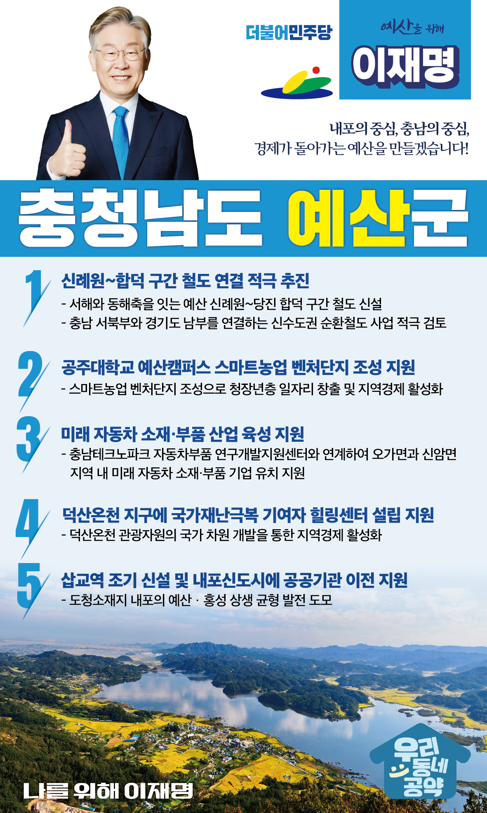

## 충남 지역 공약

# 예산군

### 내포의 중심, 충남의 중심, 경제가 돌아가는 예산!
> 2022-02-05

존경하는 예산군민 여러분,

 

예산은 예로부터 예절을 제일의 덕목으로 삼은 효(孝)사상이 깊은 곳이자 물자가 풍요로운 충남의 대표적인 고장입니다.

그러나 근래에 여러 어려움도 많습니다.

예산이 과거의 명성에 맞는 지속가능한 전원도시가 될 수 있도록 하겠습니다.

예산의 변화를 위한 이재명의 다섯가지 약속을 말씀드리겠습니다.

 

첫째, 신례원~합덕 구간 철도 연결을 적극 추진하겠습니다. 

 

충남 북부와 경기 남부는 대한민국 산업, 교통, 물류의 핵심거점으로 성장하고 있습니다. 

예산 신례원과 당진 합덕 구간에 철도를 신설하여 서해와 동해축을 잇고 충남 서북부와 경기도 남부를 연결하는 신수도권 순환철도 사업을 적극 검토하겠습니다. 

 

둘째, 공주대학교 예산캠퍼스에 스마트농업 벤처단지 조성을 지원하겠습니다.

 

공주대 예산캠퍼스에는 농축수산업과 식품 관련 분야의 전문가와 학생이 많습니다. 

또한 18만평 이상의 넓은 캠퍼스도 갖추고 있습니다.

이 곳에 스마트농업 벤처단지 조성으로 청장년층의 새로운 일자리와 지역경제 활성화의 원천이 될 수 있도록 돕겠습니다.

 

셋째, 예산에 미래 자동차 소재·부품 산업 육성을 지원하겠습니다. 

 

예산에는 충남테크노파크 자동차부품 연구개발지원센터가 있습니다. 

이와 연계하여 오가면과 신암면 지역에 미래 자동차 소재·부품 기업이 들어올 수 있도록 지원하겠습니다.  

이를 통해 지역 일자리를 늘리고 지역경제가 활성화될 수 있도록 돕겠습니다. 

 

넷째, 덕산온천에 국가에 기여하신 분들을 위한 힐링센터 설립을 지원하겠습니다.

 

코로나처럼 국가재난 극복에 기여하신 분들을 위한 힐링 공간이 필요합니다.

예산에는 덕산온천이 있습니다. 천혜의 힐링 치유 공간입니다. 

덕산온천 지역에 국가에 기여하신 분들을 위한 힐링센터 설립을 지원하여 더 많은 국민들이 예산을 방문할 수 있도록 돕겠습니다.

다섯째, 삽교역을 조기에 신설하고 내포신도시에 공공기관 이전을 지원하겠습니다. 

 

내포신도시는 충남의 도청소재지이자 혁신도시인 수부도시입니다. 

또한 예산군민의 숙원사업이었던 삽교역 신설이 확정됐습니다.

삽교역을 조기에 완공하고 내포신도시에 공공기관 이전을 지원하여 예산이 발전되도록 하겠습니다. 

 

 

존경하는 예산군민 여러분!

 

이재명은 지킬 수 있는 것만 약속했고 약속했던 것은 지켜왔습니다.

살기 좋은 예산 미래를 위한 약속, 실력과 성과로 입증된 이재명이 반드시 실천하겠습니다.

 

예산 앞으로! 발전 제대로! 

예산군민을 위해, 이재명!  

						