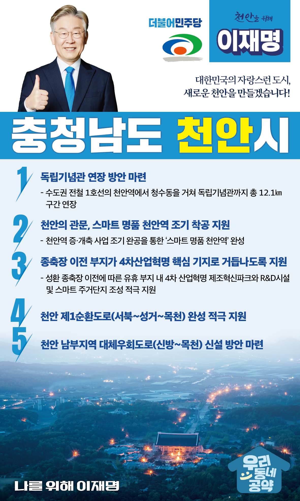

## 충남 지역 공약

# 천안시

### 대한민국의 자랑스런 도시, 새로운 천안!
> 2022-02-05

존경하는 천안시민 여러분,

 

‘하늘 아래 가장 편안한 도시’ 천안은 천안아산 KTX역을 중심으로 발달한 교통인프라와 삼성SDI 등 대기업의 풍부한 일자리로 높은 거주만족도를 자랑하는 자타공인 충청의 중심도시입니다.

 

또한, 충청을 대표하는 도농복합도시로 농업이 고루 발달하여 천안배, 입장포도, 병천오이, 수신메론 등 지역을 대표하는 우수한 특산물이 풍부해 미래 대한민국의 핵심거점으로 부상하고 있습니다. 인구 100만이 살아도 부족함 없는 행복도시 천안의 발전을 위한 5대 공약을 말씀드리겠습니다.

 

 

첫째, 수도권 전철의 독립기념관 연장을 적극 검토하겠습니다.

천안에는 민족정신이 담겨있는 독립기념관이 있습니다.

그러나, 교통접근성이 매우 떨어져 자유롭게 방문하기가 어렵습니다.

수도권 전철 1호선의 천안역에서 독립기념관까지 연장하는 방안을 적극 검토하겠습니다, 독립운동의 역사를 알리고 민족정신을 함양하며, 천안의 가치를 높이겠습니다. 

 

둘째, 천안의 관문, 스마트 명품 천안역 조기 착공을 지원하겠습니다.

벌써 18년째 임시역사로 운영되고 있는 천안역이 새로운 천안역로 바뀌는 증개축 설계가 다시 재개되었습니다.

천안시민의 자랑이 될 “스마트 명품 천안역”로 탈바꿈 할 수 있도록 조기 착공을 적극 지원하겠습니다.

 

셋째, 종축장 이전 부지가 4차산업혁명 핵심 기지로 거듭나도록 지원하겠습니다.

 

천안시민의 50년 숙원이었던 성환 종축장이 드디어 이전합니다. 

천안시가 계획하는‘4차 산업혁명 제조혁신파크’와 R&D시설을 조성하고 신성장 산업 일자리 창출과 스마트 주거지역이 되도록 적극 지원하겠습니다.

 

넷째, 천안 제1순환도로 완성을 적극 지원하겠습니다.

 

천안은 심각한 교통정체로 도심축 확대가 저해되고 교통흐름 개선이 절실합니다. 

서북-성거-목천에 이르는 제1순환도로를 건설하여 천안 각 지역을 연결하고 교통정체로 인한 주민의 불편을 해소할 수 있도록 적극 지원하겠습니다.

 

다섯째, 천안 남부지역에 대체우회도로(신방~목천) 신설을 적극 검토하겠습니다.

 

상습 교통 정체구간인 국도 21호선 동쪽 지역의 교통량 분산이 필요합니다.

천안 남부권의 교통 혼잡 완화와 주민 불편 해소를 위해 신방~목천 구간의 대체우회도로 신설을 적극 검토하겠습니다.

 

 

존경하는 천안시민 여러분

 

이재명은 지킬 수 있는 것만 약속했고 약속했던 것은 지켜왔습니다.

살기 좋은 천안시 미래를 위한 약속, 실력과 성과로 입증된 이재명이 반드시 실천하겠습니다.

 

천안 앞으로! 발전 제대로!

천안시민을 위해, 이재명은 합니다. 

						