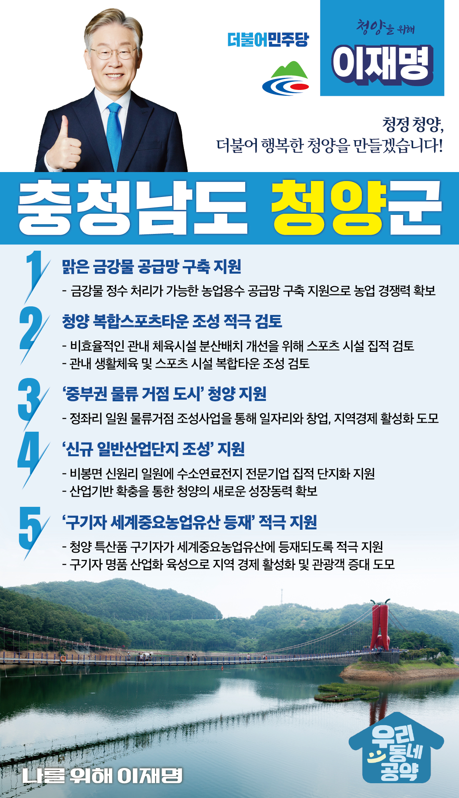

## 충남 지역 공약

# 청양군

### 청정 청양, 더불어 행복한 청양!
> 2022-02-05

존경하는 청양군민 여러분, 

 

청양은 예로부터 충남의 알프스로 불리며 청정하고 아름다운 지역으로 널리 알려진 충남의 중심입니다.

 

지리적으로는 충남 서해와 내륙을 연결하는 교통의 중심지이고, 인재 양성의 중요성을 일찍부터 알고 전국에서 가장 빨리 무상교육의 시대를 연 교육 선진 지역입니다. 

아울러, 청양고추·구기자를 전국 제일의 농산물로 만든 민관 협력 정책으로 전국 각지에서 협력 행정을 배우러 오는 자랑스러운 고장입니다.  

 

청양을 복지와 농업이 어우러진 일류 지역으로 만들고, 아이부터 어르신까지 살기 좋은 ‘13만의 청양시대’로 나아가기 위한 이재명의 5대 공약을 말씀드리겠습니다.

 

첫째, ‘맑은 금강물 공급망 구축’을 지원해 물 걱정 없는 청양을 만들겠습니다.

금강변을 따라 쭉 이어지는 다양한 원예작물은 청양의 자랑입니다. 

그러나 지역 특성상 지하수에 철분이 과도하게 함유되어 있어 청양군민은 오랜기간 몸살을 앓아왔습니다. 

금강물을 정수처리하여 사용할 수 있는 농업용수공급망 구축을 지원해 물 걱정 없는 청양을 만들겠습니다. 

 

둘째, ‘청양 복합스포츠타운’조성을 적극 검토하겠습니다.  

청양은 성공적인 스포츠마케팅으로 수많은 체육대회를 유치해 큰 성과를 냈습니다. 

그러나, 흩어져 있는 관내 체육시설 탓에 대회 운영의 효율이 떨어지는 아쉬움도 있습니다.

스포츠시설 집적을 적극 검토하여 스포츠도시 청양의 위상이 높아지도록 지원하겠습니다. 

 

셋째, ‘중부권 물류거점도시’ 청양으로 거듭납니다.

청양이 중부권 교통중심지가 되도록 지원하고, 청양군이 추진하고 있는 정좌리 일원의 물류거점 조성사업을 통해 일자리와 창업, 지역경제 활성화로 이어질 수 있도록 돕겠습니다.  

 

넷째, 청양군이 추진하는 ‘신규 일반산업단지’조성을 지원해 청양에 새로운 활력을 불어넣겠습니다.

청양의 열악한 산업 기반과 양질의 일자리 부족, 인구 감소의 악순환. 이제 끝내겠습니다. 

비봉면 신원리 일원에 수소연료전지 전문기업 집적 단지화를 지원하고, 산업기반을 확충하여 청양의 새로운 성장동력이 확보되도록 지원하겠습니다. 

 

다섯째, 구기자가 세계중요농업유산에 등재되도록 적극 지원하겠습니다. 

구기자는 몸이 허약하여 생긴 병을 다스리고 근육과 뼈를 강하게 하며 정기를 만드는 것으로 알려져 있습니다. 

청양의 특산품인 구기자가 세계중요농업유산에 등재될 수 있도록 적극 지원하겠습니다. 

또한 기자 명품 산업화 육성으로 지역경제 활성화 및 관광객 증대를 이뤄내겠습니다.

 

 

 

더불어 행복한 청양!

청양 앞으로! 발전 제대로! 청양을 위해, 이재명! 

						