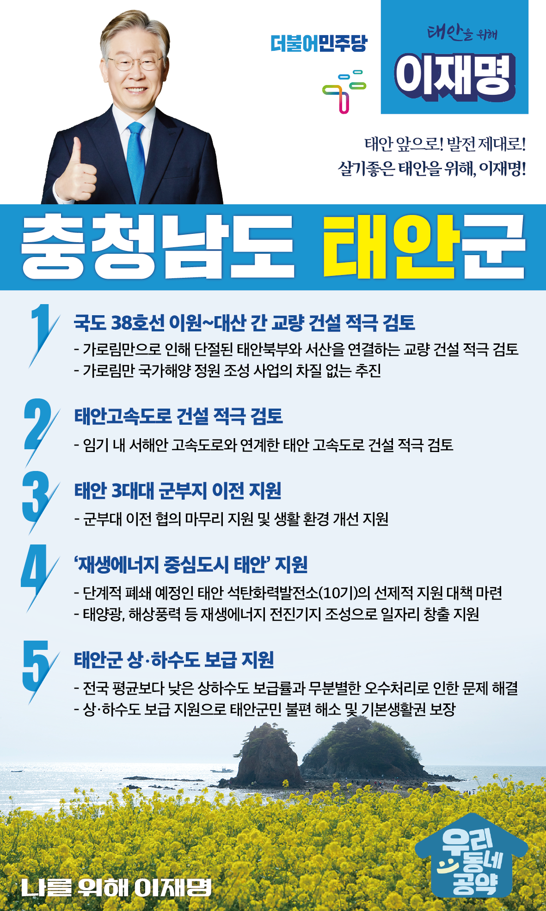

## 충남 지역 공약

# 태안군

### 태안 앞으로, 발전 제대로! 
> 2022-02-05

존경하는 충남 태안군민 여러분, 더불어민주당 대통령 후보 이재명입니다.

 

태안은 2007년 기름유출 사고를 이겨내고 아름다운 자연을 지켜낸 대한민국 위기 극복과 자원봉사의 상징입니다.

태안은 풍부한 해산물, 아름다운 백사장과, 울창한 소나무 숲, 향기로운 꽃향기로 국민의 사랑을 받는 휴양과 치유의 고장입니다.

 

천연의 자연환경을 지키고 보존하면서도 더욱 살기 좋은 태안군을 만들 이재명의 ‘태안 발전 5대 공약’을 말씀드리겠습니다.

 

첫째, 국도38호선 이원~대산 간 교량 건설을 적극 검토하겠습니다.

 

태안 북부 원북과 이원은 거리상 서산 대산과 가깝지만 가로림만이 가로막아 발전이 더딥니다. 

국도 38호선 이원~대산 교량 건설을 적극 검토하여 태안의 균형발전을 앞당기겠습니다. 

더불어 가로림만 국가해양정원 조성 사업도 차질없이 추진하겠습니다.

 

둘째, 태안 고속도로 건설을 적극 검토하겠습니다.

 

태안은 수도권과 가까운 지역임에도 고속도로가 없어 접근이 어렵습니다. 

서해안 고속도로와 연계한 태안 고속도로 건설을 적극 검토하여 아름다운 태안을 더 빠르게 찾아올 수 있도록 하겠습니다.

 

셋째, 태안 3대대 군부지 이전을 지원하겠습니다.

 

태안 읍내 3대대 군 부지를 태안군민에게 돌려드리겠다는 약속이 이행되지 않고 있습니다. 

국방부와 부대 이전협의를 신속히 마무리하고, 태안군민들의 생활 환경이 획기적으로 개선될 수 있도록 지원하겠습니다.

 

넷째, 에너지 대전환 시대, 태안을 재생에너지 중심지로 만들겠습니다.

 

기후위기 탄소중립 방향에 따라 태안 석탄화력발전소 10기도 단계적 폐쇄가 불가피합니다. 

이에 발전소와 협력업체 종사자의 고용불안과 지역경제 침체가 우려됩니다. 

태안군을 태양광, 해상풍력 등 재생에너지 전진기지로 만들겠습니다. 

에너지 대전환을 통해 이전보다 더 많은 일자리를 만들어 고용불안을 해소하고 태안이 지속가능한 경제 발전의 모델이 될 수 있도록 하겠습니다.

 

다섯째, 태안군 상‧하수도 보급을 지원하여 쾌적한 삶을 제공하겠습니다.

 

환경보호 등을 이유로 태안군 상‧하수도 보급률이 전국 평균에 미치지 못합니다. 

개인이 설치한 지하수와 오수처리시설이 제대로 관리되지 않아 오히려 환경을 해치는 악순환이 반복되고 있습니다. 

상‧하수도의 보급을 지원하여 지역주민의 불편 해소하고 기본생활권을 보장하겠습니다.

 

 

이재명은 태안군민과 함께 

자연을 지키며, 더 성장하는 태안과 대한민국을 만들 것을 약속 드립니다.

 

태안 앞으로! 발전 제대로!

살기 좋은 태안을 위해, 이재명! 

						