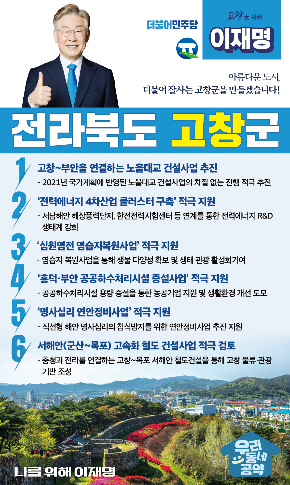

## 전북 지역 공약

# 고창군

### 아름다운 도시, 더불어 잘사는 고창군!
> 2022-02-10

존경하는 고창군민 여러분,

 

유네스코 5관왕의 세계유산도시 고창은 내륙과 바다의 풍부한 자원을 바탕으로 서해안권의 핵심도시로 입지를 굳건히 하고 있습니다.

남북으로 충청과 전남권, 동서로는 영남권과의 교류로 서해안권뿐만 아니라 내륙의 교통과 물류의 중요한 거점이 되고 있습니다.

 

고창이 다시한번 과거의 영광을 되찾고 환황해권시대의 핵심도시로 발전할 수 있도록 만들겠습니다.

사람과 물류가 모여들어 서해안 경제중심도시로 발돋움하고, 세계자연유산 갯벌 등 천혜의 자원을 통해 생태관광의 수도로 도약할 수 있도록 이재명의 고창 발전 6대 공약을 말씀드리겠습니다. 

 

 

첫째, 고창~부안을 연결하는 노을대교 건설사업을 차질 없이 추진하겠습니다. 

고창군의 30년 숙원사업인 노을대교 건립이 지난해 국가계획에 반영되었습니다.  

이 사업이 차질 없이 추진될 수 있도록 지원하여 지역경제 성장을 돕겠습니다. 

 

둘째,‘전력에너지 4차산업 클러스터 구축’을 적극 지원하겠습니다. 

고창에 있는 서남해안 해상풍력단지는 국내 최대 신재생에너지 단지입니다. 

한전 전력시험센터는 세계적 수준의 신기술 시험·연구시설을 갖추고 있습니다. 

이러한 시설과 연계하여 고창의 전력에너지 R&D 생태계를 강화하겠습니다. 

고창에 신재생에너지 관련 일자리가 넘치는 곳으로 만들겠습니다. 

 

셋째, ‘심원염전 염습지복원사업’을 적극 지원하겠습니다. 

심원염전은 유네스코 생물권보전지역이자 세계자연유산인 고창갯벌과 연접해있습니다.

염습지 복원사업을 성공적으로 마무리하여 생물다양성을 확보하고 염생태계를 보전하고 생태관광을 활성화하겠습니다. 

 

넷째, ‘흥덕·부안 공공하수처리시설 증설사업’을 적극 지원하겠습니다. 

고창에는 복분자 농공단지와 흥덕 농공단지 입주업체가 계속 늘고 있습니다. 

하수 배출량이 증가하고, 처리구역이 확대되어 시설증설이 필요합니다.

공공하수처리시설 용량 증설을 통해 농공기업을 지원하고 쾌적한 농어촌마을이 되도록 돕겠습니다.  

 

다섯째, ‘명사십리 연안정비사업’을 적극 지원하겠습니다. 

명사십리는 서해안에서 유일한 직선형 해안입니다.

그러나 해안가 완충지가 훼손되고 연안사구가 침식되어 대책이 필요합니다. 

침식방지를 위한 육상완충지를 마련하여 연안생태를 보존하고, 

명사십리 연안을 해양생태 관광의 명소로 만들겠습니다.

 

여섯째, 충청과 전라를 연결하는 ‘군산~목포 고속화 철도 건설사업’을 적극 검토하겠습니다.

익산에서 새만금까지 연결될 철도에 이어 고창에서 목포까지 연결되는 서해안 철도건설을 적극 검토하겠습니다. 

고창의 물류·관광의 기반을 조성하여 사람과 물류가 모여드는 서해안권 거점도시로 만들어가겠습니다. 

 

 

존경하는 고창군민 여러분!

이재명은 지킬 수 있는 것만 약속했고 약속했던 것은 지켜왔습니다.

살기좋은 고창군 미래를 위한 약속 실력과 성과로 입증된 이재명이 반드시 실천하겠습니다.

 

고창 앞으로, 발전 제대로!

고창군민을 위해, 이재명은 합니다! 

						