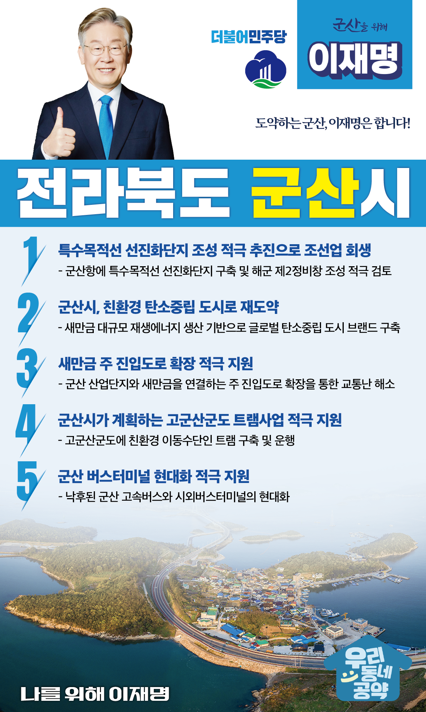

## 전북 지역 공약

# 군산시

### 도약하는 군산! 이재명은 합니다!
> 2022-02-10

존경하는 군산시민 여러분,

 

군산은 근대화를 거쳐 산업화와 새만금 시대에 이르기까지 그 역사만큼이나 아픔도 많은 곳입니다.

일제강점기에는 수탈의 한복판이었고, 최근에는 조선과 자동차 등 주력산업의 붕괴로 지역경제가 큰 타격을 받기도 했습니다.

 

하지만, 군산은 저력이 있는 곳입니다.

한강 이남 최초로 독립 만세운동이 일어난 곳이고, 해방 이후에는 향토기업을 중심으로 산업을 일으켜 전라북도의 경제발전을 책임져온 곳입니다.

 

이제는 군산 발전에 속도를 내야 합니다.

산단의 멈춰있던 공장들을 재가동하고, 새만금의 재생에너지로 신산업을 육성해 군산의 경제를 부흥시켜야 합니다

 

강력한 변화를 실현해 도약하는 군산을 만들기 위한 이재명의 군산 발전 5대 공약을 말씀드리겠습니다.

 

 

첫째, 특수목적선 선진화단지 조성을 적극 추진하여 조선업을 회생시키겠습니다

탄소 중립 기조와 해양환경규제 강화로 친환경 선박에 대한 수요가 높아지고 있습니다. 

군산항에 특수목적선 선진화단지를 구축해 군산과 전북의 조선업과 경제를 살리겠습니다.

해군 제2정비창 조성도 적극 검토하겠습니다. 

 

둘째, 군산을 친환경 탄소 중립 도시로 만들겠습니다.

군산 새만금은 우리나라 재생에너지 1번지입니다. 

전 세계적으로 새만금처럼 대규모로 재생에너지 생산이 가능한 곳이 드뭅니다.  

새만금의 대규모 재생에너지 생산을 기반으로 군산이 세계적인 탄소중립 도시가 되도록 적극 지원하겠습니다.

 

셋째, 새만금 주 진입도로 확장을 적극 지원하겠습니다. 

군산 산업단지와 새만금을 연결하는 주 진입도로의 교통 정체가 심각합니다. 

새만금 남북을 잇는 내부도로들이 개통되면 지금보다 더 심해질 것입니다.

산단 활성화를 위한 도로 확장으로 군산 경제 회생의 길이 뻥 뚫릴 수 있도록 지원하겠습니다.

 

넷째, 군산시가 계획하는 고군산군도 트램사업을 적극 지원하겠습니다. 

군산 앞바다의 고군산군도는 천혜의 자연을 가진 곳입니다. 

전기트램 등 친환경 이동수단 구축을 통해 탄소배출 없는 지역으로 발전되도록 돕겠습니다. ‘섬으로 가는 기차’가 고군산군도의 새로운 명물이 될 수 있도록 지원하겠습니다.

 

다섯째, 군산 버스터미널 현대화를 적극 지원하겠습니다. 

군산이 자연도 좋고, 살기도 좋은 곳인데, 버스터미널에 마중을 나가면 그렇게 아쉬울 수가 없다고 하십니다. 

낙후된 군산 고속버스와 시외버스터미널을 현대적인 모습으로 탈바꿈 할 수 있도록 적극 지원하겠습니다.

 

 

존경하는 군산시민 여러분!

이재명은 지킬 수 있는 것만 약속했고 약속했던 것은 지켜왔습니다.

살기 좋은 군산시 미래를 위한 약속 실력과 성과로 입증된 이재명이 반드시 실천하겠습니다.

 

군산 앞으로, 발전 제대로!

군산시민을 위해, 이재명은 합니다! 

						