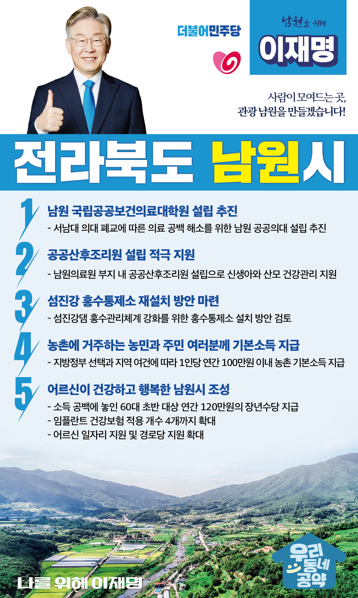

## 전북 지역 공약

# 남원시

### 사람이 모여드는 곳, 관광 남원을 만들겠습니다! 
> 2022-02-10

존경하는 남원시민 여러분

 

지리산의 관문이자 판소리 동편제의 본고장 남원은 전통과 현대가 어우러진 문화예술의 도시입니다.

 

그러나 남원은 정주여건이 개선되지 않아 스쳐 지나가는 도시의 한계를 벗어나지 못하고 있습니다.

 

이제 남원을 문화관광과 교육 인프라가 두터운 살기 좋은 관광도시로 발돋움시켜야 합니다. 

남원 발전을 위한 5대 공약을 말씀드리겠습니다.

 

첫째, 서남대 의대 폐교상황을 감안해서 남원에 공공의대 설립을 추진하겠습니다.

 

코로나19로 필수 공공의료서비스의 중요성이 더욱 커졌습니다.  

그러나 서남대 폐교로 남원시를 포함해 지리산권의 의료공백이 큽니다.  

지역민의 건강과 안전을 위해 남원에 공공의대 설립을 추진하겠습니다. 

 

둘째, 공공산후조리원 설립을 적극 지원하겠습니다. 

 

남원은 전북 동부권과 지리산 권역을 아우르는 의료 거점입니다. 

그러나 남원의료원에서는 분만만 가능하고 산후조리는 할 수 없습니다.  

공공산후조리원 설립을 적극 지원하여 남원과 지리산권의 신생아, 산모의 건강을 돌보는 환경을 구축하겠습니다. 

 

셋째, <섬진강 홍수통제소>를 재설치 방안을 마련하겠습니다.

 

섬진강 일대는 대규모 홍수피해가 빈번하게 발생하는 지역입니다. 

홍수를 관리하는 통제소가 타 지역과 통합되면서 주민들의 안전이 위협받고 있습니다. 

섬진강에 홍수관리체계를 강화하기 위해 홍수통제소 설치 방안을 검토하겠습니다. 

 

넷째, 농촌에 거주하는 농민과 주민 여러분께 기본소득을 지급하겠습니다.

 

지방정부의 선택과 지역의 여건에 따라 1인당 연간 100만원 이내의 농촌 기본소득을 지급하겠습니다.

농촌 기본소득 지급으로 농촌과 도시 간 소득격차를 줄이고, 안정적 생활을 지원하겠습니다. 

 

다섯째, 어르신이 건강하고 행복한 남원을 만들겠습니다.

소득 공백에 놓인 60대 초반을 대상으로 연간 120만원의 장년수당을 지급하겠습니다.

또한 임플란트 건강보험 적용 개수를 현재 2개에서 4개로 확대하고 어르신 요양에 대한 국가 책임을 확대하고 어르신 일자리 지원과 경로당 지원 확대로 어르신들이 행복한 남원을 만들겠습니다.

 

 

 

존경하는 남원시민 여러분!

이재명은 지킬 수 있는 것만 약속했고 약속했던 것은 지켜왔습니다.

살기 좋은 남원 미래를 위한 약속, 실력과 성과로 입증된 이재명이 반드시 실천하겠습니다.

 

남원 앞으로! 발전 제대로! 

남원시민을 위해, 이재명! 

						