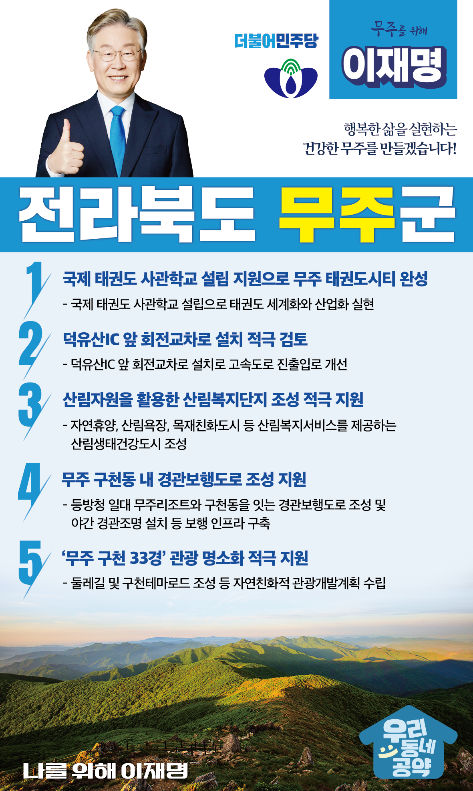

## 전북 지역 공약

# 무주군

### 행복한 삶을 실현하는 건강한 무주를 만들겠습니다!
> 2022-02-10

존경하는 무주군민 여러분, 무주는 이름부터 통합과 화해의 마음을 담고 있습니다.

2천년 전 신라의 무풍과 백제의 주계로 나뉘었던 땅이 합쳐져 무주라는 이름이 탄생했습니다.

 

무주는 예로부터 무예인의 땅이었습니다.

이곳에 있는 우리나라에서 가장 아름다운 계곡 ‘구천동’은 호국 무사 9천 명이 무술을 연마했다고 하여 붙여진 이름입니다.

 

그러나 또한 ‘무주구천동’은 ‘산수갑산’이라는 말과 함께 낙후지역의 대명사로 쓰여 왔습니다.

 

이제 낙후의 대명사라는 이미지를 극복하고 무주군을 태권도 도시의 위상에 맞는 국제적인 관광도시로 만들겠습니다.

무주 발전을 위한 이재명의 5대 공약을 말씀드리겠습니다. 

 

 

첫째, ‘국제 태권도 사관학교’ 설립을 지원하여 무주 태권도시티를 완성하겠습니다.

 

무주를 대표적인 태권도 한류도시로 만들겠습니다.

이를 위해 ‘국제 태권도 사관학교’ 설립을 지원하여 무주군의 자긍심을 높이고, 태권도 세계화와 산업화를 실현하겠습니다.

둘째, 덕유산IC 앞 회전교차로 설치를 적극 검토하겠습니다. 

 

현재 덕유산 IC 앞 교통체계가 복잡하여 불편이 큽니다.  

덕유산IC 앞 회전교차로를 설치하여 고속도로 진출입로를 개선해야 합니다. 

이를 통해 무주군민들과 관광객들의 교통편의를 높이겠습니다.  

 

셋째, 무주군의 산림자원을 활용한 산림복지단지 조성을 적극 지원하겠습니다. 

 

숲은 힐링의 장소이자 국민들이 가장 선호하는 자연자원입니다.

무주군에서 자연휴양, 산림욕, 치유활동과 같은 산림복지서비스를 받는 산림복지단지, 산림욕장 조성사업을 지원하겠습니다.

 

넷째, 무주 구천동에 경관보행도로 조성을 지원하여 보행자 안전을 지키겠습니다. 

 

무주리조트로 진입하는 등방천 일대는 보행로가 없어 사고위험이 높습니다.

겨울철에 리조트 관광객들이 구천동 계곡까지 오실 수 있도록 보행 인프라를 구축해야 합니다. 

무주리조트와 구천동을 잇는 경관보행도로 조성을 지원하여 안전한 무주구천동, 더 오래 머무는 무주구천동을 만들겠습니다. 

 

다섯째, ‘무주 구천 33경’ 관광 명소화를 적극 지원하겠습니다. 

 

무주 구천 33경은 기암괴석과 아름다운 소를 자랑하는 대표적 관광자원입니다.

무주 구천 33경을 자연친화적으로 개발하기 위해 무주 구천 33경 관광개발계획이 수립될 수 있도록 적극 지원하겠습니다. 

 

 

존경하는 무주 군민 여러분!

 

이재명은 지킬 수 있는 것만 약속했고 약속했던 것은 지켜왔습니다.

살기 좋은 무주군 미래를 위한 약속 실력과 성과로 입증된 이재명이 반드시 실천하겠습니다.

 

무주 앞으로, 발전 제대로!

무주군민을 위해, 이재명은 합니다! 

						