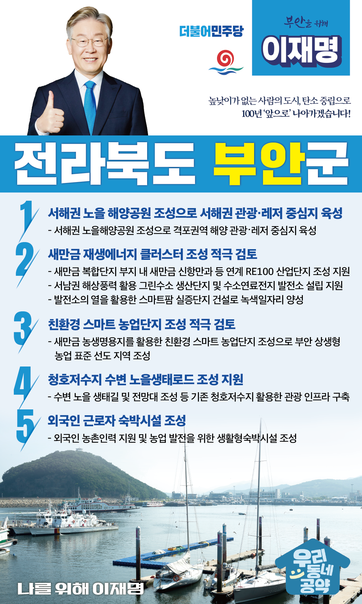

## 전북 지역 공약

# 부안군

### 높낮이가 없는 사람의 도시, 탄소 중립으로 100년 ‘앞으로’ 나아가겠습니다!
> 2022-02-10

존경하는 부안군민 여러분

 

부안은 서해안권 관광·레저의 중심도시이자 서남권 해상풍력단지와 수소 산업의 메카로 성장할 수 있는 도시입니다.

 

특색있는 서해안 해양관광 레저 문화를 집적화를 통해 관광객의 다양한 관광수요를 충족시킬 수 있습니다. 

 

또한 전북의 풍부한 자연에너지는 부안이 과거의 아픔을 딛고 친환경․재생에너지의 중심지로 재탄생하는 대전환의 발판이 될 것입니다. 

 

또한 공동체 문화가 발달한 부안은 사회적 농업이 발달할 수 있는 적합한 모델입니다. 

 

탄소 중립의 중심지, 높낮이가 없는 사람의 도시, 미래 100년의 부안을 위해 ‘이재명의 5대 공약’을 말씀드립니다. 

 

 

첫째, 「서해안권 노을 해양공원」조성을 지원하여 부안군을 서해안권 관광·레저의 중심지로 육성하겠습니다.

 

격포권역은 채석강, 국가지질공원, 국립공원 등의 자연자원과 국가어항인 격포항 등이 위치하여 다양한 발전 요소를 갖춘 지역입니다.

격포권역이 해양 레저의 중심지가 되도록 「서해권 노을해양공원」조성을 지원하겠습니다. 

 

둘째, 「새만금 재생에너지 클러스터」 조성을 적극 검토하여 부안을 탄소중립도시로 만들겠습니다. 

 

새만금 복합단지 부지에 새만금 신항만 등과 연계한 RE100 산업단지 조성을 지원하겠습니다.

또한 서남권 해상풍력을 활용한 그린수소 생산단지와 수소연료전지 발전소 설립도 돕겠습니다.

발전소의 열을 활용한 스마트팜 실증단지도 만들어 부안군이 녹색일자리의 선두주자가 될 수 있도록 적극 지원하겠습니다. 

 

셋째, 새만금 농생명용지를 활용한 친환경 스마트 농업단지 조성을 적극 검토하겠습니다. 

 

부안군은 새만금 농생명용지에 식량자급기반을 마련하고 첨단기술을 기반으로 하는 스마트농업, 수출인프라 구축을 추진하고 있습니다. 부안이 상생형 농업의 표준을 선도하는 지역이 되도록 적극 지원하겠습니다. 

 

넷째, 청호저수지 수변의 아름다운 생태문화·풍경을 활용한 「청호저수지 수변 노을생태로드」 조성을 지원하겠습니다.

 

청호저수지는 잔잔한 호수의 수면을 가르는 일출 및 일몰의 풍경이 아름다운 저수지입니다. 수변 노을 생태길 조성 등 다양한 관광 인프라 구축을 지원하여 청호저수지가 지역 체험관광지의 중심지가 되도록 돕겠습니다.  

 

다섯째, 외국인 농촌인력을 위한 「외국인 근로자 숙박시설」 조성을 지원하겠습니다. 

 

부안군은 65세 이상 고령 인구가 전체 인구수의 34.5%를 차지하고 있는 초고령화 지역입니다. 외국인 근로자가 우리 농업의 중요한 역할을 수행하고 있습니다. 식량안보와 우리 농업의 발전을 위해 부안군이 추진하고 있는 농어촌 외국인 근로자 숙박시설 조성을 지원하겠습니다. 

 

서해안 천혜의 명소, 꼭 한번 가보고 싶은 부안 생명을 살리는 탄소 중립 선도 도시의 새로운 미래를 이재명이 만들겠습니다.

 

부안 앞으로! 발전 제대로!

부안의 미래를 위해, 이재명!

						