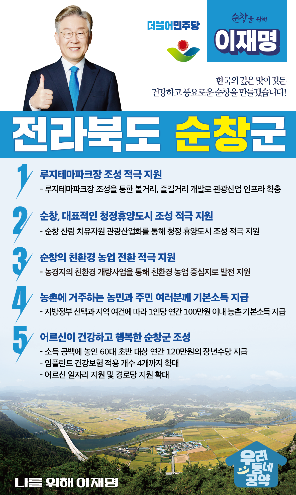

## 전북 지역 공약

# 순창군

### 한국의 깊은 맛이 깃든 건강하고 풍요로운 순창을 만들겠습니다!
> 2022-02-10

존경하는 순창군민 여러분,

 

순창은 맑은 물과 아름다운 풍광을 간직한 곳으로 전통이 깃든 깊은 맛을 간직하고 발전시켜온 고장입니다.

 

순창의 맑고 깨끗한 공기를 지키며 순창만의 산업과 자원을 활용해 군민 모두가 행복한 삶을 누릴 수 있는 순창의 넉넉한 미래를 열겠습니다.

 

순창군의 새로운 내일을 열어갈 ‘이재명의 순창군 발전 5대 공약’은

 

첫째, 순창시가 추진하고 있는 <루지테마파크장> 조성을 적극 지원하겠습니다.  

 

순창은 천혜의 자연환경으로 많은 관광객들이 찾아오는 곳이지만 관광산업 인프라가 부족해 볼거리, 즐길거리 개발이 필요합니다.  

순창시가 추진하는 <루지테마파크장> 조성을 지원하고, 순창의 문화 관광 인프라 확충을 지원하겠습니다. 

 

둘째, 순창이 대표적인 ‘청정휴양도시’가 되도록 적극 지원하겠습니다. 

 

순창은 호남정맥과 섬진강이 관통하는 청정지역으로 대표적인 건강․장수지역입니다. 

순창의 산림 치유자원을 관광산업화하여 순창이 청정한 휴양도시가 되도록 적극 지원하겠습니다. 

 

셋째, 순창의 친환경 농업 전환을 적극 지원하겠습니다. 

 

순창은 친환경 농업을 확대하고 있고, 친환경 쌀을 지역 학교급식에 활용하는 생태친화적 농업지역입니다. 

순창이 대표적인 친환경 농업 중심지로 발전하도록 농경지의 친환경 개량사업을 적극 지원하겠습니다. 

 

넷째, 농촌에 거주하는 농민과 주민 여러분께 기본소득을 지급하겠습니다.

 

지방정부의 선택과 지역의 여건에 따라 1인당 연간 100만원 이내의 농촌 기본소득을 지급하겠습니다.

농촌 기본소득 지급으로 농촌과 도시 간 소득격차를 줄이고, 안정적 생활을 지원하겠습니다. 

 

다섯째, 어르신이 건강하고 행복한 순창을 만들겠습니다.

 

소득 공백에 놓인 60대 초반을 대상으로 연간 120만원의 장년수당을 지급하겠습니다.

또한 임플란트 건강보험 적용 개수를 현재 2개에서 4개로 확대하고 어르신 요양에 대한 국가 책임을 확대하고 어르신 일자리 지원과 경로당 지원 확대로 어르신들이 행복한 순창을 만들겠습니다.

 

 

존경하는 순창군민 여러분!

 

이재명은 지킬 수 있는 것만 약속했고 약속했던 것은 지켜왔습니다.

살기 좋은 순창 미래를 위한 약속, 실력과 성과로 입증된 이재명이 반드시 실천하겠습니다.

 

순창 앞으로! 발전 제대로! 

순창군민을 위해, 이재명! 

						