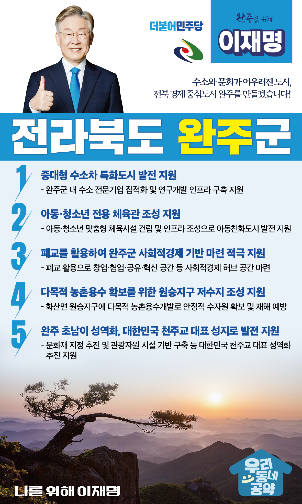

## 전북 지역 공약

# 완주군

### 수소와 문화가 어우러진 도시, 전북 경제 중심도시 완주를 만들겠습니다!
> 2022-02-10

존경하는 완주군민 여러분,

 

완주군은 ‘완전한 고을’이라는 이름처럼 도시와 농촌, 첨단과 전통이 어우러진 도농복합 자족도시로 성장하는 기회의 도시입니다. 

자동차·기계, 부품 소재, 탄소 산업이 집적화되고 수소 산업의 선도도시로 전북 경제를 이끌어가는 지역입니다.

 

가능성의 도시 완주를 전통과 산업이 공존하는 미래혁신도시 수소 시범도시를 뛰어넘는 친환경 미래차 거점도시 공동체 문화와 사회적경제가 어우러진 지속 가능한 활력 도시로 만들겠습니다. 

 

완주 발전을 위한 5대 공약을 말씀드리겠습니다.

 

첫째, 완주군이 중대형 수소차 특화도시가 될 수 있도록 지원하겠습니다.

 

완주는 세계 최초로 수소트럭을 상용화했고, 국내 유일의 수소버스 생산 지역입니다.

완주에 수소 전문기업을 집적화하고 연구개발 인프라가 구축되도록 지원하겠습니다. 

이를 통해 완주가 수소차 특화도시로 발전할 수 있도록 돕겠습니다. 

 

둘째, 건강한 미래세대 육성을 위해 아동·청소년 전용 체육관 조성을 지원하겠습니다.

 

완주군은 2016년에 유니세프 ‘아동친화도시’로 선정된 후 각종 청소년 정책을 성공적으로 추진해왔습니다. 

이제 정책적 접근을 넘어 아동·청소년들이 여가와 체육활동에 참여할 수 있는 인프라 조성이 필요합니다.  

아동친화도시 완주군의 완성을 위해 아동·청소년 맞춤형 체육시설 건립을 지원하겠습니다.

 

셋째, 폐교를 활용해 완주군의 사회적경제 기반이 마련되도록 적극 지원하겠습니다. 

 

완주군은 먹거리, 에너지, 돌봄, 문화, 복지 등 지역사회 문제를 사회적경제 방식으로 해결하는 공간 조성을 추진중입니다.  

지역 내 폐교가 창업·협업·공유·혁신 공간이 되도록 지원하겠습니다. 

 

넷째, 원승지구에 다목적 농촌용수 확보를 위한 저수지 조성을 지원하겠습니다. 

 

완주군은 해마다 가뭄이 반복되면서 주민들이 많은 불편을 겪어왔습니다. 

화산면 원승지구에 친환경 수리시설 설치를 지원하여 자연재해를 예방하고, 안정적으로 수자원을 확보할 수 있도록 돕겠습니다. 

 

다섯째, 완주 초남이 성지가 대한민국 천주교 대표 성지가 되도록 지원하겠습니다.

 

완주에는 천주교 최초 순교자 유해가 발굴된 초남이 성지가 있습니다.  

완주가 대한민국 천주교의 대표 성지가 될 수 있도록 지원하겠습니다. 

 

 

존경하는 완주 군민 여러분!

 

이재명은 지킬 수 있는 것만 약속했고 약속했던 것은 지켜왔습니다.

살기좋은 완주군 미래를 위한 약속 실력과 성과로 입증된 이재명이 반드시 실천하겠습니다.

 

완주 앞으로, 발전 제대로!

완주군민을 위해, 이재명은 합니다! 

						