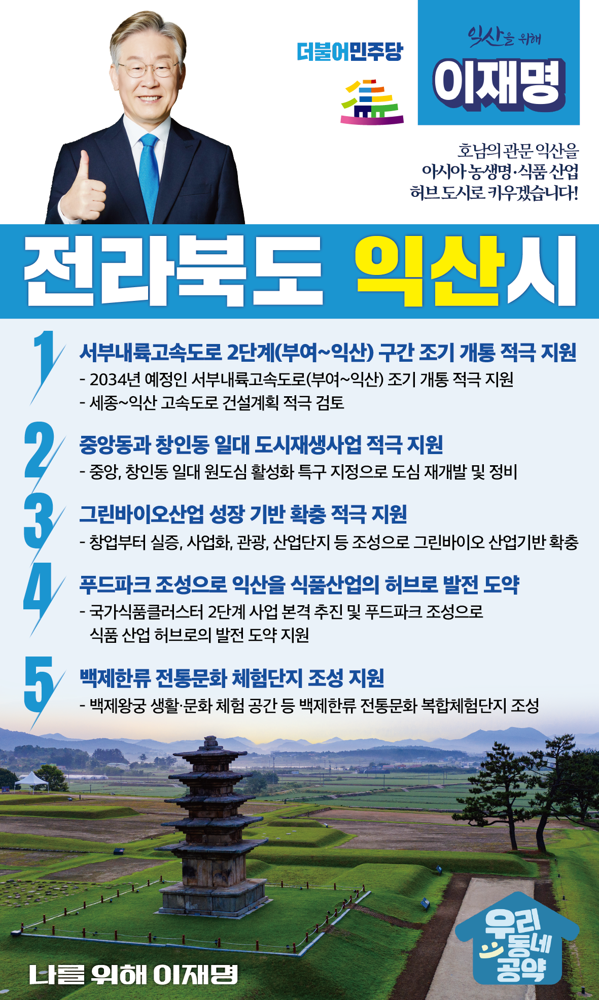

## 전북 지역 공약

# 익산시

### 호남의 관문 익산을 아시아 농생명 · 식품 산업 허브 도시로 키우겠습니다!
> 2022-02-10

존경하는 익산시민 여러분,

 

익산은 한반도 고대 역사인 마한의 중심지였으며 동아시아를 호령했던 백제의 역사와 문화가 살아 숨 쉬는 고도입니다.

전라선·호남선·장항선이 만나는 사통팔달 교통의 요지로 호남의 관문이자 오랜 역사를 바탕으로 한 문화적 매력과 비옥한 농업을 기반으로 한 식품 산업의 잠재력을 갖춘 도시입니다.

 

새만금 개발이 본격적으로 확장되면 서해안을 통한 물류 확대와 관광 수요 증가로 교통도시·문화도시 익산의 역할은 더욱 중요해질 것입니다.

 

생동하는 익산을 위한 새로운 변화 환경부터 산업까지 도시의 대변혁을 이루어 미래로 나아가기 위한

‘이재명의 익산 발전 5대 공약’을 말씀드리겠습니다.

 

첫째, 서부내륙고속도로 2단계(부여-익산) 구간 조기 개통을 적극 지원하겠습니다. 

익산은 철도의 요지이지만 도로 교통 접급성이 낮았습니다. 

2034년 예정인 서부내륙고속도로 부여-익산 구간이 조기에 개통될 수 있도록 적극 지원하겠습니다.

또한 서울-세종 고속도로를 익산까지 연장하는 노선 신설을 적극 검토하겠습니다. 

 

둘째, 중앙동과 창인동 지역의 도시재생을 적극 지원하겠습니다. 

 

과거 익산역 주변 원도심은 상권의 중심이었으나 현재는 공동화 현상이 심각합니다. 

중앙동과 창인동 일대 ‘도시재생사업’을 통해 원도심 활력을 회복시키겠습니다. 

도시의 틀을 다시 짜는 혁신적인 계획과 빠른 실행으로 도시재생의 성공 모델이 되도록 적극 지원하겠습니다.

 

셋째, 익산시의 그린바이오산업 성장 기반이 확충되도록 적극 지원하겠습니다. 

 

익산에는 종합대학, 식품클러스터, 농업기술실용화재단 등 농생명 산업과 연구 관련 기관이 있습니다.

이에 더해 창업부터 실증, 사업화, 산업, 관광으로 이어지는 그린바이오 산업기반을 확충해 익산의 미래를 선도할 신성장동력이 될 수 있도록 하겠습니다. 

 

넷째, 푸드파크 조성으로 익산을 식품산업의 허브로 만들겠습니다.

 

익산에는 국내 유일의 국가식품클러스터가 있습니다. 

‘국가식품클러스터 2단계’ 사업을 본격 추진해 국가클러스터의 위상을 높이겠습니다.  

식품에 관한 모든 것을 체험할 수 있는 푸드파크를 조성해 익산이 식품 산업의 허브가 될 수 있도록 적극 지원하겠습니다.

 

다섯째, 익산시의 <백제한류 전통문화 체험단지> 조성을 지원하겠습니다.

 

익산은 유네스코 세계문화유산인 미륵사지와 왕궁리 유적을 품은 문화도시입니다. 

익산시가 계획하는  <백제한류 전통문화 복합체험단지> 조성으로 관광객들이 백제왕궁의 생활·문화를 체험할 수 있도록 적극 지원하겠습니다. 

익산을 500만 관광도시로 육성하겠습니다.

 

 

존경하는 익산시민 여러분!

 

이재명은 지킬 수 있는 것만 약속했고 약속했던 것은 지켜왔습니다.

살기 좋은 익산시 미래를 위한 약속 실력과 성과로 입증된 이재명이 반드시 실천하겠습니다.

 

익산 앞으로! 발전 제대로!

익산을 위해, 이재명! 

						