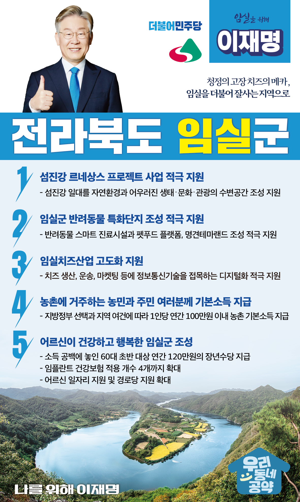

## 전북 지역 공약

# 임실군

### 호청정의 고장 치즈의 메카 임실을 더불어 잘사는 지역으로 만들겠습니다!
> 2022-02-10

존경하는 임실군민 여러분!

치즈의 고장으로 잘 알려진 임실군은 우수한 농산물을 생산하고 관광·문화 역량을 키워가는 농촌 모델의 모범사례입니다.

 

임실은 전북의 심장 전주와 남부권을 잇는 교통망이 조성되어 있고 자연이 내려준 선물, 섬진강을 중심으로 치유와 회복의 문화 거점지역으로 성장하고 있습니다.

 

전라북도를 뛰어넘어 대한민국 농촌의 미래 비전을 전북에서 구현할 “이재명의 임실발전 5대 공약”을 말씀드리겠습니다.

 

첫째, ‘섬진강 르네상스 프로젝트’사업을 적극 지원하겠습니다. 

 

섬진강에 다목적댐 개발로 주민들은 생활기반을 잃었습니다. 

임실군의 특별한 희생에 대한 특별한 보상이 필요한 이유입니다.  

섬진강 일대를 자연환경과 어우러진 생태․문화․관광의 수변공간 조성을 지원하겠습니다.  

전북과 임실이 추진하는 섬진강 르네상스 프로젝트의 성공을 적극 지원하겠습니다. 

 

둘째, 임실군의 반려동물 특화단지 조성을 적극 지원하겠습니다. 

 

반려동물과 함께하는 가구가 늘면서 관련 산업이 커지고 있습니다.

그러나 반려동물 산업과 서비스에 집적특화된 지역은 없습니다. 

오수개의 고장인 임실은 반려동물산업이 발전할 여건을 갖추고 있습니다. 

임실군이 추진하는 반려동물 스마트 진료시설과 펫푸드 플랫폼, 명견테마랜드가 조성되도록 적극 지원하겠습니다. 

 

셋째, 임실치즈산업의 고도화를 지원하겠습니다.

 

치즈는 임실의 대표 상품이자 주력산업입니다. 

시대의 변화에 발맞춰 임실치즈산업의 경쟁력을 보다 강화할 수 있도록 치즈 생산, 운송, 마켓팅에 정보통신기술을 접목하는 디지털화를 적극 지원하겠습니다. 

 

넷째, 농촌에 거주하는 농민과 주민 여러분께 기본소득을 지급하겠습니다.

 

지방정부의 선택과 지역의 여건에 따라 1인당 연간 100만원 이내의 농촌 기본소득을 지급하겠습니다.

농촌 기본소득 지급으로 농촌과 도시 간 소득격차를 줄이고, 안정적 생활을 지원하겠습니다. 

 

다섯째, 어르신이 건강하고 행복한 임실을 만들겠습니다.

 

소득 공백에 놓인 60대 초반을 대상으로 연간 120만원의 장년수당을 지급하겠습니다.

또한 임플란트 건강보험 적용 개수를 현재 2개에서 4개로 확대하고 어르신 요양에 대한 국가 책임을 확대하고 어르신 일자리 지원과 경로당 지원 확대로 어르신들이 행복한 임실을 만들겠습니다.

 

 

존경하는 임실군민 여러분!

 

이재명은 지킬 수 있는 것만 약속했고 약속했던 것은 지켜왔습니다.

살기 좋은 임실 미래를 위한 약속, 실력과 성과로 입증된 이재명이 반드시 실천하겠습니다.

 

임실 앞으로! 발전 제대로! 

임실군민을 위해, 이재명! 

						