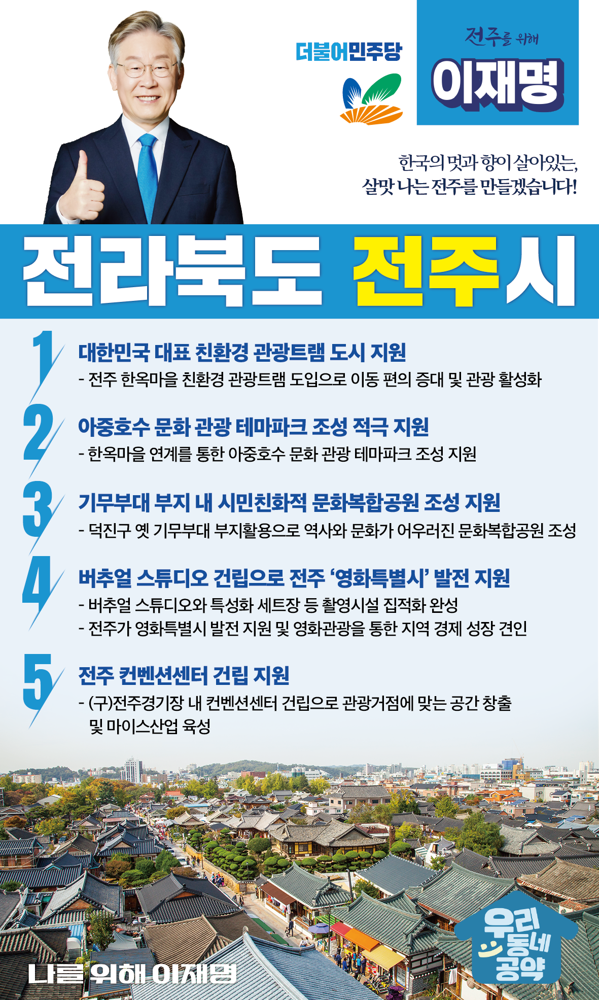

## 전북 지역 공약

# 전주시

### 한국의 멋과 향이 살아있는, 살맛 나는 전주를 만들겠습니다!
> 2022-02-10

존경하는 전주시민 여러분,

 

전주는 전라북도 제1의 도시로 역사와 전통을 갖춘 ‘가장 한국적인 도시’이며 모두가 자유롭고 평등한 세상을 추구한 대동과 동학의 이상과 좌절이 함께 깃든 변혁의 고장입니다.

 

그러나 가파르게 이루어진 산업화와 정보화 시대의 격동 속에서 전주를 이끌었던 제조업과 전통산업은 위기를 맞았습니다.

이제 전주의 산업적 기반을 다시 정립하고 건강, 생태, 문화가 어우러진 생명과 인간을 존중하는 ‘전주다움’을 바로 세워야 합니다.

 

수소와 탄소를 중심으로 한 미래 신산업 육성 한옥마을 트램과 테마파크로 이어지는 관광거점 K-필름과 컨벤션센터가 상징하는 문화도시 새로운 복지서비스 모델을 만들어가는 건강생태 도시 모두를 품을 수 있는 넉넉한 전주의 미래가 여기에 있습니다.

 

전주의 새로운 내일을 열어갈 ‘이재명의 전주 발전 5대 공약’을 말씀드리겠습니다.

 

첫째, 전주시를 <대한민국을 대표하는 친환경 관광트램 도시>가 되도록 지원하겠습니다. 

전주의 대표적 관광거점인 한옥마을을 한번에 돌아볼 수 있는 연결망이 부재합니다. 

전주 한옥마을에 친환경 관광트램 도입을 지원해 이동 편의를 높이고 대한민국을 대표하는 관광 콘텐츠로 개발하겠습니다.

 

둘째, <아중호수 문화 관광 테마파크> 조성을 적극 지원하겠습니다.

전주는 도심 근교 내 야외에서 즐길 수 있는 공간이 부족하고, 한옥마을과의 관광 연계성도 떨어지는 실정입니다. 

전주의 아름다운 자원인 아중호수에 ‘문화 관광 테마파크’ 조성을 지원해 관광·문화 도시 전주를 만들겠습니다.

 

셋째, 기무부대 부지에 시민친화적 <문화복합공원> 조성을 지원하겠습니다.

덕진구 옛 기무부대 부지에 역사와 문화를 새길 수 있는 복합적 기능을 갖춘 공원을 조성할 수 있도록 지원하겠습니다. 

기무부대 부지에 대한 오랜 논란을 끝내고 전주 시민에게 건강과 문화가 살아있는 품격있는 공간으로 돌려드리겠습니다.

 

넷째, 전주시에 버추얼 스튜디오 건립을 지원해 전주를 ‘영화특별시’로 키우겠습니다.

버추얼 스튜디오와 특성화 세트장 등 촬영시설 집적화를 완성해 전주가 영화특별시로 거듭나도록 적극 지원하겠습니다. 

전주의 전통과 문화가 콘텐츠에 스며들 수 있게 기반을 닦고 영화관광을 통해 지역 경제 성장을 돕겠습니다.

 

다섯째, 전주시가 추진하는 컨벤션센터 건립을 지원하겠습니다. 

계획과 좌절이 반복된 전주 컨벤션센터 건립을 마무리해야 합니다.  

전주컨벤션센터 건립을 지원해 관광거점에 맞는 공간을 창출하고 마이스산업을 전주의 새로운 성장동력으로 만들겠습니다. 

 

 

존경하는 전주시민 여러분!

 

이재명은 지킬 수 있는 것만 약속했고 약속했던 것은 지켜왔습니다.

살기 좋은 전주시 미래를 위한 약속 실력과 성과로 입증된 이재명이 반드시 실천하겠습니다.

 

전주 앞으로, 발전 제대로!

전주시민을 위해, 이재명은 합니다!

						