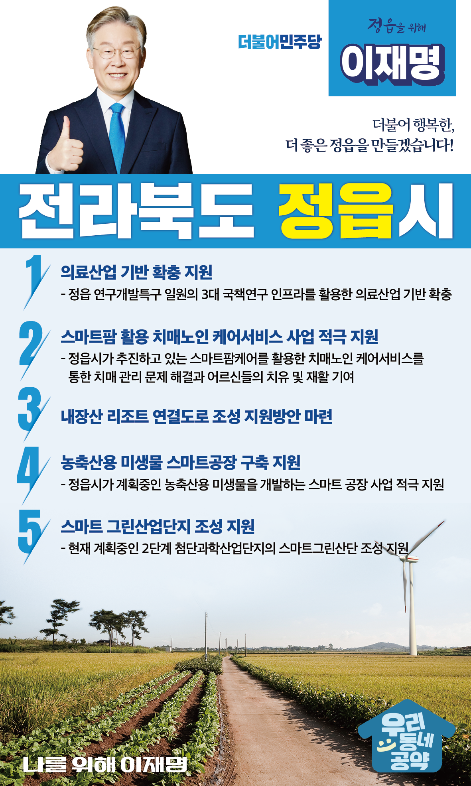

## 전북 지역 공약

# 정읍시

### 더불어 행복한, 더 좋은 정읍!
> 2022-02-10

존경하는 정읍시민 여러분,

 

전북의 서남권 거점도시로서 새로운 도약을 준비하는 정읍은 3대 국책연구기관과 48만평의 연구개발특구단지가 지정되어있는 첨단과학산업도시입니다.

 

또한, 세계3대 연금기관인 국민연금공단 연수원과 JB금융그룹 통합연수원, 한국전기안전공사 전기안전교육원 등을 유치해 매년 수만명이 방문하는 연수도시로 도약하고 있습니다.

 

호남‧서해안 고속도로, KTX 정차 등 사통팔달 교통의 중심지이며, 정읍사와 우도농악을 탄생시킨 문화‧예술 도시이기도 합니다.

 

관광객 천만의 관광도시 정읍, 전국 최고의 첨단과학산업도시 정읍을 위한, 이재명의 정읍 발전 5대 공약을 말씀드리겠습니다. 

 

 

첫째, 정읍시의 의료산업 기반 확충을 지원하겠습니다. 

정읍 연구개발특구 일원에 있는 3대 국책연구 인프라를 활용하여 정읍의 의료산업 기반이 확충되도록 지원하겠습니다. 

정읍이 중부권(오송)-영남권(대구·경북) 바이오벨트와 견줄 수 있는 의료산업 중심지가 되도록 돕겠습니다. 

 

둘째, 스마트팜을 활용한 치매노인 케어서비스 사업을 적극 지원하겠습니다. 

농업 비중과 고령인구 비율이 높은 전북 서남권은 스마트팜을 활용한 치유농업의 최적지입니다. 

정읍시가 추진하고 있는 스마트팜케어를 활용한  치매노인 케어서비스를 적극 지원하겠습니다. 

이를 통해 지역사회의 난제인 치매 관리 문제를 해결하고 어르신들의 치유와 재활을 돕겠습니다. 

 

셋째, 내장산 리조트 연결도로 조성 지원방안을 마련하겠습니다.

정읍의 수려한 자연관광 자원과 다양한 역사문화자원을 활용한 지역발전을 견인하기 위해 내장산 연결도로 조성을 정읍시가 추진하고 있습니다.  

시민과 관광객들의 수요에 부응하고 내장산 접근성이 높아지도록 지원방안을 조속히 마련하여 내장산과 정읍을 최고의 관광지로 조성하겠습니다. 

 

넷째, 정읍시가 계획하는 농축산용 미생물 스마트공장 구축을 지원하겠습니다.  

미래성장동력으로 바이오산업이 각광받고 있습니다. 

정읍이 화학제제를 대체하는 소재를 개발하는 그린바이오 산업이 발전할 수 있도록 돕겠습니다. 

정읍시가 계획하는 농축산용 미생물을 개발하는 스마트 공장 사업을 적극 지원하겠습니다. 

 

다섯째, 정읍의 스마트 그린산업단지 조성을 지원하겠습니다.

정읍시가 계획하는 2단계 첨단과학산업단지가 스마트그린산단이 되도록 지원하겠습니다. 

기반시설의 친환경 설계를 통해 에너지를 절감하고 산업단지에서 나오는 폐부산물을 재생하여 부가가치를 창출할 수 있습니다.  

스마트 그린산업단지 조성을 적극 돕겠습니다. 

 

 

존경하는 정읍시민 여러분!

 

이재명은 지킬 수 있는 것만 약속했고 약속했던 것은 지켜왔습니다.

살기좋은 정읍시 미래를 위한 약속 실력과 성과로 입증된 이재명이 반드시 실천하겠습니다.

 

정읍 앞으로, 발전 제대로!

정읍시민을 위해, 이재명은 합니다! 

						