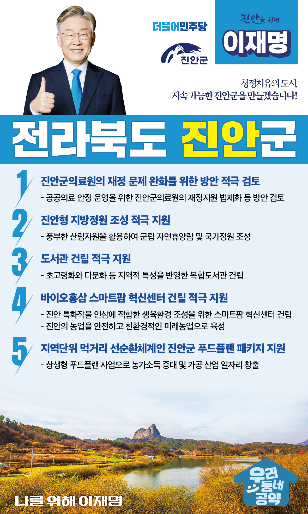

## 전북 지역 공약

# 진안군

### 청정치유의 도시, 지속 가능한 진안군을 만들겠습니다!  
> 2022-02-10

존경하는 진안군민 여러분,

 

전북 동부 산악권에 자리 잡은 진안군은 풍부한 산림자원을 바탕으로 다양한 산림 중심의 발전 전략을 수립하고 있습니다. 

전라북도 동부권의 친환경적 개발 전략으로 패러다임을 전환이 필요합니다.

 

또한, 준공 20년을 맞은 국내 다섯 번째 규모의 용담댐이 어떻게 하면 우리 진안군민과 전라북도민을 위해 활용될 수 있을지 진지하게 고민해야 할 시기입니다.

 

이런 진안군의 대전환을 위해 침체한 지역에 활력을 불어넣고 친환경 시대에 걸맞은 산림발전과 산림관광 인프라를 갖추면서 지역주민의 민생을 최우선으로 만들기 위한 이재명의 진안 발전 5대 공약을 말씀드리겠습니다. 

 

첫째, 진안군의료원의 재정 문제 완화를 위한 방안을 적극 검토하겠습니다. 

 

진안군의료원은 동부 산악권 지역거점 공공의료기관으로서 감염병의 지역사회 확산을 차단하는 역할을 수행하고 있습니다. 

하지만 만성적인 재정적자로 많은 어려움에 겪고 있습니다. 

진안군의료원이 재정 문제를 완화할 수 있는 방안을 적극 검토하겠습니다.

 

둘째, 진안형 지방정원 조성을 적극 지원하겠습니다.  

 

진안군은 면적의 76%가 산림입니다. 

진안군의 풍부한 산림자원을 활용하여 도민들에게 휴식과 산림치유 공간을 제공하는 명품 지방정원이 조성되도록 적극 지원하겠습니다. 

 

셋째, 진안군 도서관 건립을 적극 지원하겠습니다.   

 

진안군에는 전북도내 14개 시·군 중 유일하게 군립 공공도서관이 없습니다.

진안군에 초고령화와 다문화 등 지역적 특성을 반영한 복합도서관 건립을 지원하겠습니다. 

 

넷째, 바이오홍삼 스마트팜 혁신센터 건립을 적극 지원하겠습니다. 

 

코로나19 확산에 따라 면역력 증진과 건강기능식품에 대한 관심이 높아지고 있습니다.

진안의 특화작물인 인삼에 적합한 생육환경 조성을 위한 스마트팜 혁신센터 건립을 지원하겠습니다. 

진안의 농업을 안전하고 친환경적인 미래농업으로 육성하겠습니다.

 

다섯째, 지역단위 먹거리 선순환체계인 진안군 푸드플랜 패키지를 지원하겠습니다. 

 

진안군민의 소득을 높이기 위해서는 지역단위 먹거리 선순환체계 구축이 중요합니다. 

농가소득을 증대시키고, 가공 산업 일자리를 창출하기 위해 진안군과 전북도의 푸드플랜 사업을 적극 지원하겠습니다.  

 

 

존경하는 진안군민 여러분!

 

이재명은 지킬 수 있는 것만 약속했고 약속했던 것은 지켜왔습니다.

살기좋은 진안군 미래를 위한 약속 실력과 성과로 입증된 이재명이 반드시 실천하겠습니다.

 

진안 앞으로, 발전 제대로!

진안군민을 위해, 이재명은 합니다! 

						