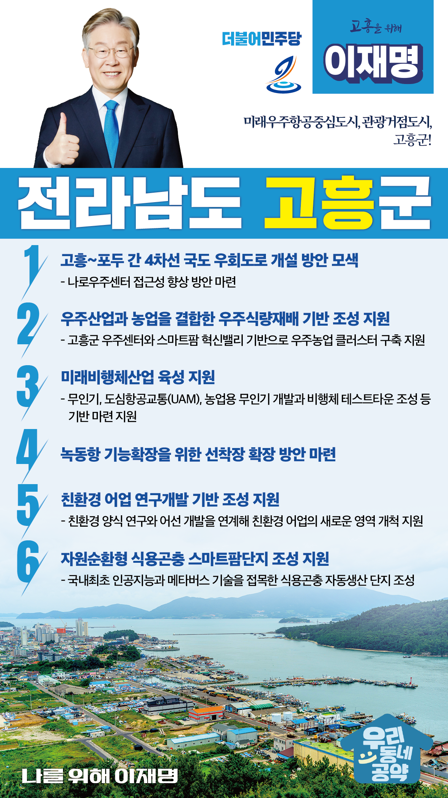

## 전남 지역 공약

# 고흥군

### 미래우주항공중심도시, 관광거점도시, 고흥군!
> 2022-02-10

존경하는 고흥군민 여러분,

 

고흥군은 전남 남해안 고흥반도와 230개의 섬으로 이루어진 자연환경지역입니다.  

최근 고흥은 대한민국 우주개발의 꿈을 실현할 우주항공 중심지로 발돋움하고 있습니다. 

우주센터를 기반으로 한 우주항공·드론산업은 이제 고흥의 자랑거리가 됐습니다.

 

또한 아시아의 푸드밸리인 스마트팜 혁신밸리가 조성되고 있어 미래형 농업의 중심지 역할까지 수행할 예정입니다.  

 

미래산업을 이끌고 있는 고흥에서 새로운 도전이 시작되고 있습니다.

고흥의 재탄생을 위한 이재명의 6가지 약속을 말씀드립니다. 

 

 

첫째, 고흥~포두간 4차선 국도 우회도로 개설을 적극 검토하겠습니다.

나로우주센터가 있는 고흥 나로도 주변 교통인프라 확충이 필요합니다.

고흥~포두 옥강간 국도의 우회도로 개설사업의 국가계획 반영을 검토하겠습니다. 

우주센터 방문객과 주민들의 교통 편의를 개선하겠습니다. 

 

 

둘째, 고흥군의 우주산업과 농업을 결합한 우주식량재배 기반 조성을 지원하겠습니다.

고흥군에는 우주센터가 있고, 민간이 주도하는 발사체 클러스터 조성사업도 추진 중에 있습니다. 

또한 스마트팜 혁신밸리도 조성 중입니다.

이를 기반으로 고흥군이 추진하는 우주농업 클러스터와 식량재배 인공생태계 구축사업을 지원하겠습니다.

 

 

셋째, 고흥군의 미래비행체산업 육성 사업을 지원하겠습니다. 

고흥군은 우수센터와 민간주도 발사체 클러스터 조성 사업 등 미래비행체산업 발전을 위한 환경이 조성되고 있습니다.

무인기, 도심항공교통(UAM), 농업용 무인기 개발과 비행체 테스트타운 조성 등 고흥군이 계획하는 미래비행체산업 기반 마련을 지원하겠습니다. 

 

 

넷째, 녹동항의기능확장을 위한 선착장 확장 방안을 마련하겠습니다. 

국가어항인 녹동항은 복합적인 기능을 수행하기에는 접안 시설이 부족합니다.

녹동항이 해양관광, 수산유통 기능을 확충할 수 있도록 접안시설을 확장하고 어선의 안전한 피항이 가능하도록 선착장 증설 방안을 마련하겠습니다. 

 

 

다섯째, 친환경 어업 연구개발 기반 조성을 지원하겠습니다.

고흥군은 전국 김밥용 김생산의 80%를 차지하고 있습니다. 

녹동조선단지에는 소형 배를 생산하는 조선소가 집적화되어 있습니다.

친환경 양식 연구와 어선 개발을 연계해 친환경 어업의 새로운 영역을 개척할 수 있도록 지원하겠습니다. 

 

 

여섯째, 고흥군에 자원순환형 식용곤충 스마트팜단지 조성을 지원하겠습니다.  

유엔(UN) 식량농업기구는 기존 육류를 대체할 식량자원으로 곤충을 꼽고 있습니다.

고흥군은 식용곤충을 자동 생산하는 계획을 수립하고 있습니다.

고흥군의 곤충생산단지 조성을 지원하겠습니다. 

 

 

존경하는 고흥군민 여러분!

 

이재명은 지킬 수 있는 것만 약속했고 약속했던 것은 지켜왔습니다.

살기 좋은 고흥군의 미래를 위한 약속. 실력과 성과로 입증된 이재명이 반드시 실천하겠습니다.

 

고흥군 앞으로, 발전 제대로!

고흥군민을 위해, 이재명은 합니다! 

						