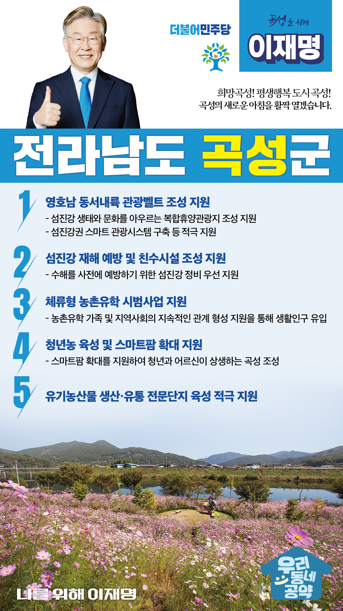

## 전남 지역 공약

# 곡성군

### 희망곡성! 평생행복 도시 곡성! 곡성의 새로운 아침을 활짝 열겠습니다!
> 2022-02-10

존경하는 곡성군민 여러분, 

 

곡성군은 섬진강기차마을부터 봉두산, 태안사, 철쭉길, 반구정습지까지 지역 구석구석 다채로운 문화‧관광 인프라를 갖춘 지역입니다. 

문재인 대통령 부부께서 선택한 백세미부터 멜론과 토란까지 특산품도 일품인 농업도시입니다.

 

무엇보다 곡성은 꿈놀자학교부터 미래교육재단까지 아이들이 행복하게 교육을 받을 수 있는 인프라를 갖추고 있어 인근 지역에서 유학을 오는 명품교육공동체입니다.

 

꿈과 행복을 키우는 미래공동체를 위해 이재명의 곡성군 5대 공약을 말씀드리겠습니다.

 

 

첫째, 영호남 동서내륙 관광벨트 조성을 지원하겠습니다.

곡성은 영․호남 시․군의 경계선에 위치하여 균형발전에서 소외되어 왔습니다. 

곡성을 섬진강 생태와 문화를 아우르는 복합휴양관광지가 되도록 지원하겠습니다.

‘섬진강권 스마트 관광시스템’ 구축 등 섬진강 통합관광벨트 조성사업이 성공적으로 추진될 수 있도록 적극 지원하겠습니다.

 

둘째, 섬진강의 재해를 예방하고 친수시설 조성을 지원하겠습니다.

곡성군은 섬진강댐 방류나 집중호우로 상습적으로 침수되고 도로마저 유실되는 지역입니다.

마을이 고립되어 주민들이 불편을 겪고 안전도 위협받는 실정입니다. 

반복적인 수해를 사전에 예방하기 위해 섬진강 정비를 우선적으로 지원하겠습니다.  

 

 

셋째, 체류형 농촌유학 시범사업을 통해 지역에 활기를 불어넣겠습니다. 

곡성군 인구소멸 위기에 처해 있습니다. 인구문제를 해결할 중장기 계획이 필요합니다.

체류형 농촌유학 시범사업을 통해 폐교 위기에 봉착한 작은 학교들을 살리겠습니다. 

또한 농촌유학 가족과 지역사회와 지속적인 관계 형성으로 생활인구를 유입시키고 도시와 농촌이 동반 성장하는 성공적인 모델로 정착시키겠습니다.

 

넷째, 청년농을 육성하고 스마트팜 확대를 지원하겠습니다. 

고령화된 곡성은 농업활동 인구가 매우 부족합니다. 

새로운 농업방식으로 지역 경제도 살리고 청년농 육성도 해야 합니다.

미래농업을 위한 스마트팜 조성으로 6차 산업을 발전시켜 청년과 어르신이 상생하는 곡성으로 만들겠습니다.

 

 

다섯째, 유기농산물의 생산·유통 전문단지 육성을 적극 지원하겠습니다.

곡성군은 청정 자연환경을 보존하고 있어 친환경 유기농산물 생산에 최적지입니다.  

KTX 정차역이 있어 수도권 접근성이 높습니다. 

이런 장점을 살려 곡성의 농업 생산유통기반이 강화될 수 있도록 지원하겠습니다.

유기농산물 생산지를 집적시키고 공동 농작업을 통한 생산과 계약재배를 활성화시키겠습니다.

 

 

존경하는 곡성군민 여러분!

이재명은 지킬 수 있는 것만 약속했고 약속했던 것은 지켜왔습니다.

살기 좋은 곡성군 미래를 위한 약속, 실력과 성과로 입증된 이재명이 반드시 실천하겠습니다.

 

곡성 앞으로, 발전 제대로!

곡성군민을 위해, 이재명은 합니다!

						

 