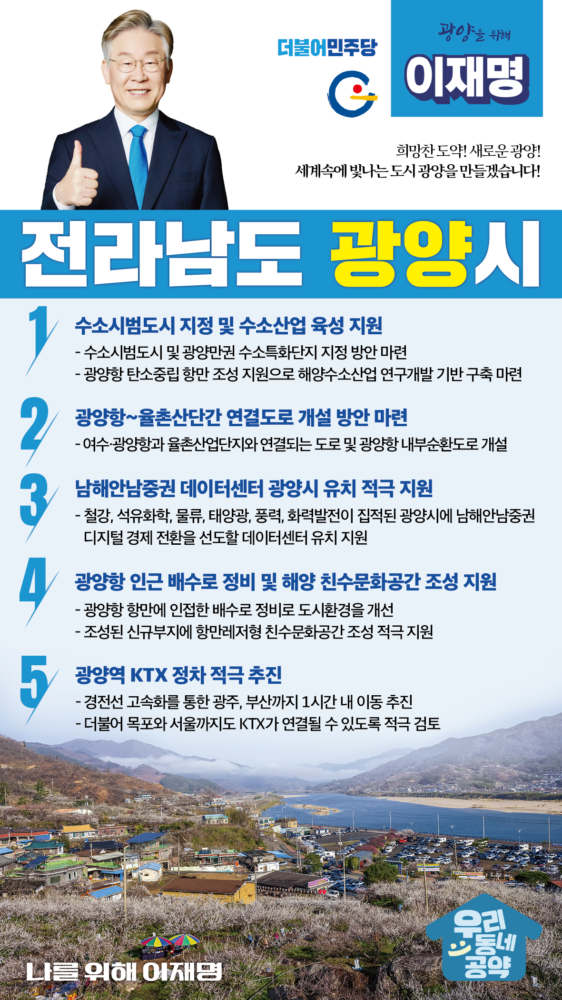

## 전남 지역 공약

# 광양시

### 희망찬 도약! 새로운 광양! 세계속에 빛나는 도시 광양을 만들겠습니다! 
> 2022-02-10

존경하는 광양시민 여러분,

 

광양시는 명산 백운산을 비롯하여 섬진강의 수려한 관광자원과 동서통합지대의 중심축 고부가가치 농업 창출, 광양항·광양제철소 등을 기반으로 한 신성장 동력산업 육성으로 경제적인 여건이 좋고 발전 가능성이 큰 도시입니다.

 

전남지역에서 가장 젊고, 역동적인 도시 광양의 발전을 위한 5대 지역공약을 말씀드리겠습니다.

 

 

첫째, 광양시의 수소시범도시 지정과 수소산업 육성을 적극 지원하겠습니다.

제철소와 석유화학 단지가 집적된 광양만권은 국내 최대의 탄소배출 지역으로 저탄소 산업구조로 전환이 시급합니다.

이를 위해 수소시범도시 지정과 광양만권 수소특화단지 지정을 적극 검토하겠습니다. 

광양항이 탄소중립 항만이 되도록 지원해 해양수소산업 연구개발 기반 구축이 되도록 적극 돕겠습니다. 

 

 

둘째, 광양항과 율촌산단간 연결도로 개설을 적극 검토하겠습니다.

율촌산업단지와 연결되는 도로가 개설되면 율촌산단은 물론 해룡산단 물동량의 원활한 처리가 가능해지고 물류비용이 절감될 것입니다. 

여수·광양항과 율촌산업단지와 연결되는 도로와 광양항 내부순환도로 개설을 적극 검토하겠습니다.

 

 

셋째, 광양시에 남해안남중권 데이터센터를 유치를 적극 지원하겠습니다.

디지털 경제로 전환하기 위해서는 클라우드 플랫폼 기반의 데이터 인프라가 필수적입니다.

광양시는 150만 남해안남중권 생활의 중심지로 철강, 석유화학, 물류, 태양광, 풍력, 화력발전이 집적된 지역입니다.

남해안남중권 디지털 경제 전환을 선도할 데이터센터가 들어서도록 적극 돕겠습니다. 

 

넷째, 광양항 인근 배수로 정비로 해양 친수문화공간 조성을 적극 지원하겠습니다.

 

광양항 항만에 인접한 배수로는 모기와 해충 발생으로 지역 주민들의 불편이 큽니다. 

배수로 정비로 도시환경을 개선하고 조성된 신규부지에 항만레저형 친수문화공간이 조성되도록 적극 지원하겠습니다.

 

 

다섯째, 광양역 KTX 정차를 적극 추진하겠습니다. 

영남과 호남의 경계인 광양은 그동안 철도교통망에서 소외되어 왔습니다. 

경전선을 고속화하여 광주, 부산까지 1시간 내에 이동할 수 있도록 하겠습니다. 

더불어 목포와 서울까지도 KTX가 연결될 수 있도록 적극 검토하겠습니다. 

 

 

존경하는 광양시민 여러분!

이재명은 지킬 수 있는 것만 약속했고 약속했던 것은 지켜왔습니다.

살기 좋은 광양시 미래를 위한 약속, 실력과 성과로 입증된 이재명이 반드시 실천하겠습니다.

 

광양 앞으로! 발전 제대로! 

광양시민을 위해, 이재명!  

						