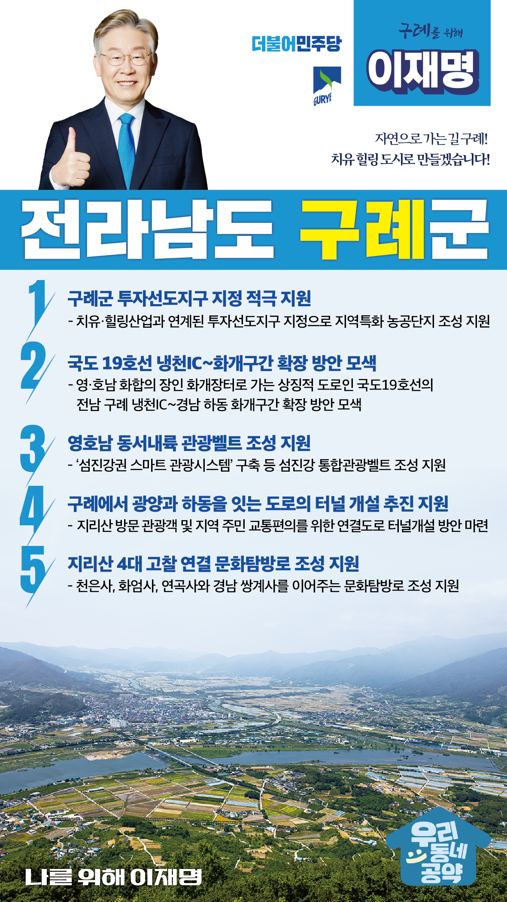

## 전남 지역 공약

# 구례군

### 자연으로 가는 길 구례! 치유 힐링 도시로 만들겠습니다! 
> 2022-02-10

존경하는 구례군민 여러분,

 

구례군은 지리산과 섬진강을 품고 있는 천혜의 생태지역이자 화엄사, 쌍산재, 운조루가 있는 문화관광도시입니다. 

산수유, 우리밀 등을 친환경 유기농법으로 생산해 생협을 통해 전국에 공급하는 친환경농업공동체이기도 합니다.

 

구례는 작지만 지역민들이 그 어느 지자체보다 따뜻한 연대와 돌봄으로 위기를 극복하고 스스로 미래를 개척해온 지역공동체입니다.

 

지속 가능하고 행복한 미래공동체를 위한 구례군 5대 공약을 말씀드리겠습니다.

 

 

첫째, 구례군이 투자선도지구로 지정되도록 적극 지원하겠습니다. 

농업을 미래성장 산업으로 육성하기 위해 농업의 6차 산업화가 필요합니다. 

구례의 치유·힐링산업과 연계된 투자선도지구를 지정해 지역특화 농공단지가 조성되도록 지원하겠습니다. 

관광객 유치와 일자리 창출을 통한 지역경제 활성화에 기여하겠습니다. 

 

 

둘째, 국도 19호선(전남 구례 냉천IC~ 경남 하동 화개) 확장을 적극 검토하겠습니다.

국도 19호선은 영·호남 화합의 장인 화개장터로 가는 상징적 도로이지만, 도로 여건이 매우 열악합니다.  

영･호남 남부 내륙권역의 균형발전과 국도의 간선도로 기능을 확보하기 위해 국도 19호선의 냉천IC에서 화개 구간이 확장될 수 있도록 적극 검토하겠습니다.

 

 

셋째, 영호남 동서내륙 관광벨트 조성을 지원하겠습니다.

구례는 영․호남 시․군의 경계선에 위치하여 균형발전에서 소외되어 왔습니다. 

구례를 섬진강 생태와 문화를 아우르는 복합휴양관광지가 되도록 지원하겠습니다.

‘섬진강권 스마트 관광시스템’ 구축 등 섬진강 통합관광벨트 조성사업이 성공적으로 추진될 수 있도록 적극 지원하겠습니다.

 

 

넷째, 구례에서 광양과 하동을 잇는 도로의 터널개설을 추진을 지원하겠습니다.

경남 하동, 전남 구례·광양·곡성은 섬진강권 통합관광벨트 조성 등 각종 광역 사업을 함께 추진하고 있습니다.

이 사업들을 활성화하기 위해서는 교통망 확충이 시급합니다. 

지리산을 찾는 관광객과 지역 주민들의 교통 편의를 위해 구례군과 광양시, 하동군을 잇는 도로의 터널개설을 적극 검토하겠습니다.

 

 

다섯째, 지리산 4대 고찰을 하나로 연결하는 문화탐방로 조성을 지원하겠습니다.

천년고찰인 구례의 천은사, 화엄사, 연곡사와 경남 쌍계사를 하나로 이어주는 문화탐방로 조성을 돕겠습니다. 

지리산이 보유한 풍부한 산림휴양 자원을 효율적으로 이용하고, 보다 많은 관광객이 구례지역을 방문할 수 있도록 하겠습니다.

 

 

 

존경하는 구례군민 여러분

 

이재명은 지킬 수 있는 것만 약속했고 약속했던 것은 지켜왔습니다.

살기좋은 구례군 미래를 위한 약속, 실력과 성과로 입증된 이재명이 반드시 실천하겠습니다.

 

구례 앞으로, 발전 제대로!

구례군민을 위해, 이재명은 합니다! 

						