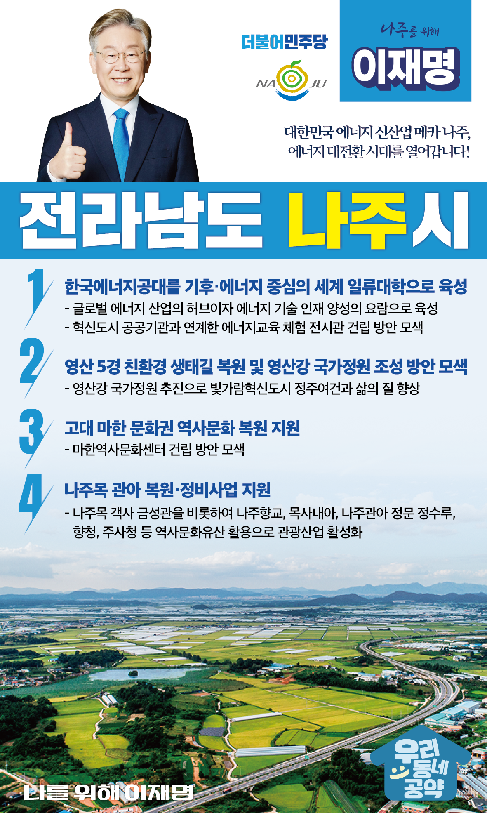

## 전남 지역 공약

# 나주시

### 대한민국 에너지 신산업 메카 나주! 에너지 대전환 시대를 열어갑니다!
> 2022-02-10

사랑하는 나주시민 여러분

 

우리 나주는, 역사와 문화가 흐르고, 예술이 살아 숨 쉬는 고장입니다.

지금은 빛가람 혁신도시의 출범으로 대한민국 에너지 신산업의 메카로 거듭나고 있습니다.

 

최근 기후위기, 환경위기 라는 전지구적 위기 앞에서, 나주는 한국에너지공대 출범과 함께 탄소중립을 향한 에너지 대전환의 중심에 서 있습니다.

나주가 국내 탄소중립을 이끌어갈 수 있도록 적극적인 지원이 필요한 시점입니다. 

 

대한민국 에너지 대전환 시대를 주도하는 나주가 전남권을 넘어 대한민국의 대전환의 키를 잡을 수 있도록 만들어야 합니다. 

 

대전환의 중심 나주를 만들기 위한 4대 공약을 시민 여러분께 약속드립니다.

 

 

첫째, 한국에너지공대를 기후·에너지 중심의 세계 일류대학으로 만들어가겠습니다.

나주혁신도시에 있는 한국에너지공대를 세계 일류대학으로 육성하여 글로벌 에너지 산업의 허브이자 에너지 기술 인재 양성의 요람으로 발전시키겠습니다.

또한, 혁신도시에 입주한 공공기관들과 연계하여 미래 에너지교육 체험의 장으로 활용될 ‘창의융복합전시관’ 건립도 검토하겠습니다. 

 

 

둘째, 영산 5경을 친환경 생태길로 복원하고, 영산강 국가정원 조성을 적극 검토하겠습니다.  

영산강변 자전거도로 정비와 친환경 생태길 조성, ‘영산강 국가정원’의 추진을 적극 검토하겠습니다.

이를 통해 빛가람혁신도시의 정주여건과 삶의 질을 향상시키고, 나주가 첨단과학과 생태가 공존하는 도시로 변화되도록 지원하겠습니다.  

 

 

셋째, 고대 마한의 역사문화 복원에 앞장서겠습니다.

마한 문화권은 고대 동아시아 해상교역을 통해 독자적인 문화체계와 국제성을 중심으로 성장한 자랑스러운 우리 문화입니다.

나주의 마한 문화권 복원을 위한 마한역사문화권센터 건립을 적극 검토하고, 마한의 정신으로 동서 화합과 아시아 각국과의 문화 협력 증진에 기여하겠습니다. 

 

 

넷째, 수준 높은 나주의 역사를 되살리고 구도심을 활성화시키겠습니다. 

나주 구도심에는 나주목 객사 금성관을 비롯하여 나주향교, 목사내아 등 다양한 역사문화 자원이 밀집해 있습니다. 

‘나주목 관아 복원·정비사업’ 지원을 적극 검토하여 나주 구도심의 역사문화를 보전하고 관광산업을 활성화 시키겠습니다.

 

 

 

나주시민 여러분! 

 

제가 가장 잘하는 게 실력! 실적! 실천! 입니다. 

나주 발전, 이재명이 제대로 추진하겠습니다.  

 

앞으로, 제대로, 바꾸겠습니다!

나주를 위해 이재명!! 제대로 하겠습니다.!! 감사합니다.

						