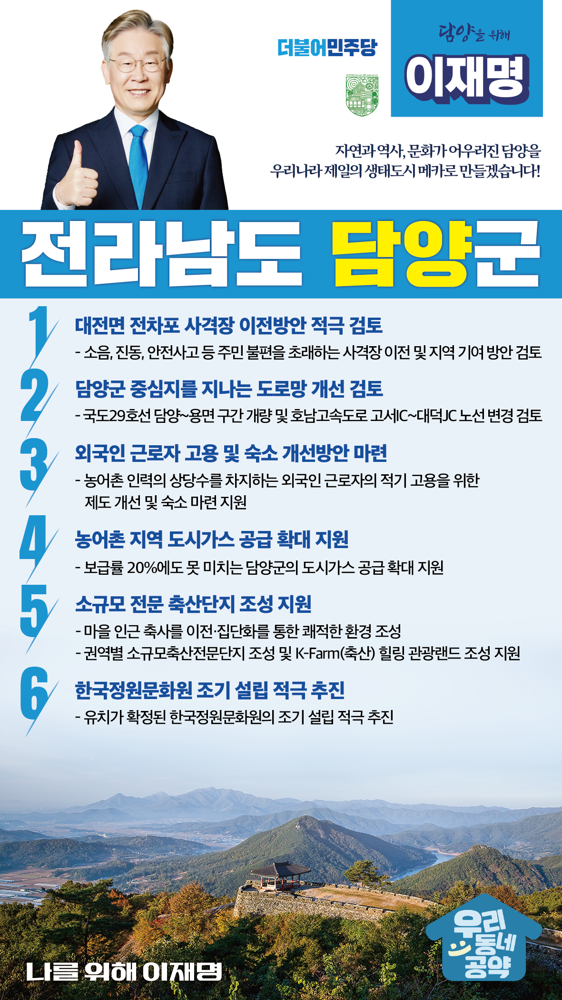

## 전남 지역 공약

# 담양군

### 자연과 역사, 문화가 어우러진 담양을 우리나라 제일의 생태도시 메카로 만들겠습니다!
> 2022-02-10

담양군민 여러분, 

 

담양군은 예로부터 대나무의 주산지로서 대한민국 대표 관광지 죽녹원, 메타세쿼이아길, 관방제림 등 천혜의 자연과 소쇄원 등 다양한 문화재를 보유하고 있어 한 번 발길을 닿으면 그대로 머무르고 싶은 아름다운 고장입니다.

 

전국을 대표하는 생태도시로서 보다 많은 관광객의 발길이 늘어날 수 있도록 전라남도 담양군을 위한 이재명의 6대 공약을 말씀드리겠습니다. 

 

 

첫째, 대전면의 전차포 사격장 이전방안을 적극 검토하겠습니다.

전차포 사격으로 인한 소음, 진동, 위험 등 주민의 삶의 질이 오랫동안 악화되어 있습니다. 

사격장 이전을 통해 주민들의 삶의 질을 제고하고 지역발전에 도움을 줄 수 있는 합리적인 방안을 마련하겠습니다.

 

둘째, 주민 불편을 유발하는 교통망 개선을 적극 지원하겠습니다. 

교통체증이 빈번하고 주민 불편을 유발하는 국도 29호선 담양~용면 개량사업을 적극 검토하겠습니다.

또한, 고서면 중심지를 관통해 지역발전의 큰 장애요인인 호남고속도로 고서~대덕 노선 변경 계획도 검토하겠습니다.

 

 

셋째, 부족한 농촌인력을 고려하여 외국인 근로자 고용과 숙소 개선방안을 마련하겠습니다. 

농어촌 인력의 상당수는 외국인 근로자가 담당하고 있습니다.

외국인 근로자를 적기에 활용할 수 있도록 고용 관련 제도를 보다 현실적으로 개선하겠습니다.  

외국인 근로자가 생활할 수 있는 숙소 마련을 지원하겠습니다. 

 

 

넷째, 농어촌 지역의 부족한 도시가스 공급 확대를 지원하겠습니다.

농어촌지역 도시가스 공급이 부족한 것이 현실입니다. 

20%에도 미치지 못하는 담양군 도시가스 공급이 확대될 수 있도록 지원하겠습니다. 

도농간 격차를 줄이고 담양군민의 삶의 질 향상에 앞장서겠습니다. 

 

 

다섯째, 소규모 전문 축산단지 조성을 지원하여 지역발전에 기여하겠습니다. 

담양군 축사중 절반에 가까운 45%가 마을 100m 이내에 위치해 악취로 인한 주민 갈등이 심합니다.

마을 인근 축사를 이전·집단화하여 쾌적한 환경 조성이 필요합니다. 

권역별 소규모축산전문단지 조성을 비롯해 함평군과 함께 추진하는 K-Farm(축산) 힐링 관광랜드 조성사업을 적극 지원하겠습니다. 

 

 

여섯째, 한국정원문화원의 조기 설립을 적극 추진하겠습니다.

담양군은 대한민국 정원문화의 중심지입니다. 

유치가 확정된 한국정원문화원이 조기 설립되어 담양군의 새로운 성장 동력으로 자리 잡을 수 있도록 지원을 아끼지 않겠습니다.

 

 

 

존경하는 담양 군민 여러분!

 

이재명은 지킬 수 있는 것만 약속했고 약속했던 것은 지켜왔습니다.

살기좋은 담양군 미래를 위한 약속, 실력과 성과로 입증된 이재명이 반드시 실천하겠습니다.

 

담양 앞으로, 발전 제대로!

담양군민을 위해, 이재명은 합니다! 

						