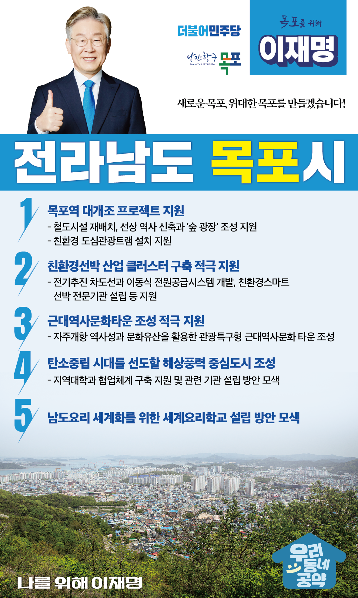

## 전남 지역 공약

# 목포시

### 새로운 목포, 위대한 목포를 만들겠습니다! 
> 2022-02-10

존경하는 목포시민 여러분, 

 

목포는 개항 이후 가장 먼저 근대문물을 수용하면서 동북아 해양문화의 중심지로 발전해 왔습니다. 

목포는 무안, 신안, 영암, 해남, 완도, 진도 등 서남권 다도해의 모든 물류의 유통과 교통의 관문이자, 섬의 수도였습니다.

 

그러나 100년이 지난 지금 목포는 조선산업의 부진으로 일자리가 감소하고, 저출산‧고령화 현상이 심해지면서 인구가 감소하고 있습니다. 

 

이재명이 반드시 지역 균형발전을 이뤄내 목포를 한반도 남부권의 중심지로 키우겠습니다.

 

새로운 목포를 위한 이재명의 5대 공약을 말씀드립니다. 

 

 

첫째, 목포시가 추진하는 목포역 대개조 프로젝트를 지원하겠습니다. 

목포시는 목포역의 철도시설을 재배치하고, 선상 역사 신축과 ‘숲 광장’을 조성하여 유라시아 대륙의 기점이자 섬·해양으로 연결되는 철도역사 조성을 추진하고 있습니다.  

또한 목포역을 포함한 근대 역사자원을 활용하고 관광객의 이동 편의증진을 위한 친환경적인 도심관광트램 설치를 지원하겠습니다.  

 

 

둘째, 친환경선박 산업 클러스터 구축을 적극 지원하겠습니다.

전기추진 차도선과 이동식 전원공급시스템을 개발하고, 친환경‧스마트 선박 전문기관 설립 등 선박 특화 클러스터 조성을 적극 지원하겠습니다. 

새롭게 대두되는 270조원 규모의 세계 친환경 선박 시장을 선점하여 목포경제의 든든한 축이 되도록 하겠습니다.  

 

 

셋째, 목포시가 추진하는 근대역사문화타운(Historic Old Town Mokpo) 조성을 적극 지원하겠습니다.

목포는 근대문화 자산이 잘 보존된 지붕 없는 박물관입니다. 

자주개항 역사성과 문화유산을 활용한 관광특구형 근대역사문화 타운이 조성되고 개항역사문화센터가 건립되면 근대문화 역사자원을 활용한 문화관광도시로 거듭날 것입니다.   

 

 

넷째, 탄소 중립 시대를 선도할 해상풍력의 중심도시로 만들어 가겠습니다.  

전남의 해상풍력 잠재량은 전국의 37.3%로 가장 높습니다.

목포를 중심으로 한 해상풍력 산업생태계 조성을 적극 지원하겠습니다. 

핵심기술의 개발과 실증, 전문인력을 양성할 수 있도록 지역 대학과의 협업체계를 구축하고 관련 기관 설립도 검토하겠습니다. 

 

 

다섯째, 남도요리 세계화를위한 세계요리학교설립을 적극 검토하겠습니다.

목포는 섬과 해양의 관문으로 전 세계의 자랑인 남도음식 문화가 발달한 도시입니다. 

세계적인 요리학교를 설립하고 세계인의 입맛에 맞는 글로컬*한 상품을 개발하여, K-푸드의 세계화를 지원하겠습니다. (*Glocal = Global + Loca)

 

 

지금 우리는 목포가 새롭게 도약하는 과정에 함께 하고 있습니다. 

‘새로운 목포’는 말 그대로 새로운 변화입니다. 

정체됐던 경제, 문화, 관광산업 등이 시대 흐름에 맞춰 변화하는 것입니다.

 

 

목포의 새로운 성장동력인 미래 전략산업을 강력히 추진하고, 지역주민의 민생을 최우선으로 하는 행정가가 필요합니다.

이재명이 열어갈 목포시의 미래를 기대해주십시오.

 

목포를 위한 이재명, 

이재명은 제대로 합니다! 

						